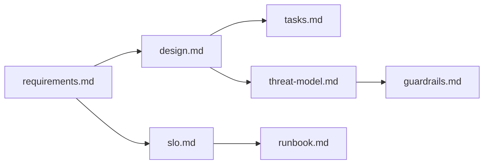

# sdd-full — Complete Spec-Driven Development Pipeline

## 0. 目的
- SDDの全成果物を一括生成
- 準備段階を完璧に完了し、実装可能な状態（L3）に到達
- 各成果物間の整合性を保証
- 品質ゲートを通過するまで改善ループ

## 1. 入力と出力

### 入力
- /sdd-full $ARGUMENTS
  - $0 = spec-slug（例: google-ad-report）
  - $1 = target-dir（任意。未指定なら `.kiro/specs/<spec-slug>/` を使う）

### 出力（すべて必須）
```
<target-dir>/
├── requirements.md      # EARS準拠要件定義 (C.U.T.E. >= 98)
├── design.md            # C4モデル設計書
├── tasks.md             # Kiro形式タスク分解
├── threat-model.md      # STRIDE脅威モデル
├── slo.md               # SLO/SLI/SLA定義
├── runbook.md           # インシデント対応手順
├── guardrails.md        # AIガードレール
├── critique.md          # 採点結果詳細
├── score.json           # 機械採点結果
└── adr/
    └── README.md        # ADR一覧（初期は空）
```

## 2. 成熟度レベル

| Level | 名称 | 達成条件 | 本スキルの目標 |
|-------|------|---------|---------------|
| L1 | Draft | requirements.md作成 | - |
| L2 | Review Ready | C.U.T.E. >= 90 | - |
| **L3** | Implementation Ready | C.U.T.E. >= 98, 全成果物完備, レビュー準備 | ✅ 目標 |
| L4 | Production Ready | 実装完了, テスト完了, セキュリティレビュー | - |
| L5 | Enterprise Ready | SLO達成, 監視設定, Runbook運用実績 | - |

## 3. 実行順序（依存関係）



1. **requirements.md** (独立)
2. **design.md** (← requirements)
3. **slo.md** (← requirements)
4. **tasks.md** (← requirements, design)
5. **threat-model.md** (← requirements, design)
6. **runbook.md** (← design, slo)
7. **guardrails.md** (← requirements, threat-model)

## 4. 手順

### Step A: 準備
1. target-dirを決定（なければ作成）
2. 既存ファイルがあれば読み込み（差分更新）
3. ユーザーから初期情報を収集（必要なら意地悪質問）

### Step B: requirements.md生成
1. /sdd-req100 相当の処理を実行
2. C.U.T.E.スコア >= 98 を目指す
3. 達しない場合は改善ループ（最大5回）

### Step C: design.md生成
1. requirements.mdを入力として設計書を生成
2. C4モデル（Context/Container/Component）
3. API契約、データモデル、セキュリティ設計

### Step D: slo.md生成
1. 非機能要件からSLI/SLOを導出
2. Error Budget Policy を定義
3. アラート設定を含める

### Step E: tasks.md生成
1. 要件と設計からタスクを分解
2. フェーズ構造で整理
3. 依存関係とGanttチャート

### Step F: threat-model.md生成
1. STRIDE分析を実施
2. リスクマトリックスで優先度付け
3. 緩和策をREQ-SEC-xxxとして追加

### Step G: runbook.md生成
1. Severity定義
2. シナリオ別対応手順
3. ロールバック手順

### Step H: guardrails.md生成
1. 権限境界定義
2. Human-in-the-Loopゲート
3. 監査証跡要件

### Step I: 最終検証
1. 全成果物の整合性チェック
2. 相互参照の検証
3. 成熟度レベル判定

## 5. 品質ゲート

| チェック項目 | 基準 | 必須 |
|-------------|------|------|
| C.U.T.E.スコア | >= 98 | ✅ |
| 全成果物存在 | 7ファイル | ✅ |
| 相互参照整合 | エラー0 | ✅ |
| 未解決事項 | 0件 | ❌（警告のみ） |
| セキュリティ要件 | REQ-SEC存在 | ✅ |

## 6. 最終応答

```markdown
## SDD Pipeline Complete

### 成熟度: L3 (Implementation Ready) ✅

### 生成ファイル
- ✅ requirements.md (C.U.T.E.: 98/100)
- ✅ design.md
- ✅ tasks.md (XX tasks, XX phases)
- ✅ threat-model.md (XX threats identified)
- ✅ slo.md (XX SLIs, XX SLOs)
- ✅ runbook.md
- ✅ guardrails.md

### 次のステップ
1. レビュー: requirements.md をステークホルダーに共有
2. ADR作成: 主要な技術決定を `/sdd-adr` で記録
3. 実装開始: tasks.md の Phase 0 から着手
```

## 7. 実行例

```bash
/sdd-full google-ad-report
```

出力:
```
.kiro/specs/google-ad-report/
├── requirements.md
├── design.md
├── tasks.md
├── threat-model.md
├── slo.md
├── runbook.md
├── guardrails.md
├── critique.md
├── score.json
└── adr/
    └── README.md
```
