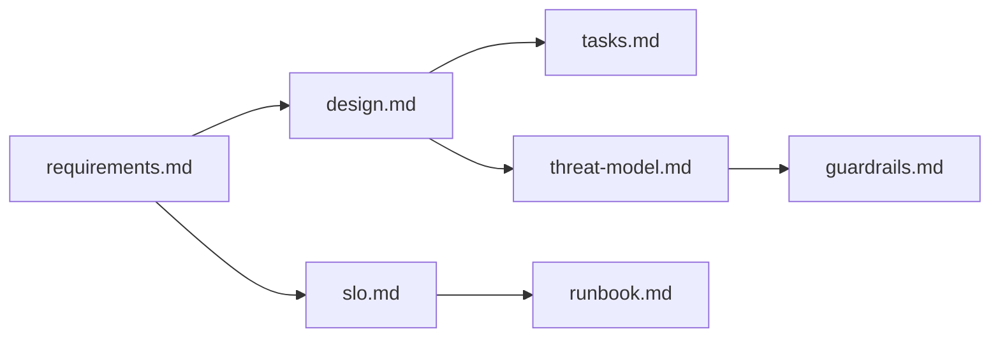

# Spec-Driven Development (SDD) Framework

> 世界最高水準の仕様駆動開発フレームワーク

## 概要

SDDは「準備段階を完璧にする」ための統合フレームワークです。
要件定義から運用手順書まで、実装前に必要なすべての成果物を生成します。

## 成熟度レベル

| Level | 名称 | 達成条件 | 成果物 |
|-------|------|---------|--------|
| **L1** | Draft | requirements.md作成 | requirements.md |
| **L2** | Review Ready | C.U.T.E. >= 90 | + critique.md, score.json |
| **L3** | Implementation Ready | C.U.T.E. >= 98, 全成果物完備 | + design, tasks, threat-model, slo, runbook, guardrails |
| **L4** | Production Ready | 実装完了, テスト完了 | + 実装コード, テスト |
| **L5** | Enterprise Ready | SLO達成, 監視設定 | + 運用実績, メトリクス |

## スキル一覧

### 個別スキル

| スキル | コマンド | 説明 | 出力 |
|--------|---------|------|------|
| **sdd-req100** | `/sdd-req100 <slug>` | EARS準拠要件定義 + C.U.T.E.採点 | requirements.md, critique.md, score.json |
| **sdd-design** | `/sdd-design <slug>` | C4モデル設計書 | design.md |
| **sdd-tasks** | `/sdd-tasks <slug>` | Kiro形式タスク分解 | tasks.md |
| **sdd-threat** | `/sdd-threat <slug>` | STRIDE脅威モデル | threat-model.md |
| **sdd-slo** | `/sdd-slo <slug>` | SLO/SLI/SLA定義 | slo.md |
| **sdd-runbook** | `/sdd-runbook <slug>` | インシデント対応手順 | runbook.md |
| **sdd-guardrails** | `/sdd-guardrails <slug>` | AIガードレール | guardrails.md |
| **sdd-adr** | `/sdd-adr "<title>" <slug>` | 技術決定記録 | ADR-XXX-<slug>.md |

### 統合スキル

| スキル | コマンド | 説明 |
|--------|---------|------|
| **sdd-full** | `/sdd-full <slug>` | 全成果物を一括生成（L3達成） |

## 使い方

### 基本フロー

```bash
# 1. 要件定義（L1→L2）
/sdd-req100 my-feature

# 2. 設計書
/sdd-design my-feature

# 3. タスク分解
/sdd-tasks my-feature

# 4. 脅威モデル
/sdd-threat my-feature

# 5. SLO定義
/sdd-slo my-feature

# 6. Runbook
/sdd-runbook my-feature

# 7. ガードレール
/sdd-guardrails my-feature
```

### 一括生成（推奨）

```bash
# すべて一括で生成（L3達成）
/sdd-full my-feature
```

## C.U.T.E. スコアリング

| 次元 | 最大点 | 評価内容 |
|------|--------|---------|
| **C** (Completeness) | 25 | 必須セクション・フィールドの完備 |
| **U** (Unambiguity) | 25 | 曖昧語の排除 |
| **T** (Testability) | 25 | GWT形式受入テストの存在 |
| **E** (EARS) | 25 | EARS構文への準拠 |
| **合計** | 100 | 98点以上で実装可能品質 |

## EARS パターン

| パターン | 構文（英語） | 構文（日本語） |
|----------|-------------|---------------|
| 普遍 | The system shall ... | システムは...しなければならない。 |
| イベント駆動 | When <event>, the system shall ... | ...とき、システムは...しなければならない。 |
| 状態駆動 | While <state>, the system shall ... | ...の間、システムは...しなければならない。 |
| 望ましくない挙動 | If <unwanted>, then the system shall ... | ...場合、システムは...しなければならない。 |
| オプション | Where <feature> is enabled, the system shall ... | ...が有効な場合、システムは...しなければならない。 |

## 意地悪質問（20問）

要件を深掘りするための質問リスト：

1. この機能が「ない」とき、誰が、どう困る？
2. 成功 / 失敗の境界を数字で言うと？
3. エラー時、誰が、どう知る？ リトライは自動？手動？上限は？
4. 同時実行されたらどうなる？
5. 二重実行されたらどうなる？
6. 外部APIが落ちていたらどうする？
7. 部分成功したら全体は成功？失敗？
8. データが巨大（10倍/100倍）だったら？
9. 認証/認可/監査ログはどう扱う？
10. 秘密情報（APIキー等）はどこから？ログに出して良い？
11. この機能を無効化する運用は想定する？
12. 手動でリカバリ/再実行/ロールバックできる？
13. タイムアウトは何秒？超えたらどうなる？
14. テスト環境と本番の違い（レート制限・データ量・権限）は？
15. SLO/SLI/SLA はある？
16. この機能で発生しうるセキュリティ脅威は何？（STRIDE観点）
17. AIエージェントが実行する場合、どこで人間の承認が必要？
18. 障害発生時のエスカレーション先と連絡手段は？
19. この技術選択の代替案は何？なぜ却下した？（ADR観点）
20. 将来の拡張（10倍のユーザー、新機能追加）に耐えられる設計か？

## テンプレート

すべてのテンプレートは `.claude/skills/sdd-req100/templates/` に格納：

- `design.template.md` - C4モデル設計書
- `tasks.template.md` - Kiro形式タスク
- `threat-model.template.md` - STRIDE脅威モデル
- `slo.template.md` - SLO/SLI/SLA
- `runbook.template.md` - インシデント対応
- `guardrails.template.md` - AIガードレール
- `adr.template.md` - MADR形式ADR

## 依存関係



## 関連ドキュメント

- [EARS公式仕様](https://www.iaria.org/conferences2013/filesICCGI13/ICCGI_2013_Tutorial_Terzakis.pdf)
- [C4 Model](https://c4model.com/)
- [STRIDE脅威モデリング](https://docs.microsoft.com/en-us/azure/security/develop/threat-modeling-tool)
- [Google SRE](https://sre.google/sre-book/table-of-contents/)
- [MADR (ADR)](https://adr.github.io/madr/)
