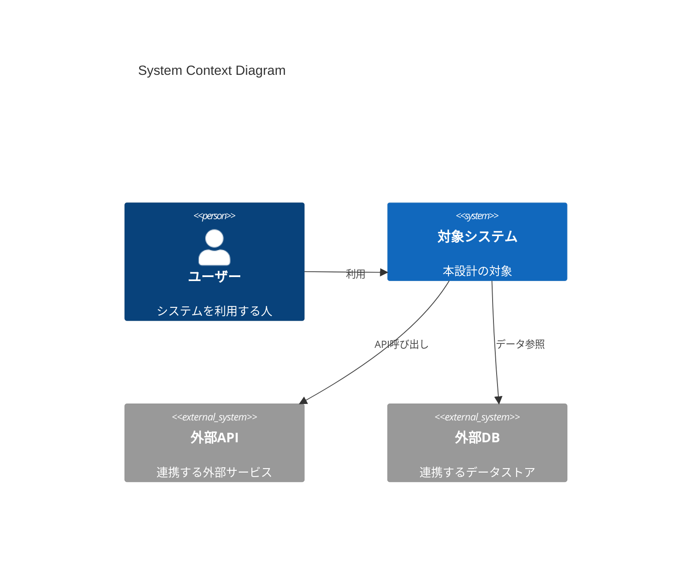
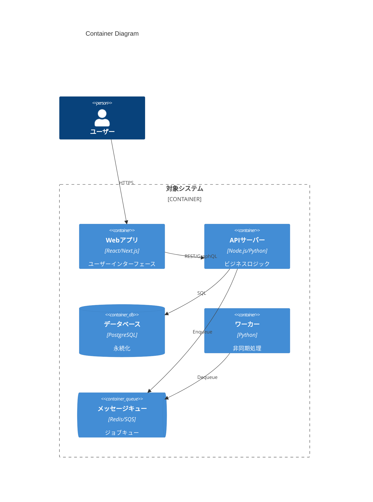
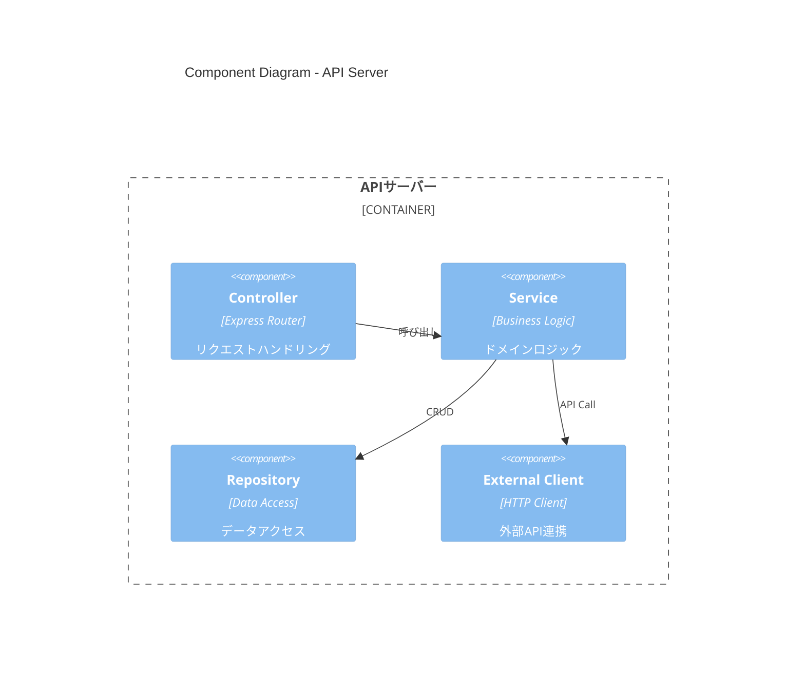
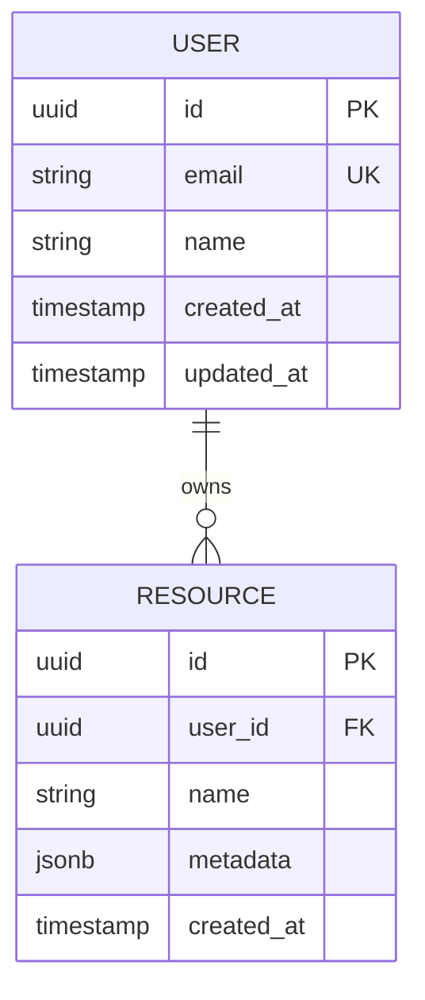

# Design: <spec-slug>

> C4モデルに基づく技術設計書。要件定義（requirements.md）を実装可能な設計に落とし込む。

## 1. Context Diagram (Level 1)

### 1.1 システム概要
- **システム名**:
- **目的**:
- **主要ユーザー**:

### 1.2 外部アクター・システム



| アクター/システム | 種別 | 役割 | 通信方式 |
|------------------|------|------|---------|
| ... | User/External | ... | ... |

## 2. Container Diagram (Level 2)

### 2.1 コンテナ構成



### 2.2 コンテナ詳細

| コンテナ | 技術スタック | 責務 | スケーリング |
|---------|-------------|------|-------------|
| Web | React/Next.js | UI/UX | 水平 |
| API | Node.js/FastAPI | ビジネスロジック | 水平 |
| DB | PostgreSQL | 永続化 | 垂直/Read Replica |
| Worker | Python | 非同期処理 | 水平 |
| Queue | Redis/SQS | ジョブ管理 | - |

## 3. Component Diagram (Level 3)

### 3.1 主要コンポーネント



### 3.2 コンポーネント責務

| コンポーネント | 責務 | 依存関係 |
|---------------|------|---------|
| Controller | リクエスト検証、レスポンス整形 | Service |
| Service | ビジネスロジック、トランザクション | Repository, External |
| Repository | データアクセス抽象化 | DB |
| External Client | 外部API通信、リトライ | - |

## 4. API Contracts

### 4.1 REST API

| Endpoint | Method | 説明 | Request | Response |
|----------|--------|------|---------|----------|
| `/api/v1/resource` | GET | リソース一覧取得 | `?page=1&limit=20` | `{data: [], meta: {}}` |
| `/api/v1/resource/:id` | GET | リソース詳細取得 | - | `{data: {}}` |
| `/api/v1/resource` | POST | リソース作成 | `{name: string}` | `{data: {id: string}}` |

### 4.2 エラーレスポンス

```json
{
  "error": {
    "code": "RESOURCE_NOT_FOUND",
    "message": "リソースが見つかりません",
    "details": {}
  }
}
```

| HTTPステータス | エラーコード | 説明 |
|---------------|-------------|------|
| 400 | VALIDATION_ERROR | リクエスト検証エラー |
| 401 | UNAUTHORIZED | 認証エラー |
| 403 | FORBIDDEN | 権限エラー |
| 404 | NOT_FOUND | リソース不在 |
| 500 | INTERNAL_ERROR | サーバーエラー |

## 5. Data Model

### 5.1 ER Diagram



### 5.2 テーブル定義

| テーブル | カラム | 型 | 制約 | 説明 |
|---------|--------|------|------|------|
| users | id | UUID | PK | 主キー |
| users | email | VARCHAR(255) | UK, NOT NULL | メールアドレス |
| users | name | VARCHAR(100) | NOT NULL | 表示名 |

## 6. 技術選定理由（ADR参照）

| 決定 | 選択 | 理由 | ADR |
|------|------|------|-----|
| 言語 | TypeScript | 型安全性、エコシステム | ADR-001 |
| DB | PostgreSQL | JSONB、拡張性 | ADR-002 |
| キャッシュ | Redis | 速度、Pub/Sub | ADR-003 |

## 7. セキュリティ設計

### 7.1 認証・認可

| 方式 | 技術 | 用途 |
|------|------|------|
| 認証 | JWT + Refresh Token | ユーザー認証 |
| 認可 | RBAC | 権限管理 |
| API認証 | API Key + HMAC | サーバー間通信 |

### 7.2 データ保護

| データ種別 | 保護方式 | 備考 |
|-----------|---------|------|
| パスワード | bcrypt (cost=12) | ハッシュ化 |
| PII | AES-256-GCM | 暗号化 |
| API Key | 環境変数 / Secret Manager | 分離保管 |

## 8. インフラ設計

### 8.1 環境構成

| 環境 | 用途 | URL |
|------|------|-----|
| Development | 開発 | localhost |
| Staging | 検証 | stg.example.com |
| Production | 本番 | app.example.com |

### 8.2 デプロイ構成

```
┌─────────────┐     ┌─────────────┐     ┌─────────────┐
│   CDN       │────▶│   LB        │────▶│   App       │
│ CloudFront  │     │   ALB       │     │   ECS/K8s   │
└─────────────┘     └─────────────┘     └─────────────┘
                                              │
                    ┌─────────────┐     ┌─────┴─────┐
                    │   Cache     │◀────│   DB      │
                    │   Redis     │     │   RDS     │
                    └─────────────┘     └───────────┘
```

## 9. 関連ドキュメント

- [requirements.md](./requirements.md) - 要件定義
- [tasks.md](./tasks.md) - タスク分解
- [threat-model.md](./threat-model.md) - 脅威モデル
- [adr/](./adr/) - 技術決定記録
