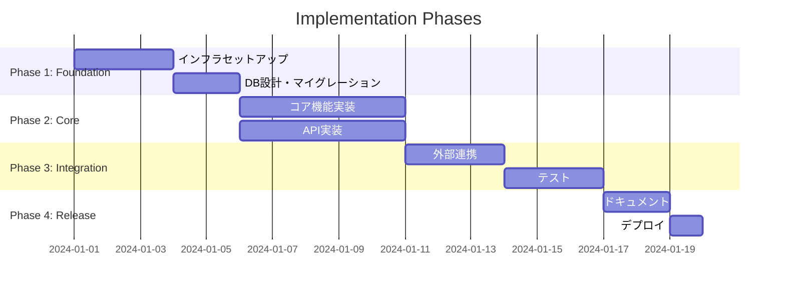
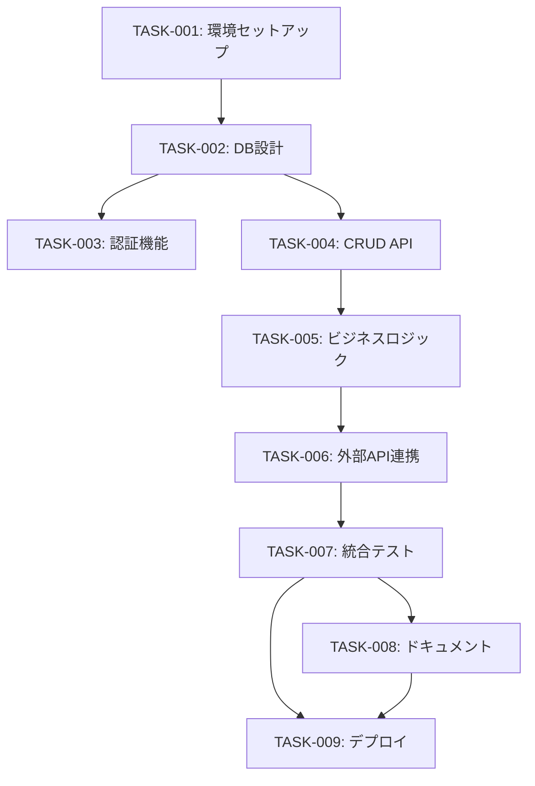

# Tasks: <spec-slug>

> Kiro形式のタスク分解。requirements.mdとdesign.mdに基づき、実装タスクを定義する。

## 1. 概要

| 項目 | 値 |
|------|-----|
| 総タスク数 | X |
| 見積もり合計 | X 時間 |
| 優先度 P1 | X 件 |
| 優先度 P2 | X 件 |
| 優先度 P3 | X 件 |

## 2. フェーズ構成



| Phase | 名称 | 目的 | 完了条件 |
|-------|------|------|---------|
| 1 | Foundation | 基盤構築 | 開発環境・DB稼働 |
| 2 | Core | コア機能 | 主要機能動作 |
| 3 | Integration | 統合 | E2Eテスト通過 |
| 4 | Release | リリース | 本番デプロイ完了 |

## 3. タスク一覧

### Phase 1: Foundation

#### TASK-001: 開発環境セットアップ
- **優先度**: P1 (MUST)
- **見積もり**: 2h
- **依存**: なし
- **担当**: -
- **関連要件**: REQ-900 (インフラ要件)
- **完了条件**:
  - [ ] Docker Compose起動
  - [ ] ローカルDB接続確認
  - [ ] 環境変数設定完了
- **実装メモ**:
  ```bash
  docker-compose up -d
  npm install
  cp .env.example .env
  ```

#### TASK-002: DBスキーマ設計・マイグレーション
- **優先度**: P1 (MUST)
- **見積もり**: 4h
- **依存**: TASK-001
- **担当**: -
- **関連要件**: REQ-001, REQ-002
- **完了条件**:
  - [ ] ERD作成
  - [ ] マイグレーションファイル作成
  - [ ] Seed データ投入
- **実装メモ**:
  - design.md の Data Model セクション参照

### Phase 2: Core

#### TASK-003: 認証機能実装
- **優先度**: P1 (MUST)
- **見積もり**: 8h
- **依存**: TASK-002
- **担当**: -
- **関連要件**: REQ-003
- **完了条件**:
  - [ ] ログインAPI実装
  - [ ] JWT発行・検証
  - [ ] リフレッシュトークン
  - [ ] ユニットテスト作成
- **受入テスト**: AT-003 (requirements.md参照)

#### TASK-004: CRUD API実装
- **優先度**: P1 (MUST)
- **見積もり**: 6h
- **依存**: TASK-002
- **担当**: -
- **関連要件**: REQ-004, REQ-005
- **完了条件**:
  - [ ] GET /api/v1/resource
  - [ ] POST /api/v1/resource
  - [ ] PUT /api/v1/resource/:id
  - [ ] DELETE /api/v1/resource/:id
  - [ ] バリデーション実装
  - [ ] エラーハンドリング

#### TASK-005: ビジネスロジック実装
- **優先度**: P1 (MUST)
- **見積もり**: 8h
- **依存**: TASK-004
- **担当**: -
- **関連要件**: REQ-006, REQ-007
- **完了条件**:
  - [ ] Service層実装
  - [ ] トランザクション管理
  - [ ] ユニットテスト

### Phase 3: Integration

#### TASK-006: 外部API連携
- **優先度**: P2 (SHOULD)
- **見積もり**: 6h
- **依存**: TASK-005
- **担当**: -
- **関連要件**: REQ-008
- **完了条件**:
  - [ ] HTTPクライアント実装
  - [ ] リトライ・サーキットブレーカー
  - [ ] モック作成（テスト用）
- **例外処理**: EH-008 (requirements.md参照)

#### TASK-007: 統合テスト
- **優先度**: P1 (MUST)
- **見積もり**: 4h
- **依存**: TASK-006
- **担当**: -
- **関連要件**: 全REQ
- **完了条件**:
  - [ ] E2Eテスト作成
  - [ ] CI/CDパイプラインでテスト実行
  - [ ] カバレッジ80%以上

### Phase 4: Release

#### TASK-008: ドキュメント整備
- **優先度**: P2 (SHOULD)
- **見積もり**: 3h
- **依存**: TASK-007
- **担当**: -
- **完了条件**:
  - [ ] API仕様書（OpenAPI）
  - [ ] READMEアップデート
  - [ ] Runbook確認

#### TASK-009: 本番デプロイ
- **優先度**: P1 (MUST)
- **見積もり**: 2h
- **依存**: TASK-007, TASK-008
- **担当**: -
- **関連要件**: REQ-900, REQ-901
- **完了条件**:
  - [ ] Stagingデプロイ・検証
  - [ ] 本番デプロイ
  - [ ] ヘルスチェック確認
  - [ ] モニタリング確認

## 4. 依存関係図



## 5. リスク・ブロッカー

| ID | リスク | 影響 | 緩和策 | 関連タスク |
|----|--------|------|--------|-----------|
| R-001 | 外部API仕様変更 | 中 | モック・契約テスト | TASK-006 |
| R-002 | DB性能問題 | 高 | インデックス設計、負荷テスト | TASK-002 |

## 6. 進捗トラッキング

| タスク | ステータス | 開始日 | 完了日 | 担当 |
|--------|-----------|--------|--------|------|
| TASK-001 | TODO | - | - | - |
| TASK-002 | TODO | - | - | - |
| TASK-003 | TODO | - | - | - |
| ... | ... | ... | ... | ... |

## 7. 関連ドキュメント

- [requirements.md](./requirements.md) - 要件定義
- [design.md](./design.md) - 技術設計
- [threat-model.md](./threat-model.md) - 脅威モデル
