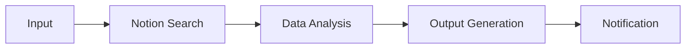

# Skill Enhancement Templates

既存スキルを改善するためのテンプレート集。
**既存ファイルは変更せず、追加のみで改善を実現する。**

---

## Template 1: Description Enhancement

### Before (現状)
```yaml
description: 太陽スタイルのコピーライティング技術を適用
```

### After (改善案)
```yaml
description: |
  日給5000万円を生み出した太陽スタイルのコピーライティング技術を適用。
  セールスレター、ステップメール、LP、VSL作成に対応。
  Use when: (1) user says「太陽スタイルで」「売れるコピー」,
  (2) user wants high-conversion copy for マーケティング,
  (3) user mentions「成約率」「コンバージョン」.
  Do NOT use for: 技術ドキュメント、ニュース記事、学術論文、
  SNS投稿（sns-marketingスキルを使用）。
```

---

## Template 2: Progressive Disclosure Structure

### Current Problem
SKILL.md に全内容が含まれ、5000語を超えている。

### Solution
```
skill-name/
├── SKILL.md                    # 500行以下に縮小
└── references/
    ├── detailed-patterns.md    # 詳細パターン
    ├── examples.md             # 具体例
    └── troubleshooting.md      # トラブルシューティング
```

### SKILL.md Updates
```markdown
## 詳細パターン

基本パターンは上記の通り。詳細は以下を参照：
- [176パターン詳細](references/detailed-patterns.md)
- [成功事例](references/examples.md)
- [問題解決](references/troubleshooting.md)
```

---

## Template 3: Validation Loop Addition

### Add to End of SKILL.md
```markdown
## Validation Loop

### 品質チェックリスト
- [ ] Step 1: 初稿作成
- [ ] Step 2: taiyo-analyzerでスコア確認
- [ ] Step 3: スコア85未満 → 修正してStep 2へ
- [ ] Step 4: スコア85以上 → 最終確認
- [ ] Step 5: 納品

### 自動検証
```bash
python scripts/validate_output.py output.md
```
```

---

## Template 4: MCP Tool Integration

### Add MCP Coordination Section
```markdown
## MCP Tool Usage

### Tool References (Use Fully Qualified Names)
- `notion:search` - Notionページ検索
- `postgres-ro:query` - DB読み取りクエリ
- `github:create_issue` - Issue作成

### Coordination Pattern

```

---

## Template 5: Metadata Addition

### Minimum Recommended Metadata
```yaml
---
name: skill-name
description: |
  Description with triggers and negative triggers.
metadata:
  version: "1.0.0"
  author: TAISUN
  category: marketing  # or: development, productivity, automation
  mcp-servers: []      # List of required MCP servers
  compatibility: Claude Code, Claude.ai
---
```

---

## Template 6: Error Handling Section

### Add to SKILL.md
```markdown
## Error Handling

### Common Errors

#### Error: API rate limit exceeded
**Cause**: Too many requests in short time
**Solution**: Wait 60 seconds and retry

#### Error: Invalid input format
**Cause**: Input doesn't match expected schema
**Solution**: Validate input with:
```bash
python scripts/validate_input.py input.json
```

### Recovery Steps
1. Log error details
2. Notify user with clear message
3. Suggest alternative approach
4. Offer to retry with modified parameters
```

---

## Template 7: Evaluations Directory

### Create evaluations/ Directory
```
skill-name/
└── evaluations/
    ├── trigger-tests.json      # トリガーテスト
    ├── functional-tests.json   # 機能テスト
    └── baseline.json           # ベースライン比較
```

### trigger-tests.json Example
```json
{
  "skill": "taiyo-style",
  "tests": [
    {
      "query": "太陽スタイルでセールスレターを書いて",
      "should_trigger": true
    },
    {
      "query": "技術仕様書を書いて",
      "should_trigger": false
    },
    {
      "query": "売れるコピーが欲しい",
      "should_trigger": true
    }
  ]
}
```

---

## Application Priority

### Critical (既存スキルに適用推奨)

| スキル | 改善項目 |
|--------|----------|
| taiyo-style | Description拡張 + Negative triggers |
| mega-research | MCP coordination明示 |
| video-agent | Validation loop追加 |

### High (新規スキル作成時に適用)

| 項目 | テンプレート |
|------|-------------|
| 新規スキル | Template 5 (Metadata) |
| MCP連携スキル | Template 4 (MCP Integration) |
| 品質重視スキル | Template 3 (Validation Loop) |

### Medium (順次改善)

| 項目 | テンプレート |
|------|-------------|
| 大規模スキル | Template 2 (Progressive Disclosure) |
| エラー多発スキル | Template 6 (Error Handling) |
| テスト不足スキル | Template 7 (Evaluations) |
