# 【保存版】NanoBanana Proで使える最強プロンプト50選｜コピペでプロ級画像が作れる完全ガイド

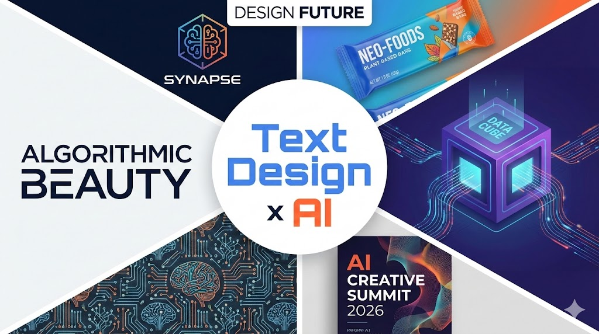

「AIで画像を作りたいけど、どう指示すればいいかわからない...」
「プロンプトの書き方がわからなくて、思い通りの画像が出ない...」
「センスがないから、AIを使ってもダサい画像しか作れない...」

そんな悩みを持つあなたに朗報です。

**この記事では、NanoBanana Pro（Google Geminiの無料AI画像生成）で使える「プロ級プロンプト50選」を、カテゴリ別に完全解説します。**

しかも、すべてのプロンプトに**日本版への置き換え例と生成画像サンプル**を付けました。

**コピペして、ブランド名を変えるだけ。それだけでプロ級のデザインが手に入ります。**

---

## なぜプロンプトが重要なのか？

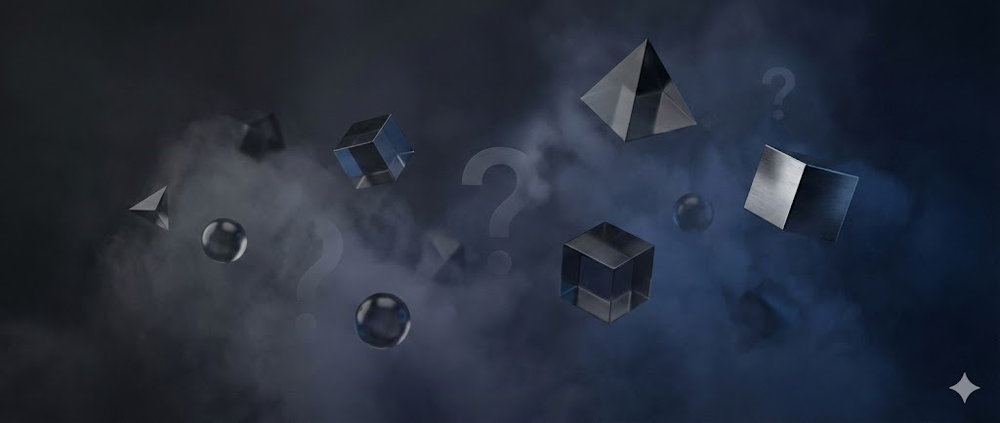

AIに画像を作らせるとき、多くの人がやってしまう失敗があります。

**「かっこいい画像を作って」**
**「おしゃれなロゴを作って」**

こんな曖昧な指示では、AIは何を作ればいいかわかりません。

### プロのプロンプトには「設計」がある

プロのデザイナーが画像を作るとき、必ず考えることがあります：

- **構図**（Composition）：要素をどう配置するか
- **ライティング**（Lighting）：光をどう当てるか
- **テクスチャ**（Texture）：質感をどう表現するか
- **カラー**（Color）：色をどう使うか

**優れたプロンプトには、これらすべてが組み込まれています。**

だから、そのプロンプトをコピペするだけで、プロの思考回路でデザインされた画像が手に入るのです。

---

## NanoBanana Proとは？（3分で始められる）

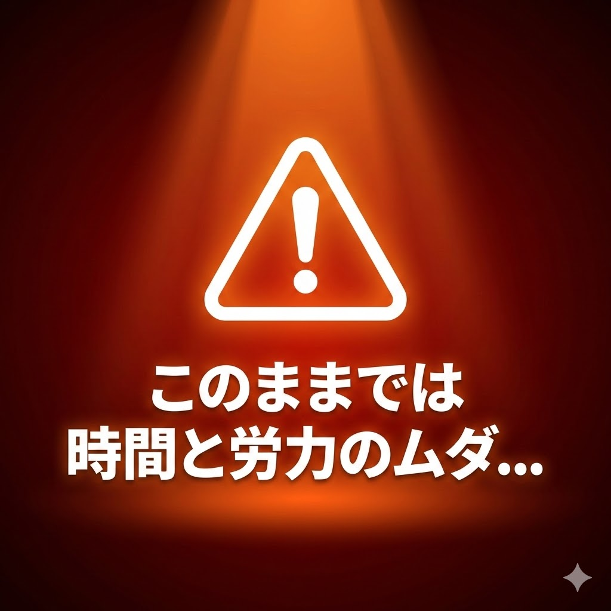

NanoBanana Proは、GoogleのAIアシスタント「Gemini」に搭載された**完全無料のAI画像生成機能**。

### NanoBanana Proの5つの特徴

**① 完全無料**
Googleアカウントがあれば追加料金なし。

**② 日本語OK**
プロンプトを日本語で書いてもOK。

**③ 日本語テキスト生成**
思考モードで画像内の日本語も美しく表示される。

**④ ブラウザだけで完結**
アプリ不要、PCでもスマホでも使える。

**⑤ 商用利用可能**
副業・ビジネスに使用OK。

### 3ステップで始める

1. **[gemini.google.com](https://gemini.google.com) にアクセス**
2. **Googleアカウントでログイン**
3. **右下で「思考モード」に切り替え** ← 必須！

**これで準備完了。所要時間は約3分です。**

---

## 【カテゴリ別】最強プロンプト50選

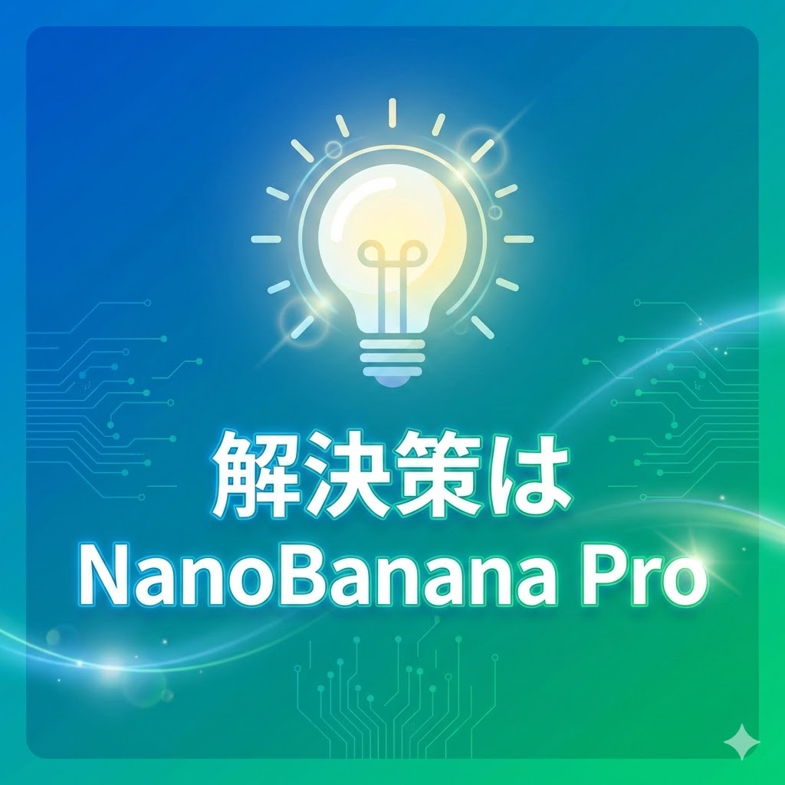

ここからが本題です。

NanoBanana Proで使える50のプロンプトを、**8つのカテゴリ別**に解説します。

各プロンプトの `[BRAND NAME]` を好きなブランド名に変えるだけで使えます。

---

### 📦 カテゴリ1：ブランドプロダクト（6種類）

ブランドの世界観を反映した製品コンセプトを生成。「もしもこのブランドがこんな商品を作ったら？」を可視化できます。

#### プロンプト1：クリエイティブ製品コンセプト

```
Design an unexpected high-end product concept for [BRAND NAME].
The product should reflect the brand's core identity while exploring
a completely new product category. Studio lighting, premium materials,
photorealistic render, 4k quality.
```

**日本版置き換え例：**
- `[BRAND NAME]` → 無印良品 → 無印良品が高級腕時計を作ったら？
- `[BRAND NAME]` → ダイソー → ダイソーがプレミアム文具を作ったら？

#### プロンプト2：非飲料ブランドの飲料化

```
A premium beverage product designed by [BRAND NAME].
The bottle design incorporates the brand's signature elements,
colors, and aesthetic. Professional product photography,
clean white background, soft studio lighting.
```

**日本版置き換え例：**
- `[BRAND NAME]` → UNIQLO → ユニクロが作るミニマルデザインのボトル飲料

**▼ 実際に生成した画像：UNIQLO × プレミアムビバレッジ**

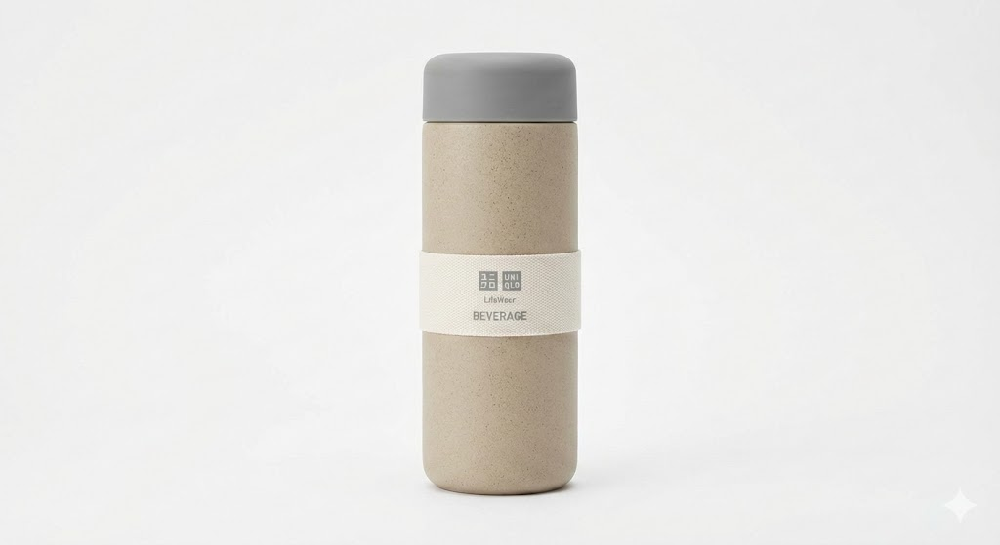

#### その他のブランドプロダクトプロンプト

**#3 Branded souvenirs collection**
ブランドお土産コレクションを生成。
→ 日本版：東京駅 × 限定お土産

**#4 Hi-end branded souvenirs**
ハイエンドスーベニアを生成。
→ 日本版：銀座 × プレミアムギフト

**#5 $15,000 product designer**
プロダクトデザイナー思考で高級製品を生成。
→ 日本版：伝統工芸 × 現代デザイン

**#6 Dieline-to-3D**
展開図から3Dパッケージを生成。
→ 日本版：パッケージデザイン

---

### 🎨 カテゴリ2：ブランドアイデンティティ（5種類）

ロゴ、カラー、ビジュアルを含む**ブランドガイドライン一式**を生成。

#### プロンプト7：30秒で$1,000相当のブランドキット

```
Create a complete brand kit for [BRAND NAME] in the [INDUSTRY] industry.
Include: logo variations, color palette with hex codes, typography suggestions,
key visual mockups. Clean presentation layout, professional design document style.
```

**日本版置き換え例：**
- `[BRAND NAME]` → 和菓子「花月」
- `[INDUSTRY]` → traditional Japanese sweets

**▼ 実際に生成した画像：和菓子店のブランドキット**

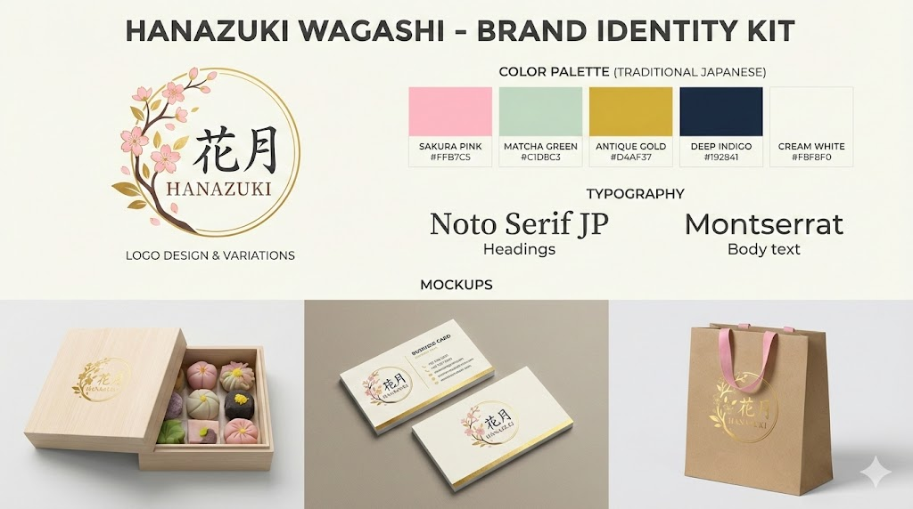

#### プロンプト8：スイスデザイン風ジオメトリックロゴ

```
Reimagine the [BRAND NAME] logo in Swiss design style.
Strict geometric shapes, grid-based composition, minimalist approach,
monochrome or limited color palette. Clean vector aesthetic, high resolution.
```

**日本版置き換え例：**
- `[BRAND NAME]` → TOYOTA → トヨタのロゴをスイスデザイン風に

**▼ 実際に生成した画像：TOYOTA × スイスデザイン**

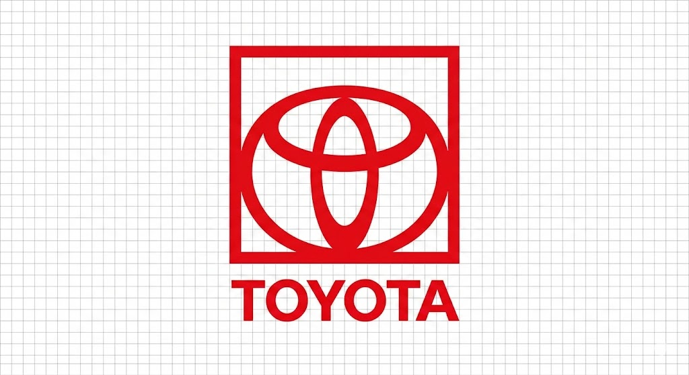

#### その他のブランドアイデンティティプロンプト

**#9 Brand mood board**
ブランドのムードボードを生成。
→ 日本版：カフェのブランドムード

**#10 Social media kit**
SNS素材一式を生成。
→ 日本版：インスタ投稿テンプレート

**#11 Business card design**
名刺デザインを生成。
→ 日本版：和モダンな名刺

---

### 🔮 カテゴリ3：3Dオブジェクト（5種類）

リアルな質感の3Dオブジェクトを生成。メタリック、ワックス、ステッカーボムなど。

#### プロンプト16：ステッカーボム3Dロゴ（人気No.1）

```
A hyper-realistic 3D physical object shaped like the [BRAND NAME] logo,
soft studio lighting. The logo is sticker-bombed, covered in a chaotic
collage of colorful vibrant stickers. Sticker style: Y2K aesthetic,
anime stickers, pop culture references. High quality render, 4k.
```

**日本版置き換え例：**
- `[BRAND NAME]` → SONY
- sticker style → Japanese anime stickers, kawaii elements, Akihabara vibes

**▼ 実際に生成した画像：SONY × ステッカーボム**

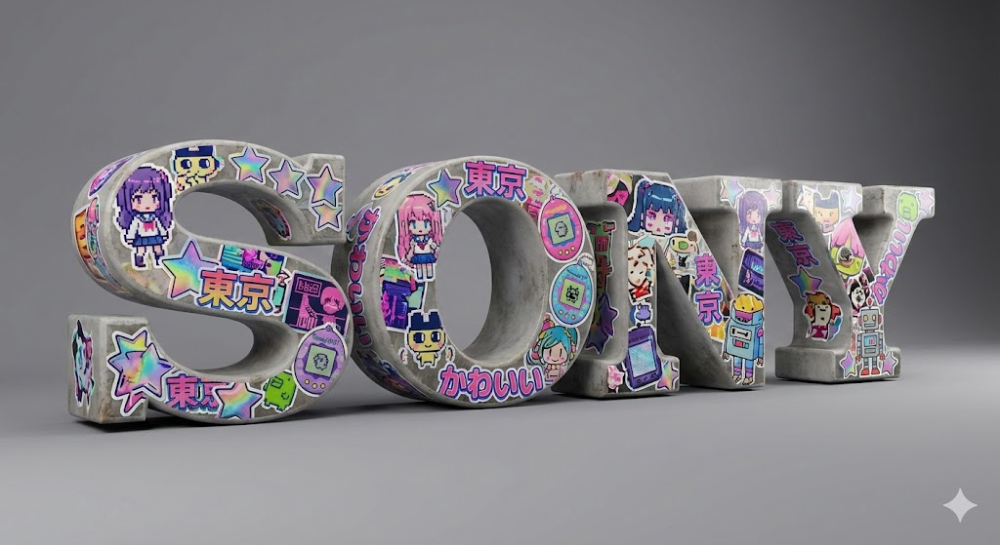

#### その他の3Dプロンプト

**#12 Dark metallic logos**
重厚感のあるメタリックロゴを生成。
→ 日本版：楽天のメタリックロゴ

**#13 Wax seal logos**
蝋封印風の高級感あるロゴを生成。
→ 日本版：老舗和菓子の封印

**#14 Logo retexturing**
2分でロゴのテクスチャを変更。
→ 日本版：ブランドロゴの質感変更

**#15 Branded grillz**
ヒップホップ系アクセサリーを生成。
→ 日本版：ストリートブランド

---

### 🖼️ カテゴリ4：ポスター＆イラスト（9種類）

グラフィックデザインの最高峰。1プロンプトでプロ級ポスターを生成。

#### プロンプト20：2000年代Gorillaz風キャラクター

```
Create a character illustration in early 2000's Gorillaz art style.
[CHARACTER DESCRIPTION]. Flat colors, bold outlines, urban aesthetic,
slightly surreal proportions, hip-hop influenced fashion.
Album cover quality, high resolution.
```

**日本版置き換え例：**
- `[CHARACTER DESCRIPTION]` → Japanese DJ with headphones, streetwear fashion

**▼ 実際に生成した画像：Gorillaz風日本人DJ**

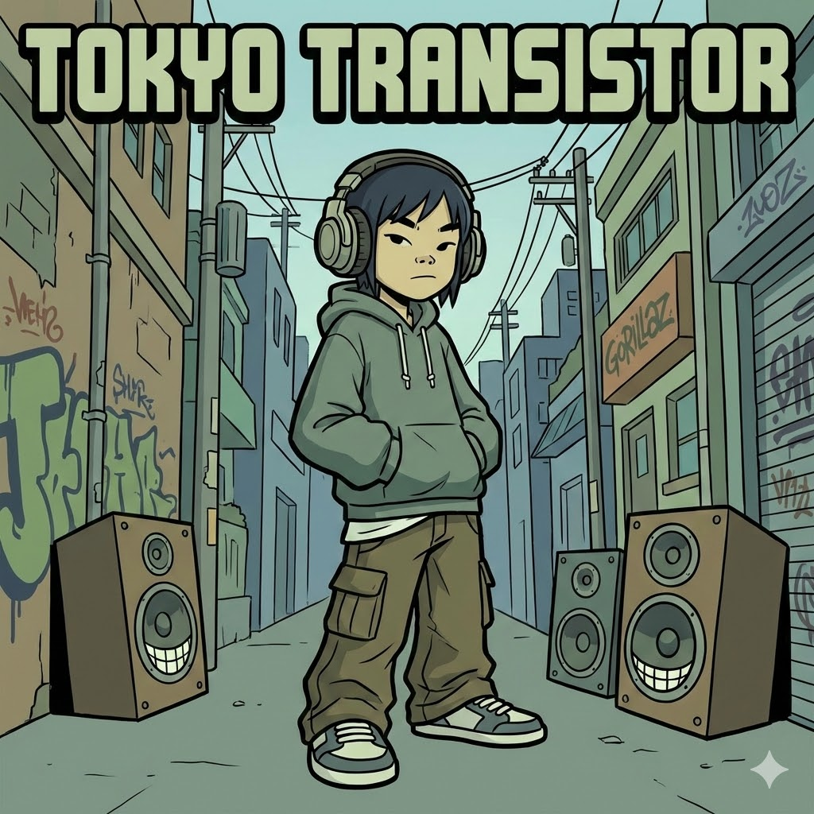

#### プロンプト23：非対称グリッドポスター

```
[BRAND NAME]. Act as a graphic design creative director constructing
a highly structured "Campaign Visual Identity Grid."

COMPOSITION: 2-column asymmetric grid layout.
Left column: bold typography with brand name.
Right column: product photography or key visual.
Color palette: brand colors with high contrast accents.
```

**日本版置き換え例：**
- `[BRAND NAME]` → サントリー → サントリーのキャンペーンポスター

#### その他のポスタープロンプト

**#17 Retro Japanese poster**
昭和レトロポスターを生成。
→ 日本版：純喫茶の看板

**#18 Risograph style print**
リソグラフ風プリントを生成。
→ 日本版：音楽イベントフライヤー

**#19 Brutalist typography**
ブルータリズムスタイルを生成。
→ 日本版：建築事務所ポスター

**#21 Vaporwave aesthetic**
ヴェイパーウェイブスタイルを生成。
→ 日本版：90年代リバイバル

**#22 Isometric illustration**
アイソメトリック図解を生成。
→ 日本版：オフィス紹介図解

---

### 🎯 カテゴリ5：アイコン（4種類）

プレゼン、SNS、Webデザイン用のカスタムアイコンを無限生成。

#### プロンプト26：Notion風ミニマリストアイコン

```
A single, isolated Notion-style minimalist illustration representing [CONCEPT].
Simple line art, warm beige/cream color palette, hand-drawn feel,
clean white background. Perfect for app icons or presentation visuals.
```

**日本版置き換え例：**
- `[CONCEPT]` → 日本茶、温泉、桜、寿司、電車

**▼ 実際に生成した画像：Notion風茶道アイコン**

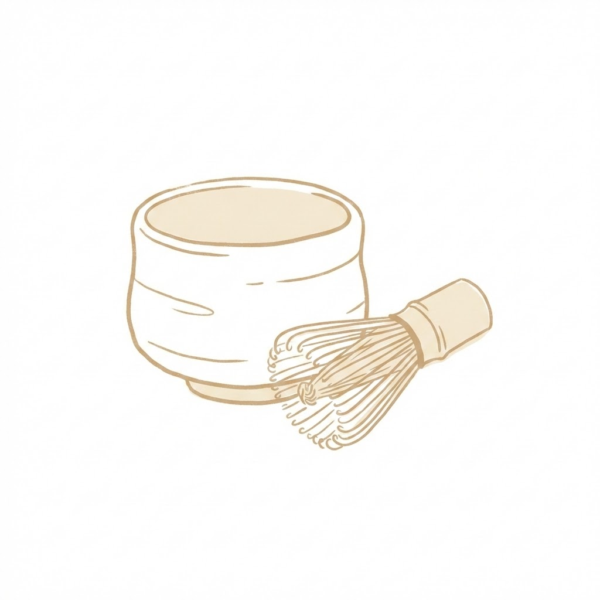

#### プロンプト29：ミニマリストキャラクターアイコン

```
A single, isolated, strict duotone flat vector icon representing
the face of [CHARACTER NAME]. FACE ONLY.
Minimal details, recognizable features only.
Clean, modern, suitable for app icons.
```

**日本版置き換え例：**
- `[CHARACTER NAME]` → 大谷翔平、宮崎駿キャラ、ピカチュウ

#### その他のアイコンプロンプト

**#27 Glassmorphism icons**
ガラス質感アイコンを生成。
→ 日本版：アプリUI

**#28 3D clay icons**
クレイ風3Dアイコンを生成。
→ 日本版：ゲームUI

---

### 📱 カテゴリ6：モックアップ（7種類）

実際の製品にブランドを適用したビジュアルを生成。

#### プロンプト35：クロスブランドスニーカーコラボ（AIが自動マッチング）

```
Creative design workflow for [BRAND NAME]:
1. Understand the brand's core identity
2. Automatically select a relevant sports brand for collaboration
3. Design a sneaker product that merges both brand aesthetics
4. Render in high-end product photography style

Output: A premium sneaker collaboration visual.
```

**日本版置き換え例：**
- `[BRAND NAME]` → 任天堂 → AIが「任天堂×Nike」のコラボスニーカーを自動デザイン

**▼ 実際に生成した画像：任天堂 × スポーツブランド スニーカー**

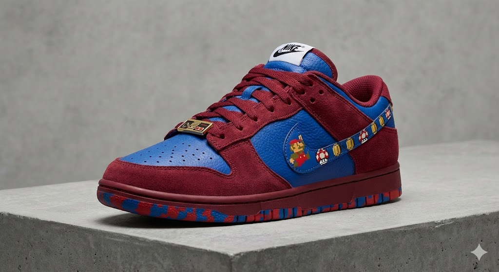

**このプロンプトが面白いのは：**
- AIがブランドの本質を理解
- 相性の良いスポーツブランドを**自動選定**
- コラボ商品をデザイン

#### その他のモックアッププロンプト

**#30 iPhone mockup**
スマホ画面モックを生成。
→ 日本版：アプリ紹介

**#31 Billboard mockup**
屋外広告モックを生成。
→ 日本版：渋谷スクランブル交差点

**#32 Magazine spread**
雑誌見開きを生成。
→ 日本版：ファッション誌風

**#33 T-shirt mockup**
Tシャツモックを生成。
→ 日本版：バンドTシャツ

**#34 Packaging mockup**
パッケージモックを生成。
→ 日本版：お菓子のパッケージ

---

### 👕 カテゴリ7：アパレル＆ファッション（8種類）

触感が伝わるような質感のファッションビジュアル。

#### プロンプト38：ハイエンドフォトキャンペーン

```
A high-end fashion photo campaign for [BRAND NAME].
Model wearing brand-inspired clothing, editorial photography style,
dramatic lighting, luxury magazine aesthetic.
Shot on medium format camera, 4k quality.
```

**日本版置き換え例：**
- `[BRAND NAME]` → コムデギャルソン → ギャルソン風のエディトリアルファッション写真

#### プロンプト44：ブランドがサッカークラブだったら

```
If [BRAND NAME] was a football/soccer club:
Design their official home jersey, incorporating brand colors,
logo adaptation for sports context, sponsor placement.
Professional sports photography, stadium background.
```

**日本版置き換え例：**
- `[BRAND NAME]` → 楽天、ソフトバンク、トヨタ → 日本企業がサッカークラブだった場合のユニフォーム

#### その他のアパレルプロンプト

**#36 Streetwear lookbook**
ストリートウェアを生成。
→ 日本版：原宿スタイル

**#37 Luxury accessories**
高級アクセサリーを生成。
→ 日本版：和柄ジュエリー

**#39 Sneaker design**
スニーカーデザインを生成。
→ 日本版：日本限定モデル

**#40 Bag collection**
バッグコレクションを生成。
→ 日本版：通勤バッグ

**#41 Watch design**
時計デザインを生成。
→ 日本版：和時計モダン

---

### ✒️ カテゴリ8：タイポグラフィデザイン（6種類）

フォント、レターマーク、タイポグラフィポスターのデザイン。

#### プロンプト50：スイスデザインタイポグラフィックポスター

```
A minimalist Swiss Design poster for the work entitled "[TITLE]".

Ascetic, legible, bold sans-serif typography.
Clean neutral background with strict grid-based composition.
Title is the dominant element.

A large frosted semi-translucent glass overlay partially covers
the typography, creating subtle distortion and depth.

Monochrome or muted sophisticated tones.
Soft studio lighting emphasizing texture.
```

**日本版置き換え例：**
- `[TITLE]` → 「禅」「侘寂」「一期一会」

**▼ 実際に生成した画像：スイスデザイン × 「禅」**

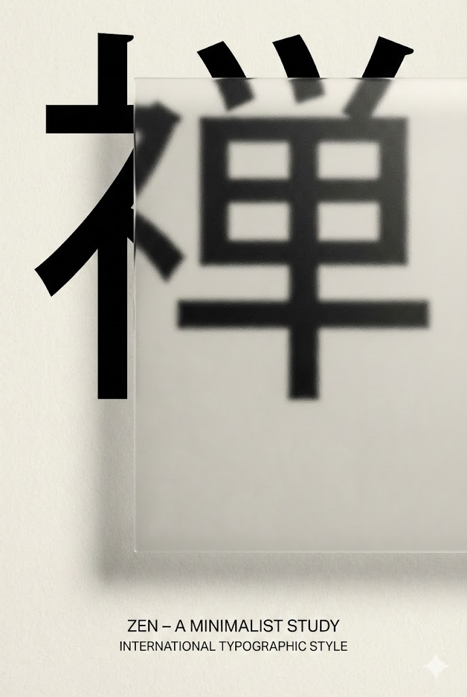

#### その他のタイポグラフィプロンプト

**#45 Custom lettermark**
レターマークを生成。
→ 日本版：会社ロゴ

**#46 3D typography**
3D文字を生成。
→ 日本版：イベントロゴ

**#47 Kinetic typography**
動的タイポグラフィを生成。
→ 日本版：MV用テキスト

**#48 Neon sign**
ネオンサインを生成。
→ 日本版：居酒屋看板

**#49 Graffiti style**
グラフィティスタイルを生成。
→ 日本版：ストリートアート

---

## プロンプト活用の3つのコツ


### コツ1：有名ブランドで試してからオリジナルへ

最初は「Nike」「Apple」「Starbucks」など、AIが理解しやすい有名ブランドで試しましょう。

理想の出力が得られたら、自分のブランド名に置き換えます。

### コツ2：思考モードを必ずON

NanoBanana Proの「思考モード」は**必須**です。

高速モードだと、プロンプトの細かいニュアンスが反映されません。

### コツ3：英語プロンプトのまま使う

プロンプトは**英語のまま**がベスト。

日本語に翻訳すると、構図やライティングの指示が失われることがあります。

ブランド名だけを日本語に変えて使いましょう。

---

## 今すぐ始めよう

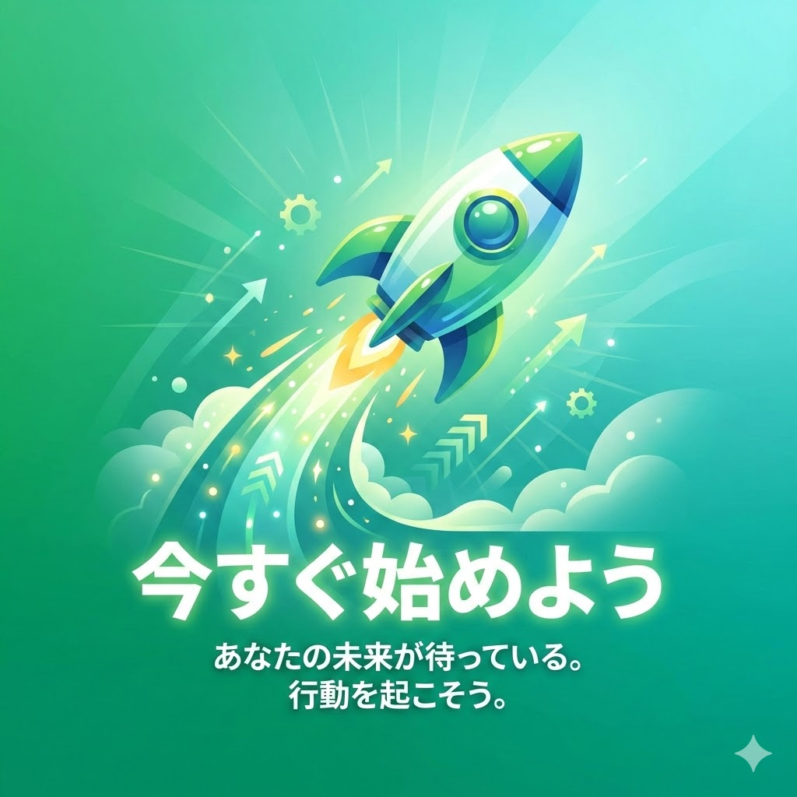

**使いたいプロンプトは見つかりましたか？**

今すぐ試してみましょう：

1. **[gemini.google.com](https://gemini.google.com) にアクセス**
2. **思考モードをON**
3. **お気に入りのプロンプトをコピペ**
4. **[BRAND NAME]を好きなブランドに変更**
5. **生成！**

---

## まとめ

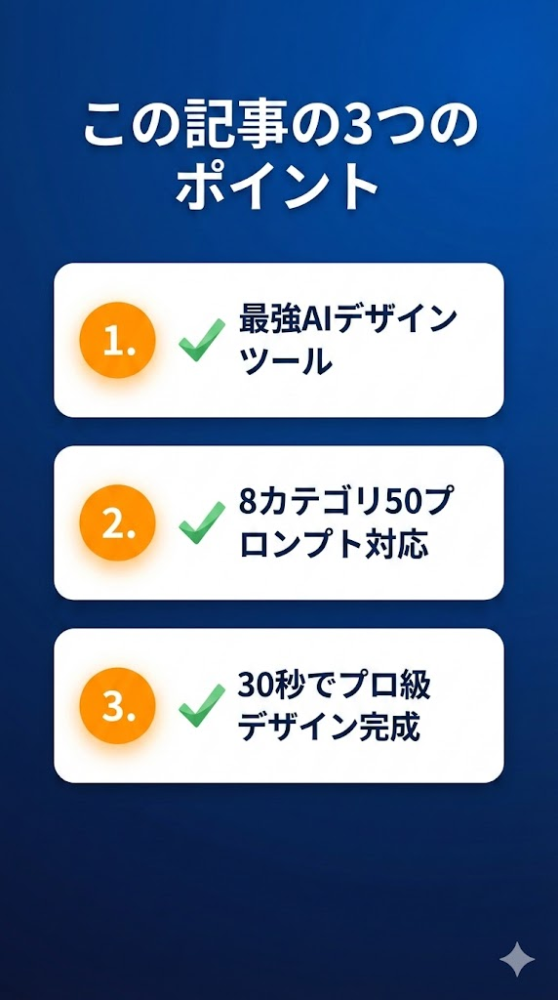

この記事では、NanoBanana Proで使える**最強プロンプト50選**を紹介しました。

**8つのカテゴリ：**

1. ブランドプロダクト（6種類）
2. ブランドアイデンティティ（5種類）
3. 3Dオブジェクト（5種類）
4. ポスター＆イラスト（9種類）
5. アイコン（4種類）
6. モックアップ（7種類）
7. アパレル＆ファッション（8種類）
8. タイポグラフィデザイン（6種類）

**すべて無料で使えます。**

プロのデザイン思考が詰まったプロンプトをコピペして、ブランド名を変えるだけ。

今日からあなたもプロ級のビジュアルを作れるようになります。

---

**この記事は「保存版」です。**

必要なときにすぐ見返せるよう、ブックマークしておくことをおすすめします。

---

**「スキ」と「シェア」もお待ちしています！**

同じ悩みを持つクリエイター仲間に、この記事を届けてもらえると嬉しいです。

---

*NanoBanana ProはGoogleが提供するGeminiの画像生成機能です*
