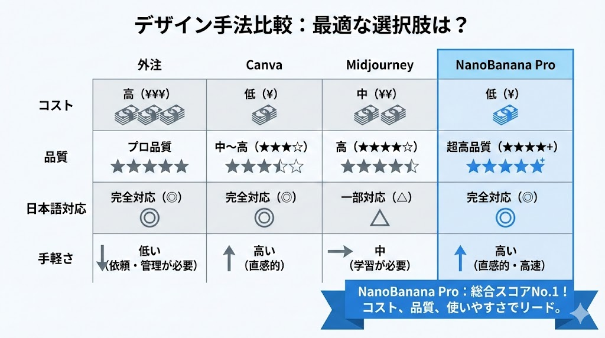
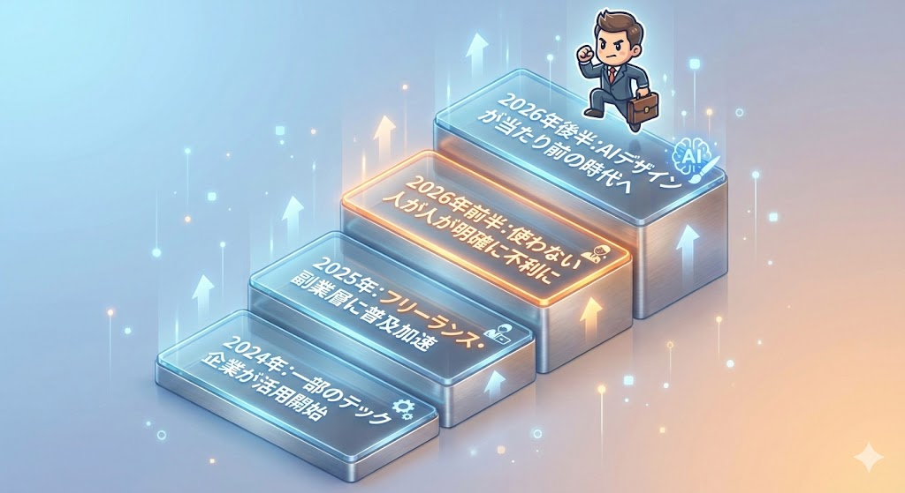
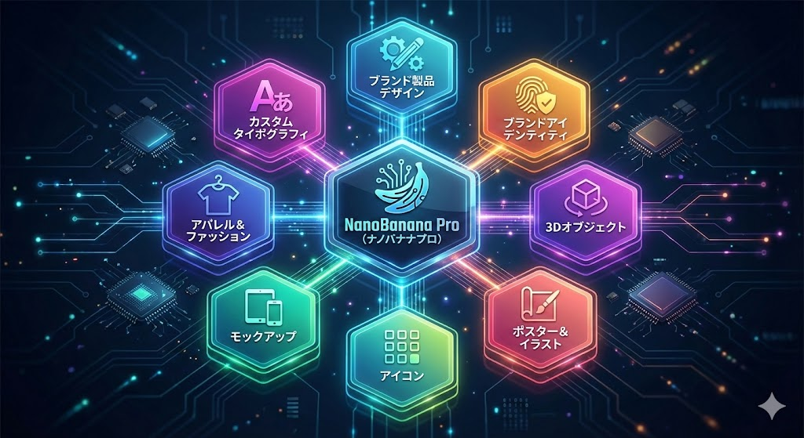
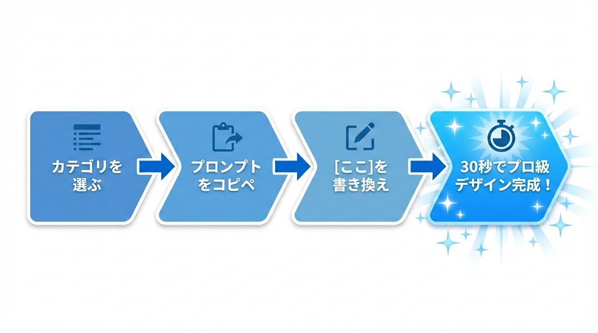
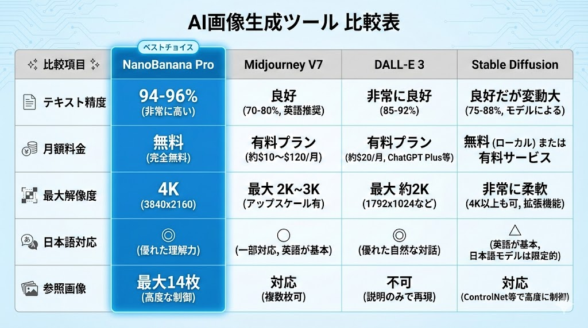
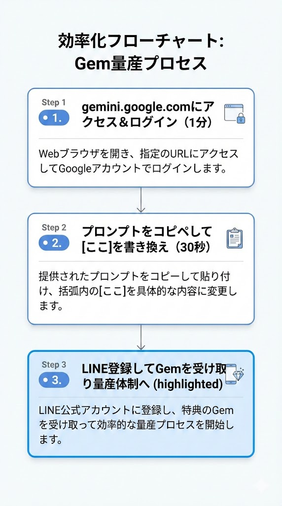
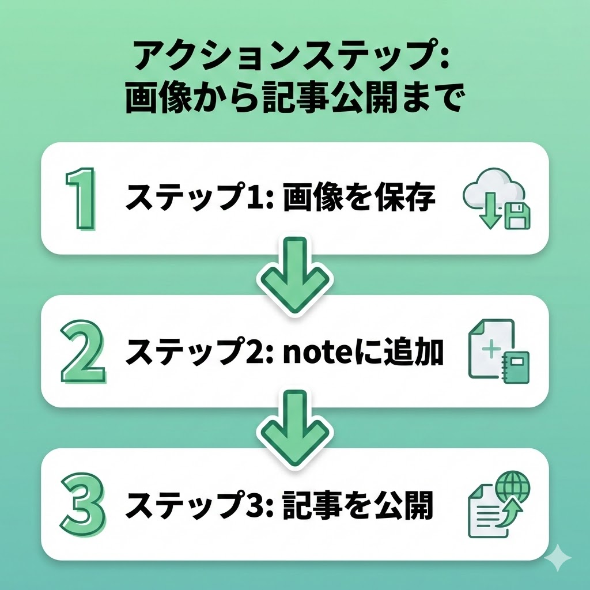
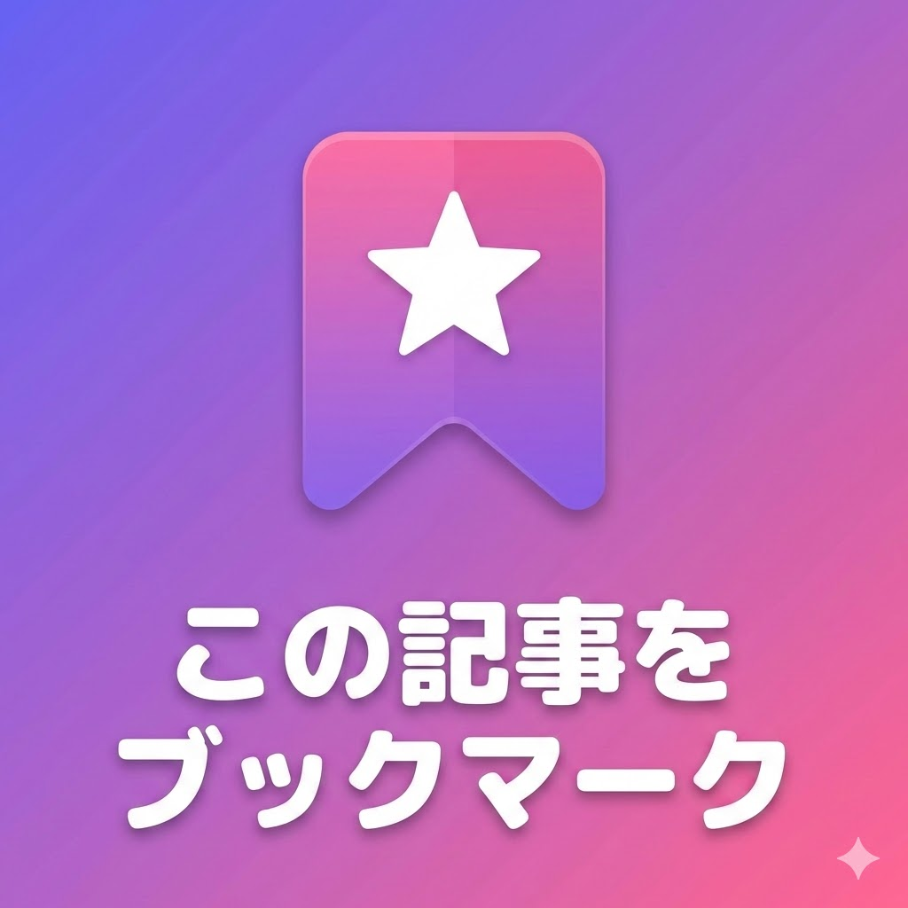
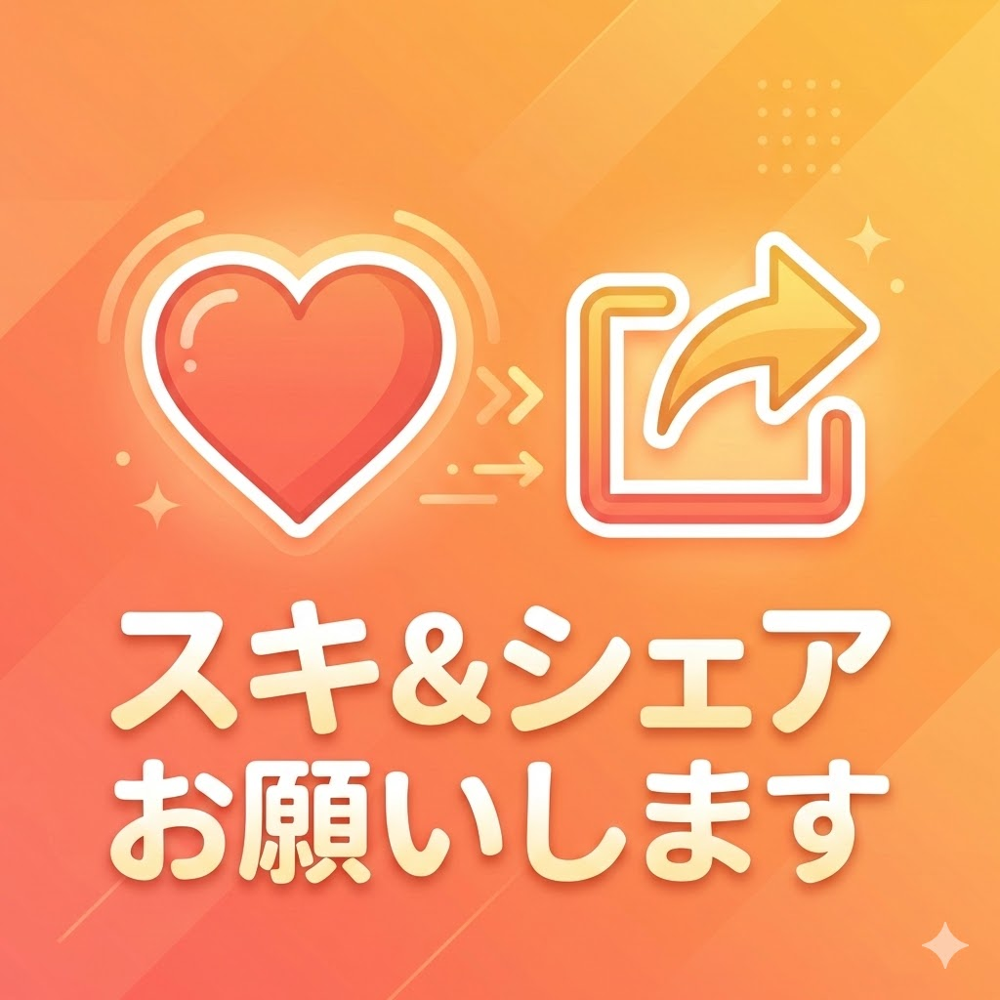

# 【保存版】元ワーナー・ミュージックのデザイナーが公開した50のAI画像プロンプト集｜NanoBanana Pro完全活用ガイド


「AIで画像を作りたいけど、どう指示すればいいかわからない...」
「プロンプトの書き方がわからなくて、思い通りの画像が出ない...」
「センスがないから、AIを使ってもダサい画像しか作れない...」

そんな悩みを持つあなたに、**とんでもない朗報**があります。

**Warner Music、PepsiCo、Spotifyで10年以上クリエイティブディレクターを務めたデザイナーが、プロ級の画像を生成するプロンプト50個を無料公開しました。**

しかも、これらのプロンプトはGoogleの無料AI画像生成機能「NanoBanana Pro」でそのまま使えます。

この記事では、その50プロンプトを**日本語解説付き**で完全網羅。

**コピペするだけで、プロ級のブランドデザインが作れるようになります。**

---

## プロンプトを公開したのは誰？


このプロンプト集を公開したのは、**Amir Mušić（アミール・ムシッチ）氏**。

10年以上のキャリアを持つデザイナー・クリエイティブディレクターで、以下の世界的企業でブランディングや広告を担当してきました：

- **Warner Music**（ワーナーミュージック）
- **PepsiCo**（ペプシコ）
- **Spotify**（スポティファイ）

そんなプロ中のプロが、**AIと自身の経験を組み合わせて作り上げた「再現可能な」プロンプト集**を無料で公開しています。



**なぜ価値があるのか？**

普通のAIプロンプトは「なんとなく良い画像」を生成するだけ。

しかしAmir氏のプロンプトは、**プロのデザイン原則（構図、ライティング、テクスチャ、タイポグラフィ）がすべて組み込まれています。**

つまり、**プロンプトをコピペするだけで、プロの思考回路でデザインされた画像が手に入る**のです。

---

## NanoBanana Proとは？（3分で始められる）


これらのプロンプトを使うには、**NanoBanana Pro**が必要です。

NanoBanana Proは、GoogleのAIアシスタント「Gemini」に搭載された**完全無料のAI画像生成機能**。



### NanoBanana Proの5つの特徴

| 特徴 | 詳細 |
|------|------|
| **完全無料** | Googleアカウントがあれば追加料金なし |
| **日本語OK** | プロンプトを日本語で書いてもOK |
| **日本語テキスト生成** | 思考モードで画像内の日本語も美しく |
| **ブラウザだけで完結** | アプリ不要、PCでもスマホでも |
| **商用利用可能** | 副業・ビジネスに使用OK |

### 3ステップで始める

1. **[gemini.google.com](https://gemini.google.com) にアクセス**
2. **Googleアカウントでログイン**
3. **右下で「思考モード」に切り替え**

**これで準備完了。所要時間は約3分です。**

---

## 【カテゴリ別】50プロンプト完全ガイド


ここからが本題。

Amir氏が公開した50のプロンプトを、**8つのカテゴリ別**に解説します。

各プロンプトは `[BRAND NAME]` の部分を好きなブランド名に変えるだけで使えます。

---

### 📦 カテゴリ1：ブランドプロダクト（#1〜#6）

ブランドの世界観を反映した製品コンセプトを生成。既存ブランドの「もしもこんな商品があったら？」を可視化します。



| # | プロンプト名 | 用途 |
|---|-------------|------|
| 1 | Creative product concepts | 意外性のあるハイエンド製品コンセプト |
| 2 | Premium beverage by [any brand] | 非飲料ブランドの飲料商品化 |
| 3 | Branded souvenirs (capsule collection) | ブランドのお土産コレクション |
| 4 | Branded souvenirs (creative concepts) | ハイエンドブランドスーベニア |
| 5 | Creative product designer prompt | $15,000相当のプロダクトデザイナー起用 |
| 6 | Dieline-to-3D visualization | 展開図→3Dビジュアライゼーション |

**使い方例（#2 Premium beverageの場合）:**
```
[BRAND NAME] をNikeに変えて実行
→ Nikeブランドの高級ドリンクボトルが生成される
```

---

### 🎨 カテゴリ2：ブランドアイデンティティ（#7〜#11）

ロゴ、カラー、ビジュアルを含む**ブランドガイドライン一式**を生成。リブランディングのコンセプト出しにも使えます。

| # | プロンプト名 | 用途 |
|---|-------------|------|
| 7 | Brand kit from one prompt | 30秒で$1,000相当のブランドキット |
| 8 | Swiss design logos | スイスデザイン風ジオメトリックロゴ |
| 9 | Glass logos | ガラス質感のロゴスタイライズ |
| 10 | Brand logos made with a crowd | 群衆で作るブランドロゴ（動画コンセプト） |
| 11 | Product branding workflow | 60秒以内で完結する製品ブランディング |

**#7 Brand kitは特に強力：**

1つのプロンプトで以下がすべて生成されます：
- ブランド基本ドキュメント
- キービジュアル
- カラーパレット
- モックアップ一式

---

### 🔮 カテゴリ3：3Dオブジェクト（#12〜#16）

リアルな質感の3Dオブジェクトを生成。メタリック、ワックス、ステッカーボムなど様々なテクスチャに対応。

| # | プロンプト名 | 用途 |
|---|-------------|------|
| 12 | Dark metallic logos | ダークメタリック×ハイライトロゴ |
| 13 | Tactile wax seal logos | 蝋封印風の触感ロゴ |
| 14 | Logo retexturing workflow | 2分でロゴをリテクスチャ（10プロンプト付き） |
| 15 | Branded grillz design | ブランドグリルズ（装飾歯）デザイン |
| 16 | Sticker-bombed 3D logos | ステッカーボムされた3Dロゴ |

**#16 Sticker-bombed 3D logosの実際のプロンプト：**
```
A hyper-realistic 3D physical object shaped like the [INSERT BRAND NAME] logo,
soft studio lighting. The logo is sticker-bombed, covered in a chaotic collage
of colorful vibrant stickers. Sticker style: Y2K aesthetic...
```

---

### 🖼️ カテゴリ4：ポスター＆イラスト（#17〜#25）

グラフィックデザインの最高峰。プロ級のポスターやイラストを1プロンプトで生成。



| # | プロンプト名 | 用途 |
|---|-------------|------|
| 17 | Photo grid tribute poster | フォトグリッドのトリビュートポスター |
| 18 | Modern sport poster design | モダンスポーツポスター |
| 19 | Mixed media collage | ミクストメディアコラージュ |
| 20 | 2000's style characters (Gorillaz vibed) | Gorillaz風2000年代キャラクター |
| 21 | Pro character sketch | 人物→プロスケッチ変換（60秒） |
| 22 | Urban photo-collage caricature | アーバンフォトコラージュ風カリカチュア |
| 23 | Grid poster design | 非対称グリッドポスター |
| 24 | Movie poster (8 images input) | 8枚の画像からハリウッド級ポスター |
| 25 | Christmas branded gifts tree | ブランドギフトで作るクリスマスツリー |

**#20 Gorillaz風キャラクターは特に人気：**

2000年代のGorillaz（ゴリラズ）のアートスタイルを再現。バンドやクリエイター向けのアートワークに最適です。

---

### 🎯 カテゴリ5：アイコン（#26〜#29）

プレゼン、SNS、Webデザイン用のカスタムアイコンを無限生成。

| # | プロンプト名 | 用途 |
|---|-------------|------|
| 26 | Notion-styled icons (pt. 1) | Notion風ミニマリストイラスト |
| 27 | Notion-styled icons (pt. 2 - halftoned) | ハーフトーン加工のNotion風ポートレート |
| 28 | Custom branded sticker pack | カスタムブランドステッカーパック |
| 29 | Minimalist characters icons | ミニマリストキャラクターアイコン |

**#26-27 Notion-styled iconsの活用法：**
- Notionページの見出しアイコン
- ブログのカテゴリアイコン
- プレゼン資料のビジュアル
- SNSプロフィール画像

---

### 📱 カテゴリ6：モックアップ（#30〜#36）

実際の製品にブランドを適用したビジュアルを生成。バッグ、スニーカー、パッケージなど。



| # | プロンプト名 | 用途 |
|---|-------------|------|
| 30 | Duffle mockup | ダッフルバッグモックアップ |
| 31 | Fast food leather bag | ファストフードブランドのレザーバッグ |
| 32 | Branded crumpled stickers | くしゃくしゃステッカーモックアップ |
| 33 | Premium beverage package design | プレミアム飲料パッケージデザイン |
| 34 | Hyper-minimal product mockup | ハイパーミニマル製品モックアップ |
| 35 | Cross brand sneaker collab | クロスブランドスニーカーコラボ |
| 36 | Branded passport cover | ブランドパスポートカバー |

**#35 Cross brand sneaker collabが面白い：**

プロンプトに `[BRAND NAME]` を入れるだけで：
1. AIがブランドの本質を理解
2. 相性の良いスポーツブランドを自動選定
3. コラボ商品をデザイン
4. ハイエンドなビジュアルショットを生成

---

### 👕 カテゴリ7：アパレル＆ファッション（#37〜#44）

触感が伝わるような質感と、ハイエンドなレンダリングのファッションビジュアル。

| # | プロンプト名 | 用途 |
|---|-------------|------|
| 37 | Premium sport jersey | プレミアムスポーツジャージ |
| 38 | Photo campaign for any brand | ブランドのフォトキャンペーン |
| 39 | Hypebeast showroom | ハイプビースト風ショールーム |
| 40 | Cross-branded winter outerwear | クロスブランドウィンターウェア |
| 41 | Crocs x {any brand} collab design | Crocs×任意ブランドのコラボ |
| 42 | Style factory workflow | 5ステップスタイルファクトリー |
| 43 | Branded boxing gloves | カスタムブランドボクシンググローブ |
| 44 | Brands as sport clubs | ブランドがサッカークラブだったら |

**#42 Style factory workflowの手順：**
1. Geminiアプリを開く
2. 自分の写真をアップロード
3. ベースプロンプトを入力
4. [BRACKETS]内の服・色を変更
5. 生成→繰り返し

---

### ✒️ カテゴリ8：タイポグラフィデザイン（#45〜#50）

フォント、レターマーク、オートタイポグラフィのデザイン。



| # | プロンプト名 | 用途 |
|---|-------------|------|
| 45 | Calligraphic monogram | カリグラフィックモノグラム |
| 46 | American retro-lettering | アメリカンレトロレタリング |
| 47 | Frame by frame text animation | フレームバイフレームテキストアニメ |
| 48 | Embossed logos / text | エンボス加工ロゴ/テキスト |
| 49 | Retro-typographic rebranding | 19世紀風リブランディング |
| 50 | Swiss design typographic poster | スイスデザインタイポグラフィックポスター |

**#50 Swiss design posterの完全プロンプト：**

```
A minimalist Swiss Design poster for the work entitled "[TITLE]".

The design is defined by an ascetic, legible, and bold sans-serif typography,
laid out on a clean, neutral background with a strict, grid-based composition.
The title is the dominant typographic element, rendered in a strong, clean font.

A large, frosted, semi-translucent glass overlay, like a textured panel or
a thick lens, partially covers the typography and the background, acting as
the primary view magnet. This glass element creates a subtle distortion,
refraction, or blurring effect on the text and shapes beneath it, adding
depth and a tactile quality.

The color palette is monochrome or strictly limited to muted, sophisticated tones.
The overall aesthetic is clean, intellectual, and highly organized, with soft
studio lighting emphasizing the texture of the glass and the paper. Additional,
smaller typographic elements (like a subtitle, date, or author's name, relevant
to the work) are placed with precision around the main title.
```

---

## プロンプトの使い方：3つのポイント


これらのプロンプトを最大限活用するためのコツをお伝えします。

### ポイント1：[BRAND NAME]を具体的に

`[BRAND NAME]` を変更する際は、**有名ブランド**を入れるとAIが世界観を理解しやすくなります。

- ❌ 「私のお店」
- ⭕ 「Nike」「Apple」「Starbucks」

自分のブランドで使う場合は、まず有名ブランドで試して理想形を確認してから、自社ブランドに置き換えましょう。

### ポイント2：思考モードを必ずON

NanoBanana Proの「思考モード」は**必須**です。

高速モードだと、プロンプトの細かいニュアンス（テクスチャ、ライティング、構図）が反映されにくくなります。

### ポイント3：英語プロンプトのまま使う

Amir氏のプロンプトは**英語のまま使う**のがベスト。

NanoBanana Proは英語プロンプトの精度が最も高く、プロが設計した構成をそのまま反映できます。

---

## 今すぐ始めよう




**ここまで読んで、使いたいプロンプトは見つかりましたか？**

今すぐ試してみましょう：

1. **[gemini.google.com](https://gemini.google.com) にアクセス**
2. **思考モードをON**
3. **お気に入りのプロンプトをコピペ**
4. **[BRAND NAME]を好きなブランドに変更**
5. **生成！**

**所要時間：約3分**

---

## まとめ


この記事では、元ワーナー・ミュージックのデザイナーAmir Mušić氏が公開した**50のAI画像プロンプト**を完全解説しました。

**8つのカテゴリ：**
1. ブランドプロダクト（#1〜#6）
2. ブランドアイデンティティ（#7〜#11）
3. 3Dオブジェクト（#12〜#16）
4. ポスター＆イラスト（#17〜#25）
5. アイコン（#26〜#29）
6. モックアップ（#30〜#36）
7. アパレル＆ファッション（#37〜#44）
8. タイポグラフィデザイン（#45〜#50）

**これらすべてが、NanoBanana Pro（完全無料）で使えます。**

プロのデザイン思考が詰まったプロンプトをコピペするだけで、あなたも今日からプロ級のビジュアルを作れるようになります。

---



**この記事は「保存版」です。**

必要なときにすぐ見返せるよう、ブックマークしておくことをおすすめします。

---



**「スキ」と「シェア」もお待ちしています！**

同じ悩みを持つクリエイター仲間に、この記事を届けてもらえると嬉しいです。

---

*この記事で紹介したプロンプトの出典：Amir Mušić氏（@AmirMushich）のXポスト*
*NanoBanana ProはGoogleが提供するGeminiの画像生成機能です*
