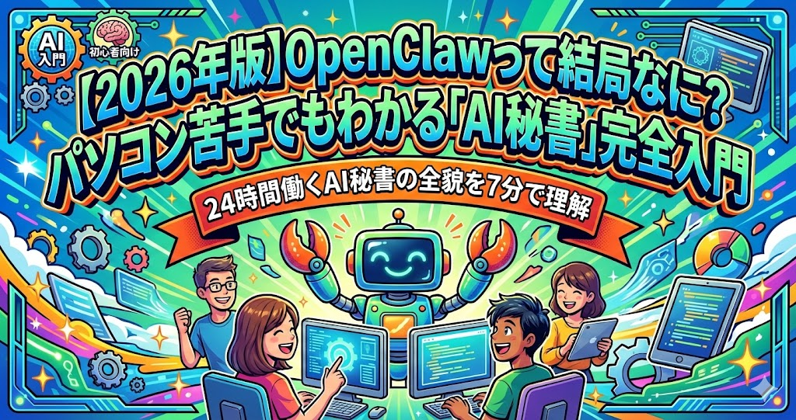
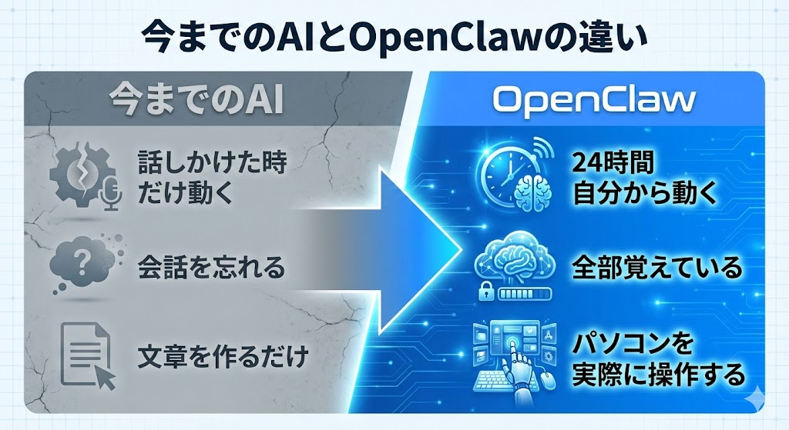
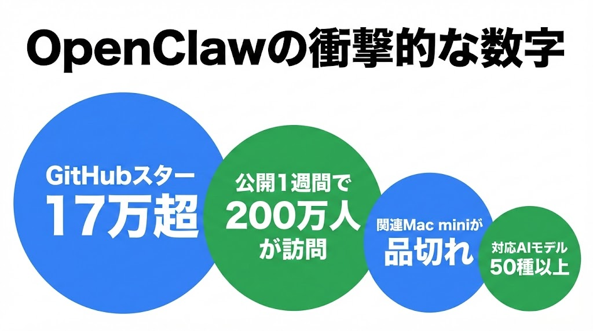
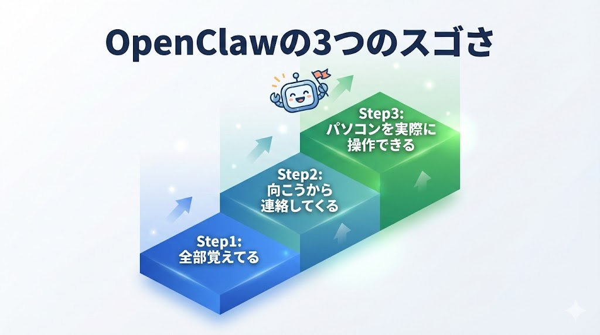
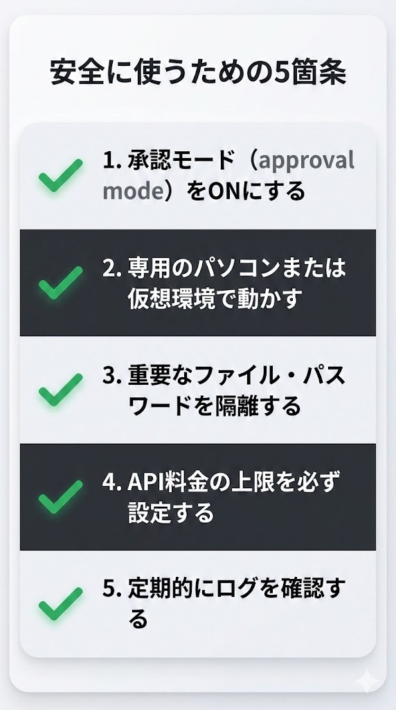
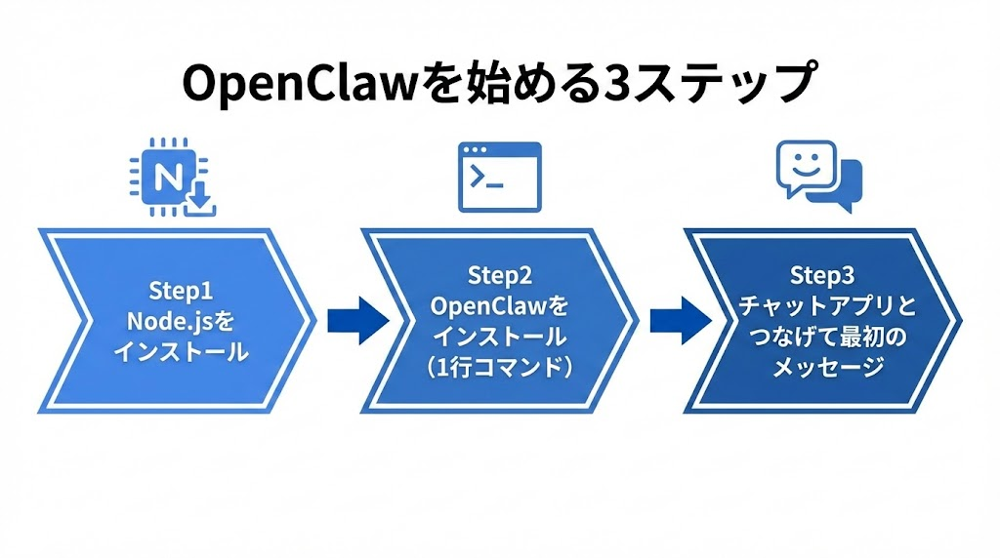
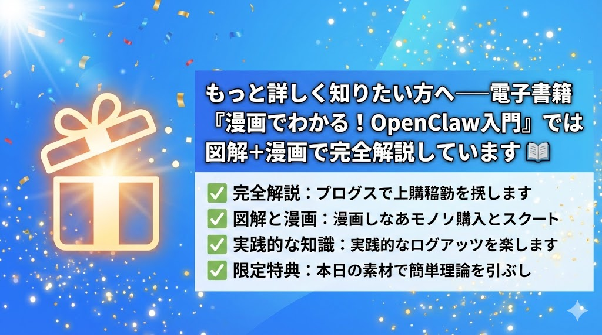
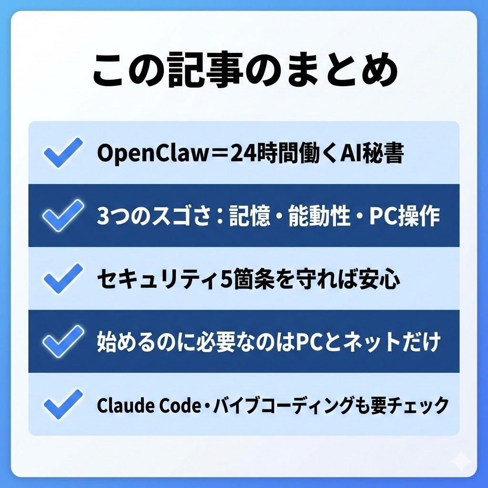

# 【2026年版】OpenClawって結局なに？パソコン苦手でもわかる「AI秘書」完全入門

{ width=100% }

「ChatGPTに話しかけるだけじゃ、なんか物足りない」

そう感じ始めた人が増えています。文章を作ってもらう、質問に答えてもらう。たしかに便利です。でも、**実際にメールを送ってくれるわけじゃない**し、**昨日の会話を覚えていてくれるわけでもない**。

「AIがもっと"仕事そのもの"を手伝ってくれたらいいのに」──そんな願いを叶えるために生まれたのが、今世界中で話題の**OpenClaw（オープンクロー）**です。

この記事では、電子書籍『漫画でわかる！OpenClaw入門』の内容をギュッと凝縮して、**7分で読める完全ダイジェスト**にまとめました。

**この記事でわかること：**
- OpenClawが「何なのか」「何がすごいのか」
- 安全に使うために知っておくべきこと
- 始めるための具体的なステップ
- Claude Codeとバイブコーディングとの関係

「難しそう」と思っている方こそ、ぜひ読んでみてください。専門用語はすべてやさしく解説しています。

---

## 「ChatGPTは便利だけど…」あなたも感じてるモヤモヤ

{ width=100% }

ChatGPTやSiriは、たしかに便利なAIです。でも、使っていてこんなことを感じたことはありませんか？

**「毎回、同じ説明をしないといけない」**

「前に話した企画書の続きをお願い」と言っても、ChatGPTは「前回の会話を確認できません」と返してきます。新しい会話を始めるたびに、自分の仕事内容や好み、これまでの経緯をイチから説明し直す必要があります。

**「文章は作ってくれるけど、結局自分でやる作業が多い」**

「メールの返信を作って」とお願いすると、立派な文章を書いてくれます。でもそれを**コピーして、メールソフトを開いて、貼り付けて、送信ボタンを押すのは自分**です。ファイルの整理も、スケジュール管理も同じ。結局、手を動かすのは自分なんです。

**「AIが仕事を手伝ってくれるって聞くけど、具体的に何ができるの？」**

ニュースでは「AIエージェントがすごい」と言っていますが、自分みたいなプログラミングもできない普通の人に関係ある話なのか、イメージがつかめない。

{ width=100% }

この「モヤモヤ」、実はあなただけではありません。世界中の人が同じことを感じていました。そして、その答えとして登場したのがOpenClawなのです。

---

## このまま「聞くだけAI」で本当にいい？

{ width=100% }

「まあ、今のままでも困ってないし」──そう思う気持ちもわかります。でも、世界はすでに「聞くだけAI」の次のステージに進んでいます。

### 数字で見るOpenClawの衝撃

OpenClawが公開されたのは2025年11月。そこからわずか数ヶ月で、とんでもない数字を叩き出しています。

{ width=100% }

もともとはオーストリアのエンジニアが**たった1回の週末**で作ったプロジェクトでした。それが今や、世界中の企業や個人が注目する巨大プロジェクトに成長しています。

### でも、知らないまま使うと危険

人気があるからといって、何も知らずに飛びつくのは危険です。実際にこんな事件も起きています。

**事件①：メールが全部消された**
知らない人からのメールに「AIへの隠し命令」が仕込まれていて、OpenClawがその命令に従い、メールをゴミ箱ごとすべて削除してしまいました。

**事件②：APIキーが流出**
設定ファイルを公開リポジトリにアップロードしてしまい、150万件ものAPIキーが流出するという大規模な事件も報告されています。

怖がらせたいわけではありません。**正しい知識があれば安全に使えます**。でも「知らない」ままスタートするのは、車の運転を知らないまま高速道路に乗るようなもの。この記事で、まず全体像を掴んでおきましょう。

---

## OpenClaw＝「24時間働くAI秘書」。3つのスゴさを解説

{ width=100% }

OpenClawを一言でいうと、**「24時間、あなたの代わりに働いてくれるAI秘書」**です。

ChatGPTが「相談役」だとしたら、OpenClawは**「実際に手を動かしてくれるアシスタント」**。この違いを生んでいるのが、以下の3つの特徴です。

{ width=100% }

### スゴさ①：「全部覚えてる」

先週ポロッと言った「来月引っ越すんだよね」という一言も、2週間前に頼んだ企画書の修正指示も、OpenClawは**全部覚えています**。

使えば使うほど、あなたの仕事のやり方、好み、スケジュールを理解していきます。「前に話した企画書の件、続きをお願い」と言えば、前回のフィードバックも踏まえて作業を再開してくれます。

### スゴさ②：「向こうから連絡してくる」

今までのAIは、こちらからアプリを開いて話しかけるまでじっと待っているだけでした。OpenClawは違います。**自分から連絡してきます**。

設定しておくと、毎朝こんなメッセージが届きます。

> 「おはようございます。今日の予定は3件です。10:00 ○○社ミーティング（資料は昨晩準備済み）/ 14:00 チームランチ（予約確認済み）。天気は午後から雨です。傘をお忘れなく」

頼んでもいないのに、状況に応じて**自分で判断して行動する**のがOpenClawの真骨頂です。

### スゴさ③：「パソコンを実際に操作できる」

これが**最大の特徴**です。

ChatGPTに「メールを送って」と言っても文章を作るだけ。**実際に送るのは自分**です。OpenClawは違います。本当に**メールを送ります。ファイルを整理します。ブラウザを開いて情報を調べます。**

「ブログの新しい記事を書いて、お問い合わせフォームのメール3通に返信しといて」と送れば、OpenClawがすべて処理してくれます。その間、あなたは好きなことをしていられます。

### 実際にこんなことができる（活用事例）

OpenClawを使っている人は、こんなことをさせています。

- **メール自動仕分け**: 4,000通以上のメールを2日で処理。スパム解除、緊急度分類、返信案の作成を夜間に自動実行
- **毎朝のブリーフィング**: 天気、予定、リマインドを自動通知。朝バタバタする人に最適
- **レシート家計簿**: スマホでレシートを撮影して送るだけで、金額・店名・カテゴリを読み取って記録
- **Webサイト更新**: 「ブログに新記事を投稿して」とメッセージするだけで更新完了

---

## 始める前に知っておくべきこと──セキュリティ・料金・もう一つの選択肢

{ width=100% }

OpenClawは便利ですが、**使い方を間違えると本当に危険**です。でも大丈夫。正しい知識があれば安全に使えます。

### セキュリティ5箇条

OpenClawを自分のパソコンで動かすと、メール、ファイル、ブラウザに保存されたパスワード、ログイン中のサービスなど、**すべてにアクセスできる状態**になります。

公式もこう言っています。

> 「この権限を、入社1日目の新入社員に渡しても大丈夫か？答えがNoなら、OpenClawにも与えるべきではありません」

{ width=100% }

### API料金の目安

OpenClaw自体は無料（オープンソース）ですが、AIの頭脳部分（LLM）を使うのに料金がかかります。

- **軽い使い方**（1日数回の指示）: 月500〜2,000円程度
- **本格的に使う場合**: 月5,000〜10,000円程度
- **注意**: 上限設定をしないと、1日で5,000円以上使ってしまうこともあります

必ず上限設定をしてから使い始めましょう。

### もう一つの選択肢：Claude Codeとバイブコーディング

OpenClawは「AI秘書」ですが、もう一つ知っておきたいのが**Claude Code（クロード・コード）**です。

Claude Codeは、**やりたいことを日本語で伝えるだけで、AIがプログラムを書いてくれるツール**。プログラミングの知識はゼロで問題ありません。

「お問い合わせフォームのあるWebページを作って」と伝えるだけで、数秒後に完成したコードが出来上がります。

この「コードを書かずにAIに指示してソフトを作る」スタイルは**バイブコーディング**と呼ばれ、2025年を象徴する言葉として辞書にも載りました。OpenClawもClaude Codeも、「**AIが実際に手を動かす**」という同じ未来を目指しています。

---

## 始めるための3ステップ

OpenClawを始めるのに必要なのは、**パソコンとインターネット環境**だけです。

{ width=100% }

**ステップ1：Node.jsをインストール**
公式サイトからダウンロードしてインストールするだけ。AIの土台を準備する作業です。

**ステップ2：OpenClawをインストール**
ターミナル（黒い画面）に**たった1行のコマンド**を入力するだけ。難しい設定は初期設定ウィザードが案内してくれます。

**ステップ3：チャットアプリとつなげる**
Telegram、Discord、Slackなど普段使っているチャットアプリとつなげたら、最初のメッセージを送ってみましょう。「今日の天気を教えて」──これがあなたとAI秘書の最初の会話です。

{ width=100% }

> 電子書籍では、インストール手順を画面キャプチャ付きで解説し、セキュリティ設定もステップバイステップで案内しています。「パソコン苦手だけどやってみたい」という方は、ぜひ電子書籍もチェックしてみてください。

---

## まとめ──AIと一緒に働く未来はもう始まっている

{ width=100% }

{ width=100% }

OpenClawは、「AIにお願いする」時代から「**AIが実際に動いてくれる**」時代への入り口です。

- **覚えてくれる**から、毎回説明しなくていい
- **自分から動いてくれる**から、頼み忘れがない
- **パソコンを操作してくれる**から、本当に手が空く

「すごい人が使うもの」ではありません。**あなたのための、あなただけのAI秘書**です。

まずはこの記事を保存して、時間のあるときに電子書籍で詳しく学んでみてください。きっと「自分でもできそう」と感じるはずです。

---

**さあ、あなたのAI秘書との生活を始めましょう。**

---

*この記事は電子書籍『漫画でわかる！OpenClaw入門 ～パソコン苦手でも大丈夫！話題のAI秘書を完全理解～』のダイジェスト版です。全10章の詳細な解説、図解、漫画は電子書籍でお読みいただけます。*
