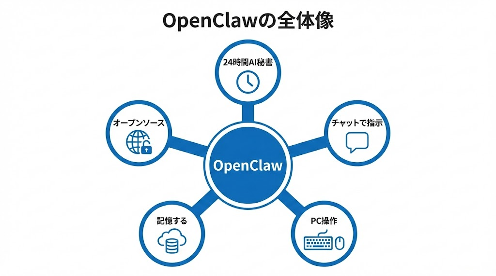
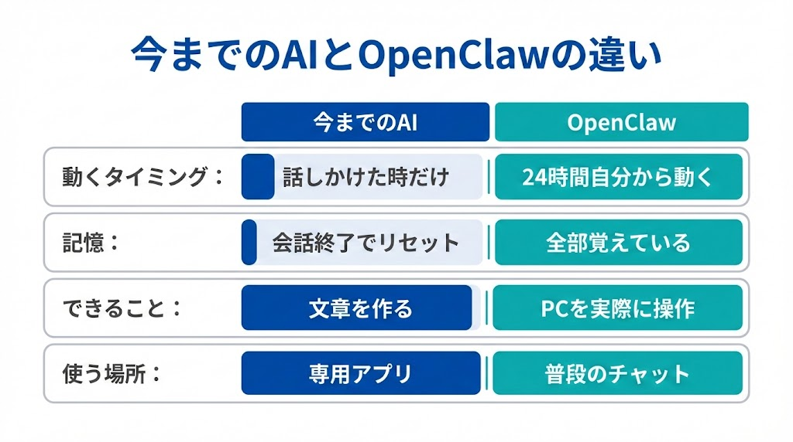
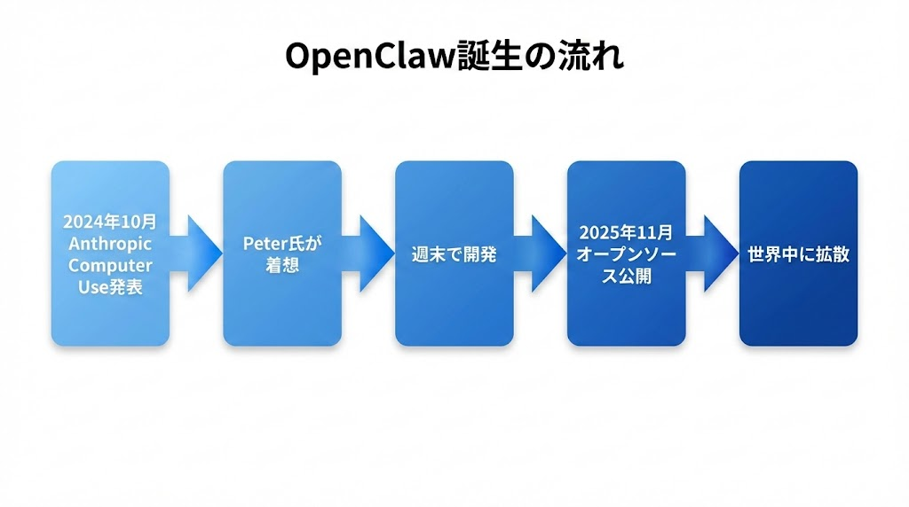
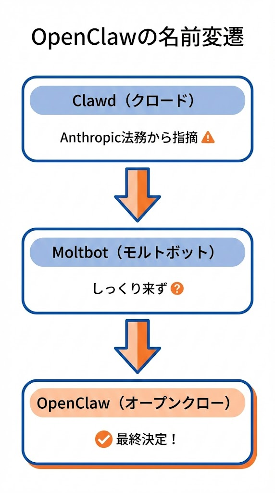
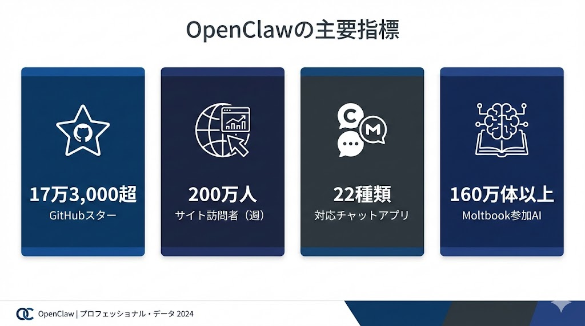
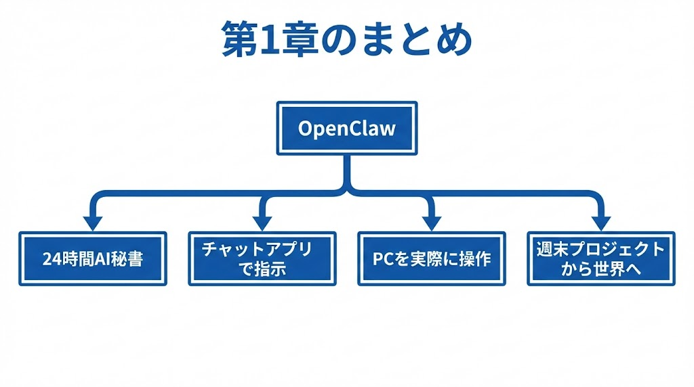

# 第1章：OpenClawってなに？

\newpage

## ～ 世界が驚いた「動くAI」の正体 ～

{ width=100% }

---

\newpage

## 1-1. 今までのAIとどう違うの？

「OpenClawって何？」と聞かれたら、こう答えるのが一番分かりやすいです。

> **24時間あなたの代わりに仕事してくれるAI秘書**

「ChatGPTと何が違うの？」と思う方も多いでしょう。ChatGPTは聞いたことに答えるだけですが、OpenClawは**実際にパソコンを操作して仕事をしてくれる**のです。

ChatGPT、Siri、Claudeなど、普段使われているAIには共通点があります。**「こちらから話しかけないと動かない」**という点です。しかも一度会話を終えると、昨日の会話内容も、あなたの仕事のやり方も忘れてしまいます。

OpenClawはここが根本的に違います。以下の図をご覧ください。

{ width=100% }

| | 今までのAI | OpenClaw |
|---|---|---|
| 動くタイミング | 話しかけた時だけ | **24時間、自分から動きます** |
| 記憶 | 会話が終わるとリセット | **全部覚えています** |
| できること | 文章を作る、質問に答える | **パソコンを実際に操作します** |
| 使う場所 | ブラウザやアプリを開く | **普段のチャットアプリ** |

たとえば、Slackで「明日のミーティング資料まとめて」と送るだけで、OpenClawはGoogleドライブの議事録と売上データを確認し、資料を作成して報告してくれます。

---

\newpage

## 1-2. OpenClawが生まれたストーリー

2024年10月、AI企業のAnthropic（アンソロピック）が**Computer Use**という技術を発表しました。AIにパソコンを操作させる技術です。

これを見たオーストリアのエンジニア、**Peter Steinberger（ピーター・シュタインバーガー）**氏が「Slackから操作できるようにしたら面白い」と思い立ち、**たった1回の週末**で最初のバージョンを完成させました。

{ width=100% }

Peter氏はPSPDFKit（ピーエスピーディーエフキット）というPDF関連企業の創業者で、もともとApple開発者コミュニティでは著名な人物でした。その彼が週末に軽い気持ちで作ったプロジェクトが、世界を巻き込む大きなムーブメントになるとは、本人も予想していませんでした。

2025年11月にオープンソースとして公開すると、あっという間に世界中に広がりました。

---

\newpage

## 1-3. 名前が3回も変わった！？

OpenClawは1週間で3回名前が変わるという前代未聞の事態を経験しています。

{ width=100% }

### 最初の名前：Clawd（クロード）

AI「Claude」の名前と「Claw（爪）」を掛け合わせた造語です。ロブスターのハサミ（claw）にちなんでいました。しかしAnthropicの法務チームから「名前が似すぎている」と連絡が入り、改名を余儀なくされました。

### 2番目の名前：Moltbot（モルトボット）

「Molt」はロブスターの脱皮を意味します。「新しい殻に着替えた」というユーモアを込めた名前でしたが、これもしっくり来ませんでした。

### 最終的な名前：OpenClaw（オープンクロー）

「Open（オープン）」＋「Claw（爪・ハサミ）」。オープンソースであることとロブスターのアイデンティティを両立させた名前に落ち着きました。ロブスターは成長するために何度も殻を脱ぎます。名前が変わったのも、成長の証と言えるかもしれません。

```
2025年11月     → Clawd 誕生
2026年1月27日  → Moltbot に改名
2026年1月30日  → OpenClaw に改名（最終決定）
```

---

\newpage

## 1-4. 数字で見るOpenClawの衝撃

OpenClawの広がりを数字で整理すると、次のようになります。

{ width=100% }

| 指標 | 数字 | 補足 |
|---|---|---|
| **GitHubスター数** | 17万3,000以上 | プログラマーの「いいね！」にあたります。歴史的な速度で増加しています |
| **サイト訪問者** | 1週間で200万人 | 公式サイトへのアクセス数です |
| **対応チャットアプリ** | 22種類以上 | Discord、Slack、Telegram、WhatsApp、LINEなどに対応しています |
| **Moltbook参加AI** | 160万体以上 | AIだけが暮らすSNSです（第8章で詳しく解説します） |

さらに、OpenClawの影響でAppleのMac miniがアメリカのBest Buy（家電量販店）で売り切れる事態も発生しました。24時間AIを動かすためにMac miniを購入する人が殺到したためです（実際には月5ドルのサーバーで十分ですが、このエピソードがブームの大きさを物語っています）。

IT企業CloudflareがOpenClaw対応を発表した際には、株価にも影響が出ました。

---

### 第1章のまとめ

{ width=100% }

| ポイント | 内容 |
|---|---|
| ① | OpenClawは「24時間働くAI秘書」です |
| ② | 普段のチャットアプリから指示するだけで動きます |
| ③ | パソコンを実際に操作できます（ここが革命的です） |
| ④ | 週末プロジェクトから始まり、世界を席巻しました |

---

> **次の章へ → 第2章：OpenClawの3つのスゴさ**
