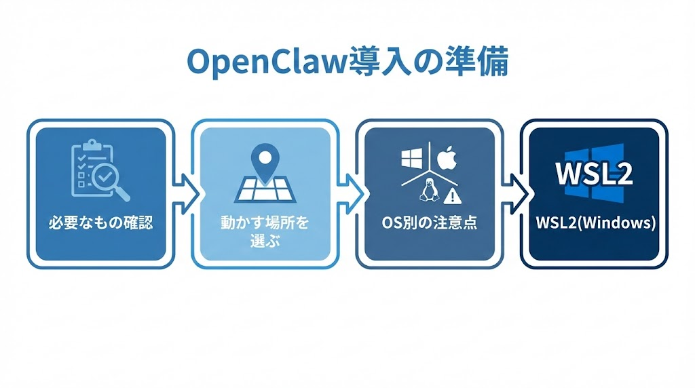
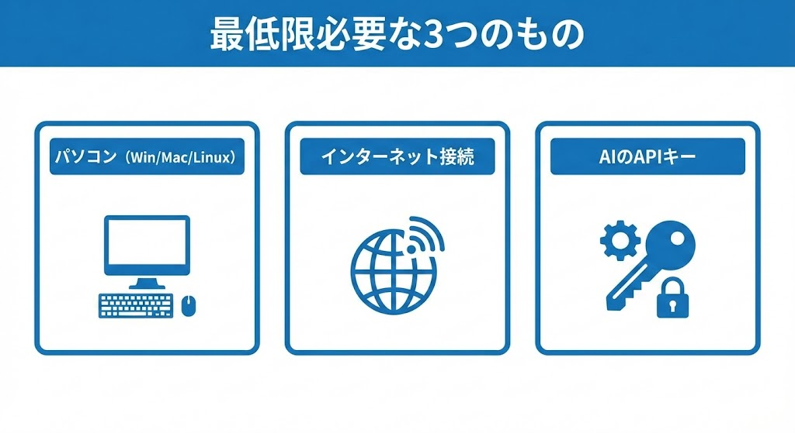
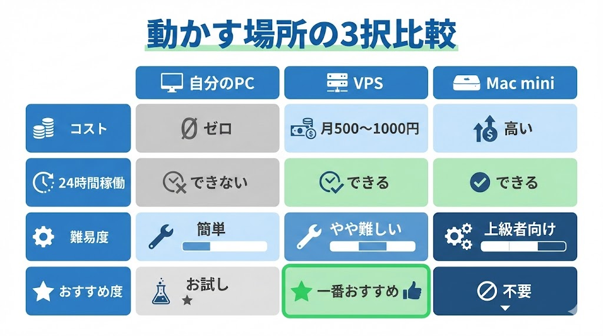
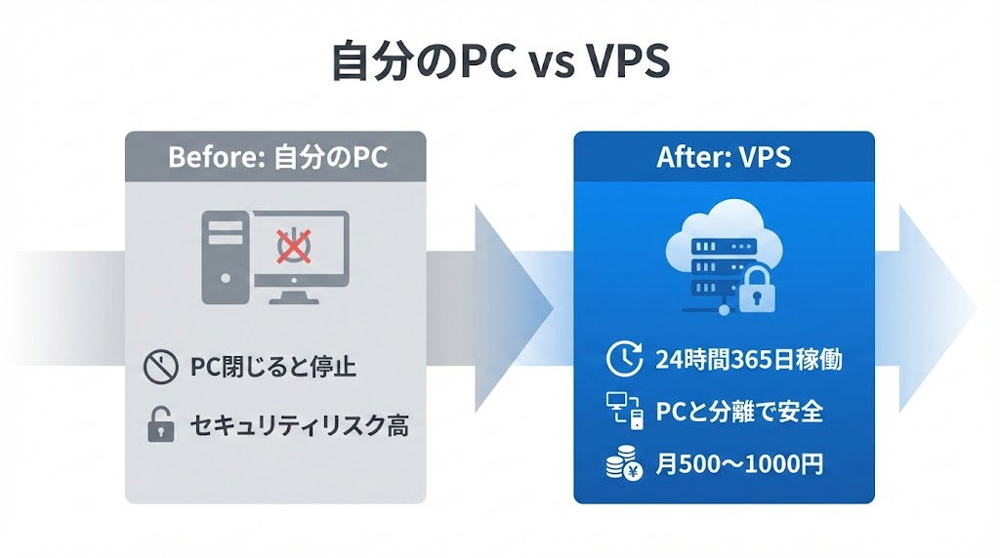
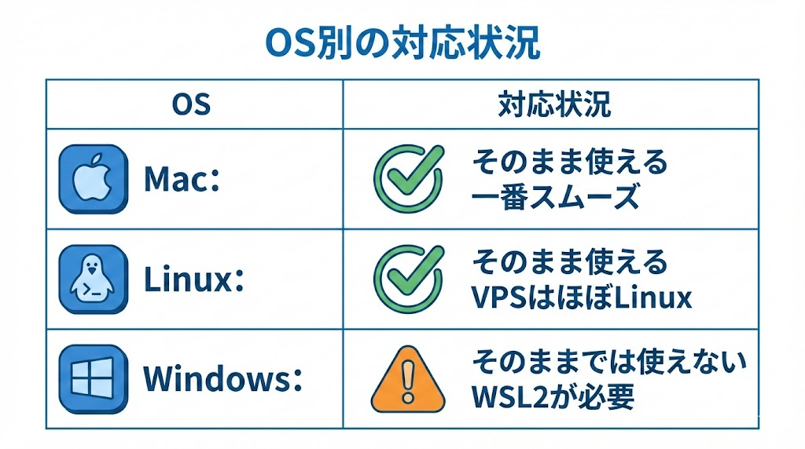
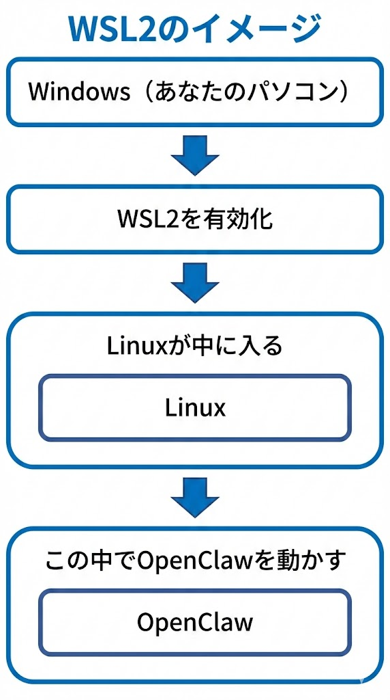
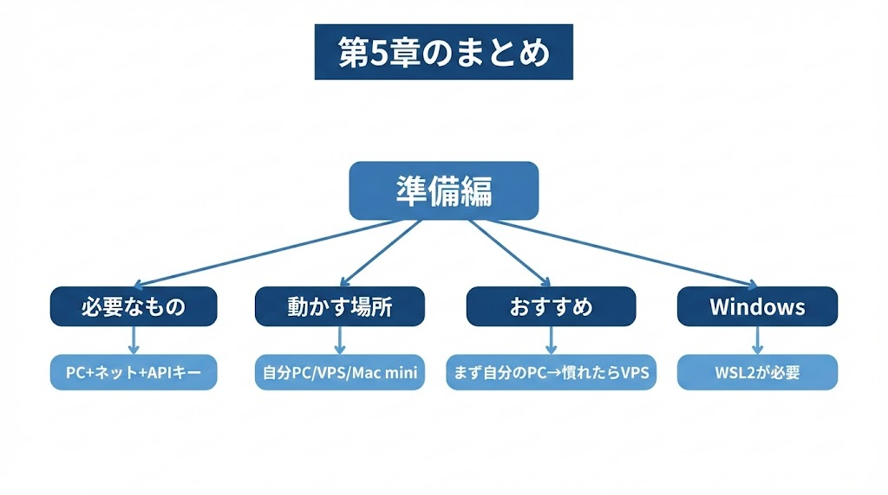

# 第5章：OpenClawをはじめよう

\newpage

## ～ 準備編 ～

{ width=100% }

---

セキュリティを理解したら、次は準備です。焦らず、まずは必要なものを確認して、どこで動かすか決めましょう。

\newpage

## 5-1. 必要なもの

OpenClawを始めるのに、特別な機材は必要ありません。

### 最低限必要なもの

{ width=100% }

| # | 必要なもの |
|---|---|
| ① | パソコン（Windows / Mac / Linux） |
| ② | インターネット接続 |
| ③ | AIのAPIキー（ClaudeまたはChatGPT等） |

### あると便利なもの

| # | あると便利 | 用途 |
|---|---|---|
| ① | スマホ | 外出先からの操作 |
| ② | チャットアプリアカウント | Telegram、Discord、Slack等 |
| ③ | クレジットカード | API利用料の支払い |

AIの頭脳はクラウド（インターネット上）にあるため、パソコン側は「司令塔」を動かすだけです。普通のスペックのパソコンで十分です。

---

\newpage

## 5-2. どこで動かす？3つの選択肢

OpenClawをどこで動かすかは、最初に決める重要なポイントです。

{ width=100% }

### 選択肢① 自分のパソコン（まず試したい人向け）

| メリット | デメリット |
|---|---|
| 追加コストゼロ | パソコンを閉じると止まります |
| すぐ始められます | 外出先から使えません |
| 設定が一番簡単です | セキュリティリスクが高いです |

**結論：** お試しならこれで十分です。本格利用するなら②に移行してください。

### 選択肢② VPS（24時間使いたい人向け）【一番おすすめ】

VPS（Virtual Private Server）とは、インターネット上にある「レンタルパソコン」です。月額料金で借りて使います。

{ width=100% }

| メリット | デメリット |
|---|---|
| 24時間365日動きます | 月額500〜1,000円程度かかります |
| どこからでもアクセスできます | 最初の設定がやや難しいです |
| 自分のPCとは分離されています（安全） | サーバーの基本知識が少し必要です |

**OpenClawの開発者も「月5ドルのVPSで十分」と言っています。** おすすめのVPSサービスはDigitalOcean、Vultr、Linodeなどです。日本のサービスでは、さくらVPSやConoHa VPSが使いやすいです。

### 選択肢③ Mac mini（上級者向け・買わなくていい）

「Mac miniが売り切れた！」と話題になりましたが、**OpenClawの開発者自身が「Mac miniは過剰投資」と警告**しています。必要なのはiMessageとの連携など、ごく特殊なケースだけです。初心者は気にしなくて大丈夫です。

まず試してみたい方は自分のパソコンで始めましょう。24時間使いたくなったらVPSに移行するのがおすすめです。

---

\newpage

## 5-3. Windows、Mac、Linuxの違い

{ width=100% }

| OS | 対応状況 | 注意点 |
|---|---|---|
| **Mac** | そのまま使えます | 一番スムーズです |
| **Linux** | そのまま使えます | VPSはほぼLinuxです |
| **Windows** | **そのままでは使えません** | WSL2の設定が必要です |

Macの方は特に心配ありません。次の章に進んでください。Windowsの方は次のセクションが重要です。

---

\newpage

## 5-4. Windowsの人は要注意！「WSL2」ってなに？

Windowsを使っている場合、OpenClawを動かす前に**WSL2**（ダブリュエスエルツー）を入れる必要があります。

### WSL2とは

**WSL2 = Windows Subsystem for Linux 2**

Windowsの中にLinux（別のOS）を入れる仕組みです。大変そうに見えますが、**コマンドを1つ打つだけ**でインストールできます。

{ width=100% }

### なぜWSL2が必要なのか

OpenClawは元々Mac/Linux向けに作られています。Windowsでそのまま動かすと様々な問題が起きるため、「Windowsの中にLinux環境を作り、その中でOpenClawを動かす」方法が推奨されています。

日本のコミュニティでも「WSL2で動かしたら問題なく動いた」という報告が多く、現時点ではこれが最も安定した方法です。次の章で具体的な手順を全部書いていますので、10分もあれば完了します。

---

### 第5章のまとめ

{ width=100% }

| ポイント | 内容 |
|---|---|
| ① | 必要なのはパソコンとネットとAPIキーだけです |
| ② | 動かす場所は3択です：自分のPC / VPS / Mac mini |
| ③ | 初心者はまず自分のPCで試し、慣れたらVPSへ移行してください |
| ④ | Mac miniは買わなくて大丈夫です |
| ⑤ | Windowsの人はWSL2が必要です |

---

> **次の章へ → 第6章：OpenClawをはじめよう ～ インストール編 ～**
