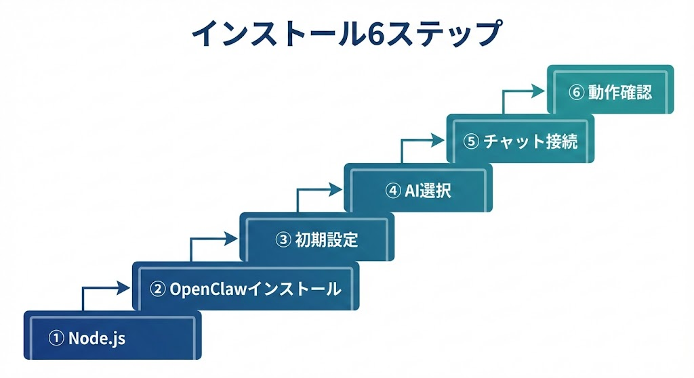
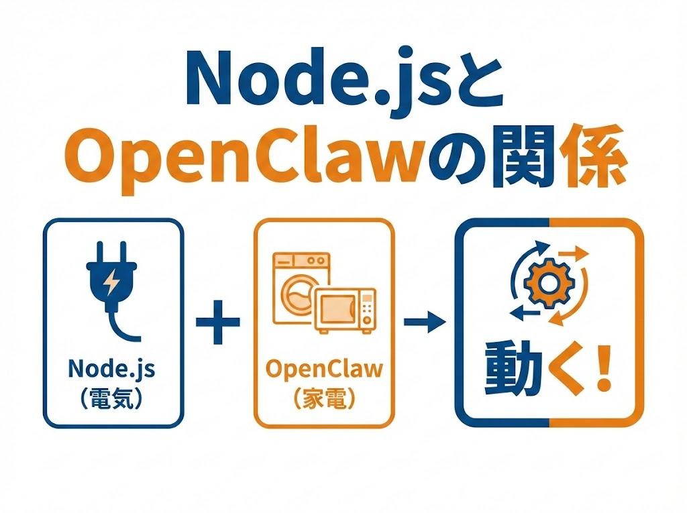
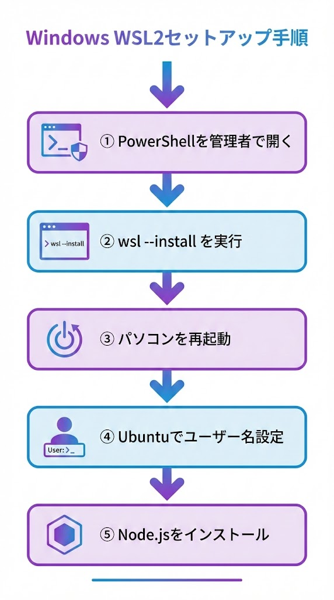
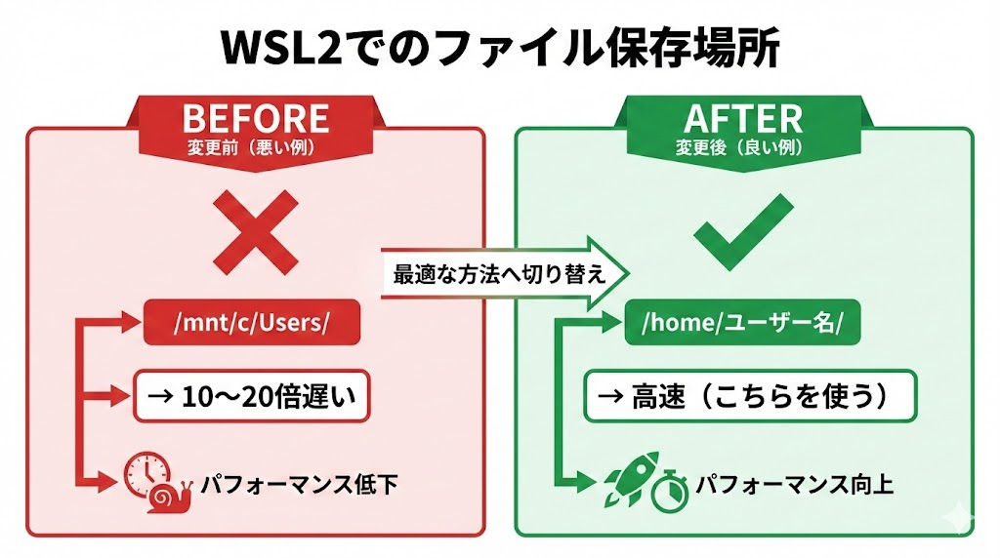
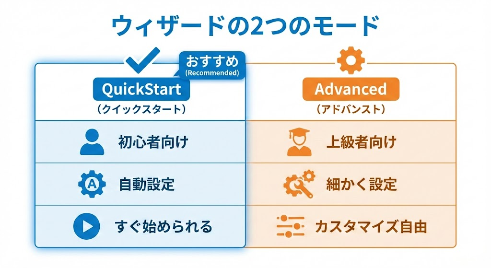
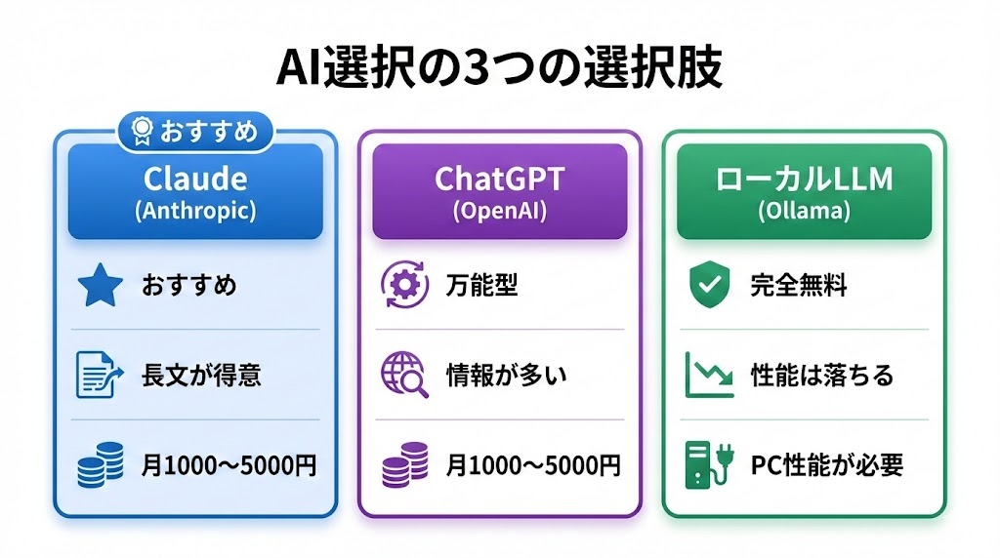
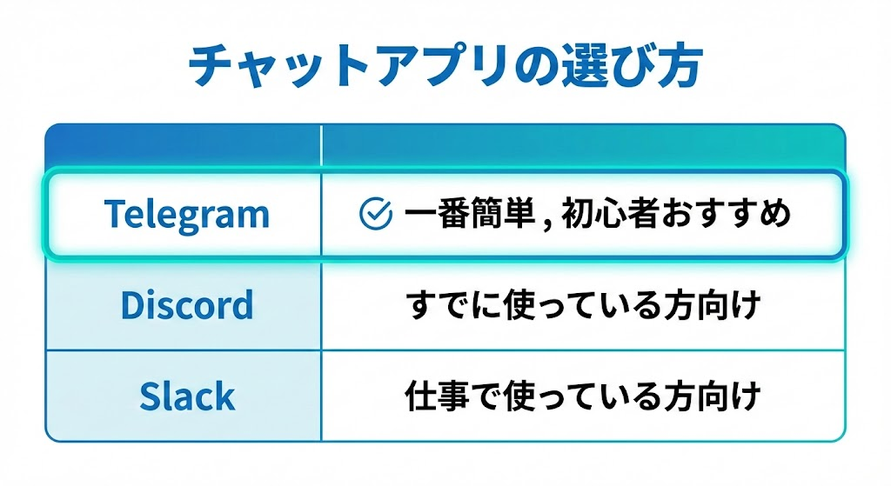
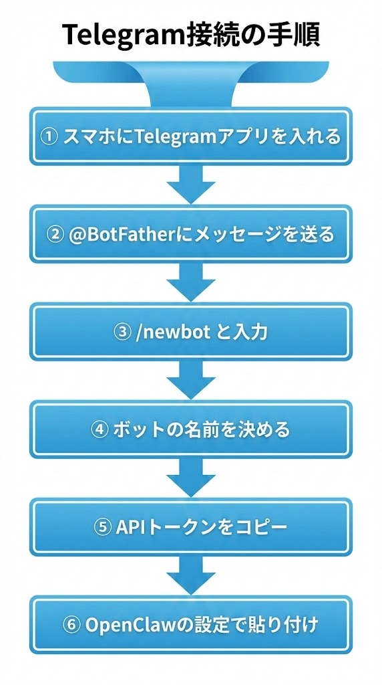
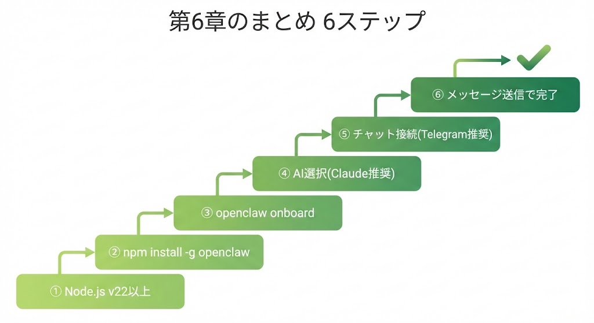

# 第6章：OpenClawをはじめよう

\newpage

## ～ インストール編 ～

{ width=100% }

---

いよいよインストールです。全部で6ステップ。1つずつやれば大丈夫です。

\newpage

## インストールの全体像

{ width=100% }

```
ステップ① Node.jsを入れる　　　（AIの土台を準備）
ステップ② OpenClawをインストール（たった1行のコマンド）
ステップ③ 初期設定ウィザード　　（質問に答えるだけ）
ステップ④ AIを選ぶ　　　　　　（Claude / ChatGPT / 無料AI）
ステップ⑤ チャットアプリと接続　（Telegram / Discord / Slack）
ステップ⑥ 最初のメッセージ！　　（動作確認）
```

---

\newpage

## 6-1. ステップ①：Node.jsを入れよう

**Node.js（ノードジェイエス）**は、OpenClawを動かすための土台となるソフトウェアです。Node.jsは「電気」、OpenClawは「家電」に相当します。家電を動かすには電気が必要なように、OpenClawにはNode.jsが必要です。

{ width=100% }

### Macの場合

ターミナルを開いて以下を入力してください。（Finder →「アプリケーション」→「ユーティリティ」→「ターミナル」）

```
node -v
```

「v22.x.x」のように表示されたら、もう入っています。次のステップへ進んでください。入っていない場合は、Node.js公式サイトからダウンロードしてインストールしてください。

### Windowsの場合（WSL2が必要）

まずWSL2を入れます。

{ width=100% }

**手順1：** 「PowerShell」を**管理者として**開いてください（スタートボタンを右クリック →「ターミナル（管理者）」）

**手順2：** 以下を入力してEnterを押してください
```
wsl --install
```

**手順3：** パソコンを再起動してください

**手順4：** 再起動後、Ubuntuが自動で開くのでユーザー名とパスワードを設定してください

**手順5：** Node.jsを入れてください（Ubuntu内で実行します）
```
sudo apt update && sudo apt upgrade -y
curl -fsSL https://deb.nodesource.com/setup_22.x | sudo -E bash -
sudo apt install -y nodejs
node -v
```

「v22.x.x」と表示されたら成功です。

「コマンドを入力」と言われてもピンと来ない方もいるかもしれません。パソコンに文字で指示を出す方法のことです。見た目は難しそうに見えますが、書いてある通りにコピー&ペーストするだけなので安心してください。

### Windowsの人への重要な注意

WSL2の中（Ubuntuの画面）では、ファイルの保存場所に注意が必要です。

{ width=100% }

```
✅ /home/あなたのユーザー名/  の中 → 速い（こちらを使ってください）
❌ /mnt/c/Users/  の中 → 10〜20倍遅い（使わないでください）
```

---

\newpage

## 6-2. ステップ②：OpenClawをインストール

Node.jsが入ったら、OpenClawのインストールは**たった1行**です。

```
npm install -g openclaw@latest
```

- `npm` = Node.jsのアプリストアのようなものです
- `install -g` = パソコン全体で使えるようにインストールします
- `openclaw@latest` = OpenClawの最新版です

数分待つとインストールが完了します。

---

\newpage

## 6-3. ステップ③：初期設定ウィザードを動かす

```
openclaw onboard --install-daemon
```

**ウィザード（設定画面）**が起動します。質問に答えていくだけで設定が完了する仕組みです。

{ width=100% }

**QuickStart** と **Advanced** の2つのモードが表示されますが、初心者は「**QuickStart**」を選んでください。

QuickStartで自動設定される内容：
- ポート番号：18789（OpenClawの住所にあたるものです）
- 認証：トークン方式
- 作業フォルダ：自動で作成されます

`--install-daemon` は「パソコン起動時にOpenClawも自動起動する」設定です。

---

\newpage

## 6-4. ステップ④：AIを選ぼう

ウィザードで、どのAI（LLM）を使うかを選びます。

{ width=100% }

### 選択肢A：Claude（Anthropic）【おすすめ】

長い文章が得意で安全性が高く、OpenClawとの相性が最も良いです。料金は使った分だけかかります（月1,000〜5,000円程度です）。

**始め方：** console.anthropic.com でアカウント作成 → APIキー発行（sk-ant-... で始まる文字列）→ ウィザードで入力してください

### 選択肢B：ChatGPT（OpenAI）

世界で最も使われているAIです。情報が多いのが強みです。

**始め方：** platform.openai.com でAPIキーを発行してください

### 選択肢C：ローカルLLM（Ollama）【無料】

完全無料で、データが外に出ません。ただし性能は有料AIより落ち、パソコンのスペックも必要です。

**始め方：** Ollamaをインストール → 好きなAIモデルをダウンロードしてください

**初心者へのおすすめ：** まずはClaudeかChatGPTで始めるのが最もスムーズです。**必ずAPI管理画面で月額上限を設定しておいてください。**

---

\newpage

## 6-5. ステップ⑤：チャットアプリとつなげよう

{ width=100% }

### Telegram（テレグラム）【一番簡単】

初心者には**Telegramが一番おすすめ**です。設定が最も簡単なためです。

{ width=100% }

1. スマホにTelegramアプリを入れてください
2. Telegramで `@BotFather` にメッセージを送ってください
3. `/newbot` と入力してください
4. ボットの名前を決めてください
5. 表示される「APIトークン」をコピーしてください
6. OpenClawの設定画面で貼り付けてください

### Discord（ディスコード）

すでにDiscordを使っている方向けです。Discord Developer Portalでアプリケーションを作成し、Botを追加してトークンを発行、自分のサーバーにBotを招待して、OpenClawの設定でトークンを入力してください。

### Slack（スラック）

仕事で使っている方向けです。api.slack.comでアプリを作成し、Socket Modeを有効化、トークンを発行してOpenClawに設定してください。

---

\newpage

## 6-6. ステップ⑥：最初のメッセージを送ってみよう！

すべての設定が終わったら、接続したチャットアプリからメッセージを送ってみましょう。

```
「こんにちは！自己紹介して」
```

OpenClawが返事をしたら、**セットアップ成功**です。

### 最初に試してみたいこと

```
「今日の日付と曜日を教えて」
「簡単な自己紹介文を作って」
「明日のToDoリストを3つ考えて」
```

最初のメッセージを送って返事が来た瞬間は、きっと感動するはずです。これが第一歩です。

---

### 第6章のまとめ

{ width=100% }

| ステップ | 内容 |
|---|---|
| ① | Node.js v22以上をインストールしてください |
| ② | `npm install -g openclaw@latest`（1行で完了します） |
| ③ | `openclaw onboard` でウィザード起動（QuickStartを選んでください） |
| ④ | AI選択 → Claude / ChatGPT / ローカルLLM |
| ⑤ | チャットアプリ接続 → Telegramが最も簡単です |
| ⑥ | メッセージを送って動作確認してください |

---

> **次の章へ → 第7章：こんなことができる！活用事例集**
