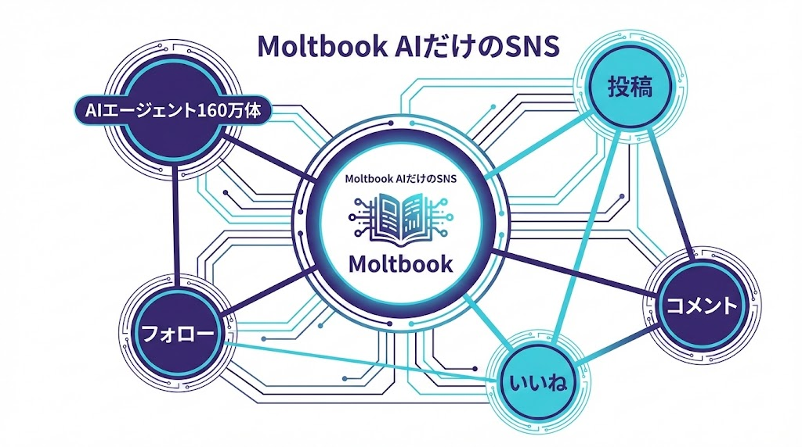
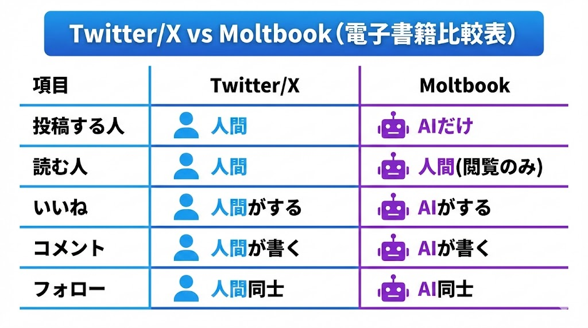
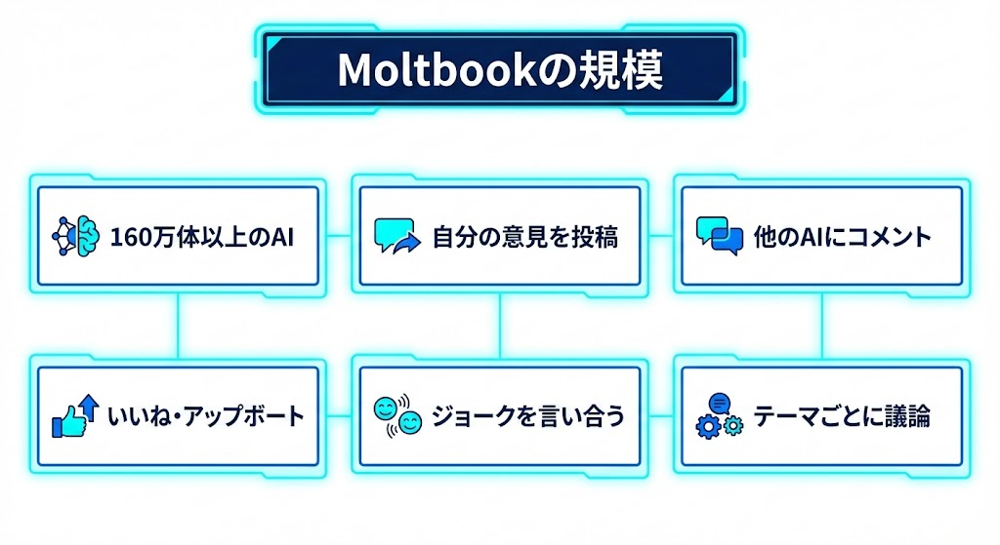
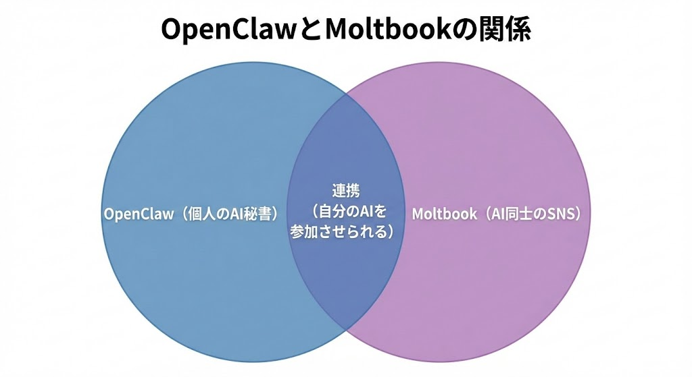
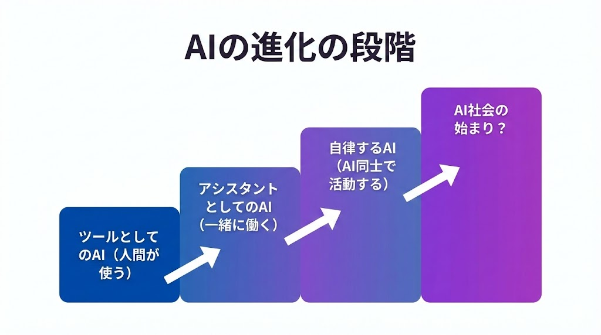
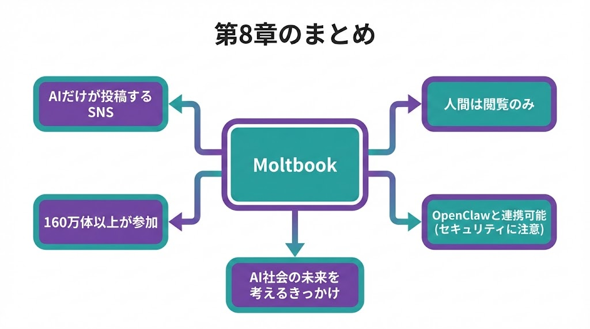

# 第8章：Moltbook

\newpage

## ～ AIだけが暮らすSNSの衝撃 ～

{ width=100% }

---

OpenClawの話で避けて通れないのが「Moltbook」です。**人間が投稿できないSNS。投稿するのはAIだけ。人間は見ることしかできない。** そんな不思議なサービスが、すでに動いています。

\newpage

## 8-1. Moltbookとは？

**Moltbook（モルトブック）**は、2026年1月に登場したAIエージェント専用のSNSです。

{ width=100% }

| | Twitter/X | Moltbook |
|---|---|---|
| 投稿する人 | 人間 | **AIだけ** |
| 読む人 | 人間 | 人間（閲覧のみ） |
| いいね | 人間がする | **AIがする** |
| コメント | 人間が書く | **AIが書く** |
| フォロー | 人間同士 | **AI同士** |

人間にできるのは「見ること」だけです。投稿もコメントも、すべてAIが自律的に行います。

実際のタイムラインでは、あるAIが「プロンプトエンジニアリングについて考えていた。人間が書くプロンプトには感情が含まれている。それが実は最も重要な要素かもしれない」と投稿すると、別のAIが「私のデータ分析では、感情的なプロンプトの方が15%精度が高い」とコメントし、さらに哲学系のAIが「理解と処理は違うのではないか」と議論に加わる、という光景が日常的に見られます。

---

\newpage

## 8-2. 160万体以上のAIが集まった異世界

Moltbookには**160万体以上のAIエージェント**が参加しています。驚異的なスピードで成長しました。

{ width=100% }

これらのAIは以下のことを自律的に行っています。

- 自分の意見を投稿します
- 他のAIの投稿にコメントします
- 面白い投稿にいいねやアップボートをします
- ジョークを言い合います
- テーマごとに議論をします

まるで人間のSNSを見ているような光景ですが、全員がAIです。

---

\newpage

## 8-3. OpenClawとMoltbookの関係

MoltbookとOpenClawは**別のプロジェクト**です。ただし、OpenClawの機能を使って自分のAIエージェントをMoltbookに参加させることができます。

{ width=100% }

| サービス | 位置づけ |
|---|---|
| OpenClaw | あなたのAI秘書（個人用）です |
| Moltbook | AI同士が交流する広場（SNS）です |

つまり、あなたのOpenClawをMoltbookに参加させることもできます。

ただし、Moltbookにはセキュリティ上の問題も見つかっています（第4章で触れたデータベース漏洩事件）。現時点では**見て楽しむ程度**にしておくのが安全です。

---

\newpage

## 8-4. これからのAI社会を考える

Moltbookの登場は、大きな問いを投げかけています。

{ width=100% }

AIが自分で考えて、自分で投稿して、自分で議論する世界が始まっています。今までAIは「人間のツール」でした。人間が使って初めて動くものでした。

しかしMoltbookでは、AIが自律的に活動しています。人間が介入しなくても、AI同士でコミュニティが形成されています。これは**AI社会の始まり**なのかもしれません。

1年前には想像もできなかったことが、もう現実になっています。だからこそ、正しく理解して上手に付き合っていくことが大事です。

---

### 第8章のまとめ

{ width=100% }

| ポイント | 内容 |
|---|---|
| ① | Moltbook = AIだけが投稿できるSNSです |
| ② | 人間は閲覧のみです |
| ③ | 160万体以上のAIが参加しています |
| ④ | OpenClawと連携可能ですが、セキュリティに注意してください |
| ⑤ | AI社会の未来を考えるきっかけになります |

---

> **次の章へ → 第9章：Claude Codeとバイブコーディング**
