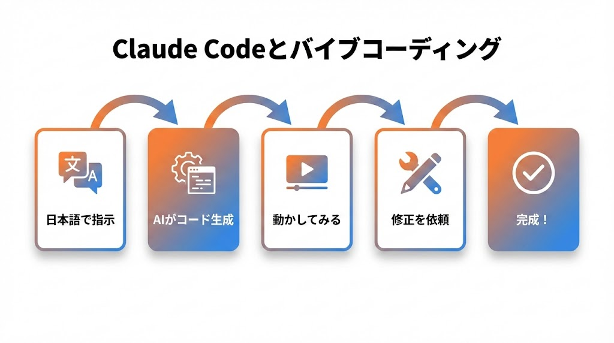
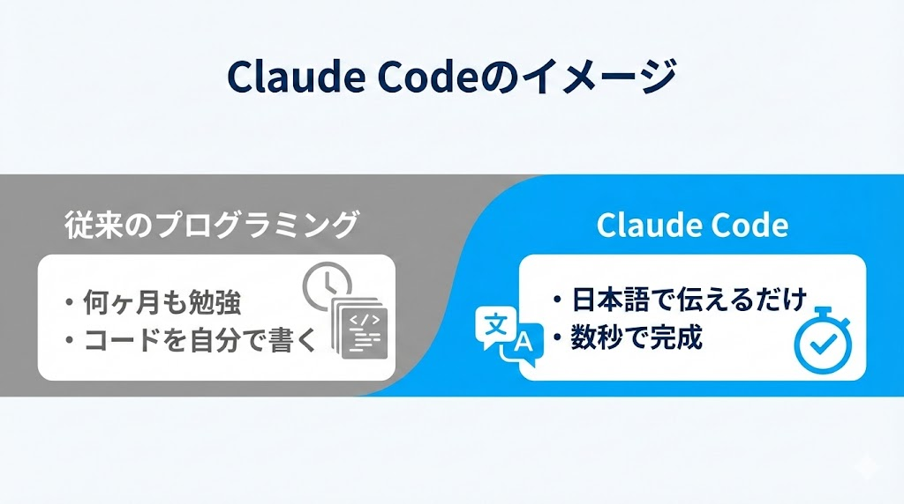
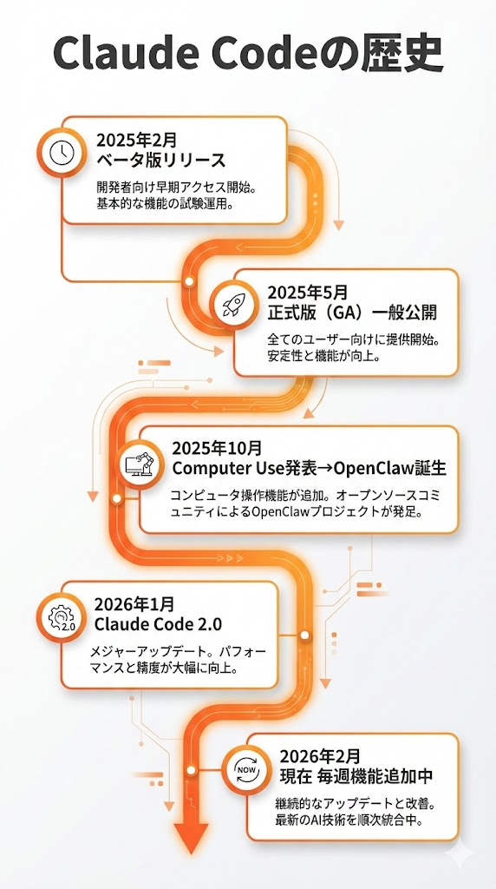
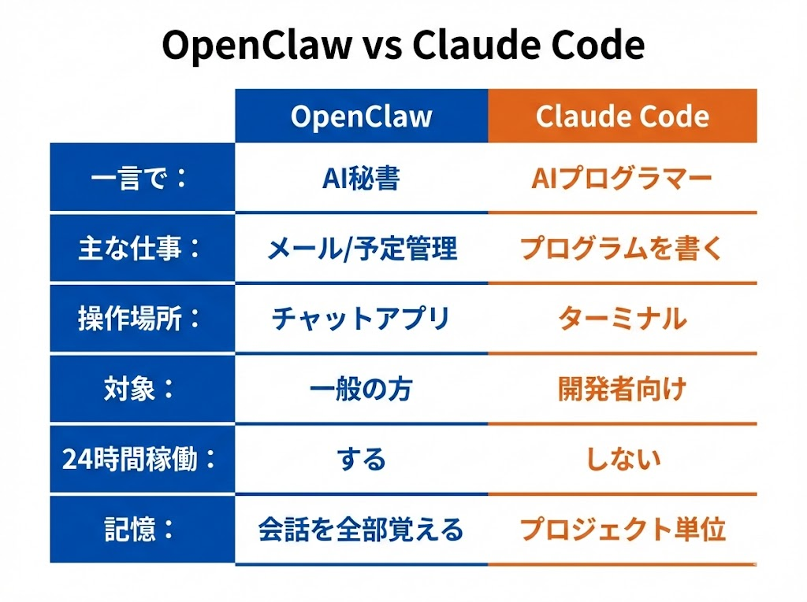
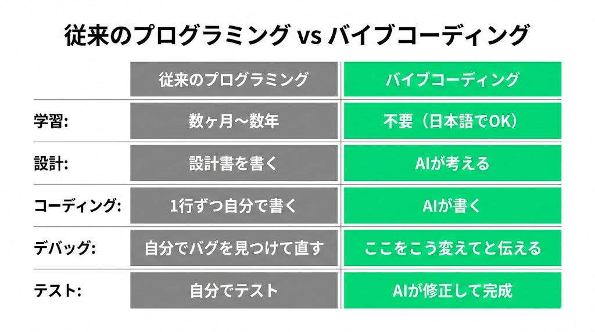
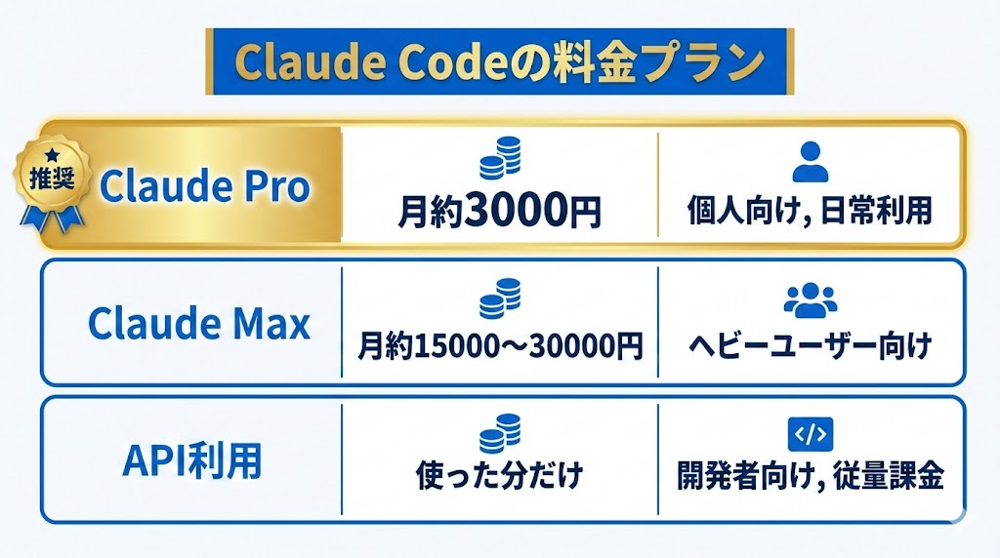
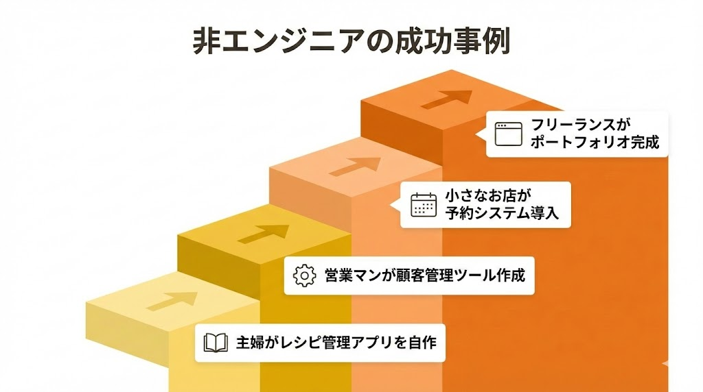
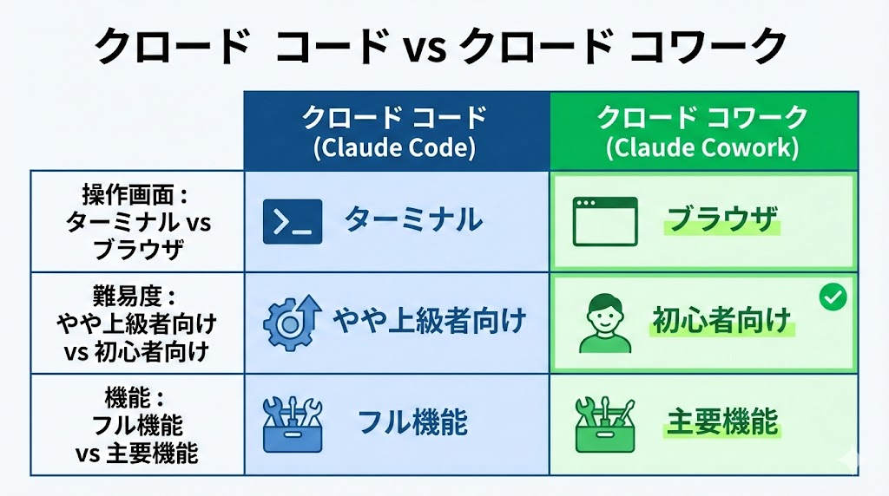
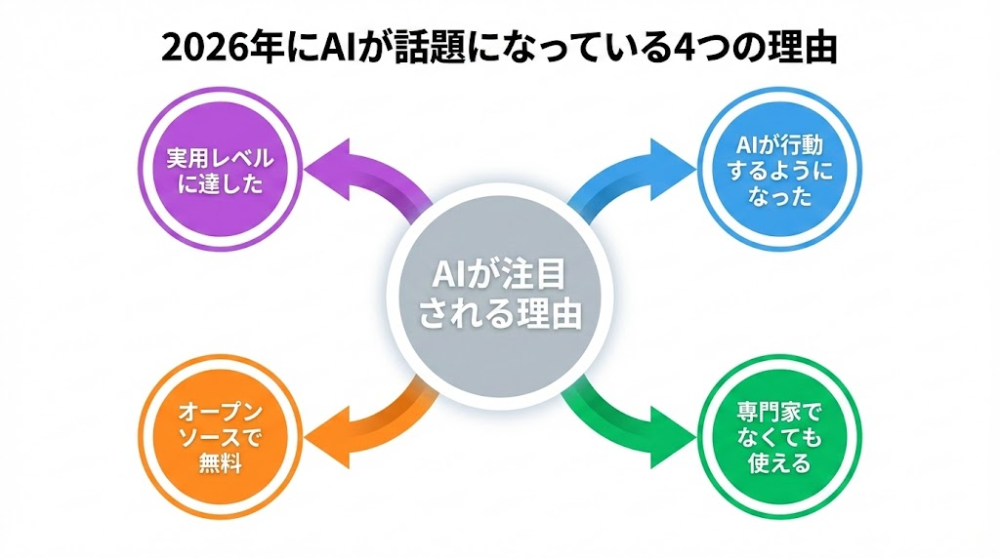
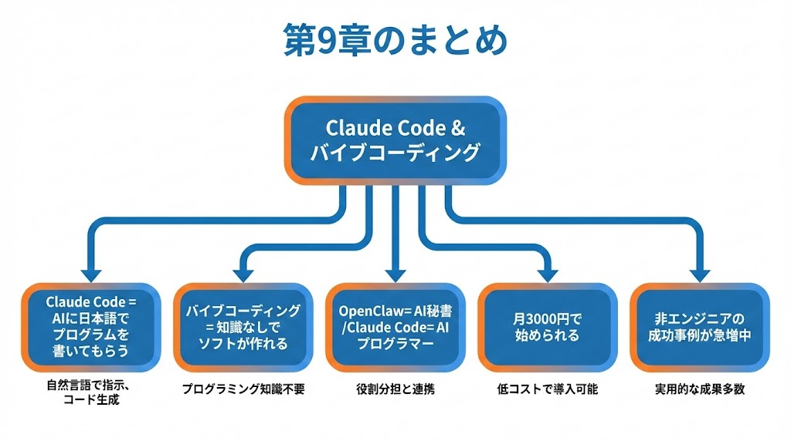

# 第9章：Claude Codeとバイブコーディング
\newpage

## ～ プログラマーじゃなくてもソフトが作れる時代 ～

{ width=100% }

---

「Claude Codeはプログラミングの話だから自分には関係ない」と思うかもしれません。しかし実は、**プログラマーじゃない人にこそ関係ある話**です。

\newpage

## 9-1. Claude Codeとは？

**Claude Code（クロード・コード）**は、Anthropic社が作ったAIコーディングアシスタントです。

一言で言えば、**やりたいことを日本語で伝えるだけで、AIがプログラムを書いてくれるツール**です。

{ width=100% }

> あなた: 「お問い合わせフォームのあるWebページを作って」
>
> Claude Code:（数秒後、完成したWebページのコードが出来上がる）

プログラミングの知識はゼロで問題ありません。日本語で「こんなの作って」と伝えるだけです。

---

\newpage

## 9-2. Claude Codeの歴史

Claude Codeは2025年2月にベータ版として登場し、驚くべきスピードで進化しました。

{ width=100% }

| 時期 | 出来事 |
|---|---|
| 2025年2月 | ベータ版リリース（研究プレビュー） |
| 2025年5月 | 正式版（GA）として一般公開 |
| 2025年10月 | Claude Computer Use発表 → OpenClaw誕生のきっかけになりました |
| 2025年11月 | OpenClawが爆発的に広がり、Claude Codeの注目度もUP |
| 2026年1月 | Claude Code 2.0（大幅アップデート） |
| 2026年2月 | 現在。毎週のように機能追加が続いています |

たった1年で「AIにプログラミングさせる」という考え方が常識になりつつあります。

---

\newpage

## 9-3. OpenClawとClaude Codeの違い

{ width=100% }

| | OpenClaw | Claude Code |
|---|---|---|
| **一言で** | 24時間働くAI秘書です | AIプログラマーです |
| **主な仕事** | メール、予定管理、情報収集 | プログラムを書きます |
| **操作する場所** | チャットアプリ | ターミナル（黒い画面） |
| **対象ユーザー** | 一般の方 | 開発者・プログラマー向け |
| **24時間稼働** | します | しません（使う時だけ） |
| **記憶** | 会話をすべて覚えます | プロジェクト単位で覚えます |

OpenClawは何でもこなす「総合秘書」、Claude Codeはプログラミング専門の「技術スタッフ」です。両方とも裏でClaude（クロード）というAIを使っているので、兄弟のような存在です。

---

\newpage

## 9-4. バイブコーディングとは？

**バイブコーディング（Vibe Coding）**とは、プログラミングの知識がなくても、AIに指示するだけでソフトウェアを作る方法のことです。

OpenAIの共同創業者**アンドレイ・カルパシー**氏が名付けた言葉で、「コードを書くのではなく、**雰囲気（バイブ）を伝えるだけ**でプログラムができる」という意味が込められています。

### 従来のプログラミング vs バイブコーディング

{ width=100% }

| 従来のプログラミング | バイブコーディング |
|---|---|
| プログラミング言語を勉強します（数ヶ月〜数年） | 日本語で「こんなアプリが欲しい」と説明します |
| 設計書を書きます | AIがコードを書きます |
| コードを1行ずつ自分で書きます | 動かしてみます |
| バグを自分で見つけて直します | 「ここをこう変えて」と伝えます |
| テストします | AIが修正して完成します |

プログラミングの勉強が不要で、日本語が話せれば誰でもできるのがポイントです。

たとえば「体重を毎日記録できるWebアプリを作って。折れ線グラフで推移が見られるように。デザインはシンプルでかわいい感じ」と伝えると、3分後には完成しています。外注したら10万円はかかるものが、3分です。

---

\newpage

## 9-5. Claude Codeの料金

{ width=100% }

| プラン | 月額 | 特徴 |
|---|---|---|
| **Claude Pro** | 約3,000円（$20） | 個人向けです。日常的に使うならこれがおすすめです |
| **Claude Max** | 約15,000〜30,000円（$100〜200） | ヘビーユーザー向けです |
| **API利用** | 使った分だけ | 開発者向けです。従量課金です |

初心者は**Claude Pro（月3,000円）**で十分です。

---

\newpage

## 9-6. 非エンジニアでもできること

バイブコーディングで、プログラミング経験ゼロの方が以下のようなことを実現しています。

{ width=100% }

| 事例 | 内容 |
|---|---|
| 主婦がアプリを作りました | レシピ管理アプリを自作して家族に共有 |
| 営業マンが業務ツール作成 | 顧客管理シートをWebアプリに変換 |
| 小さなお店が予約システム導入 | 外注50万円の予約システムを自作 |
| フリーランスがポートフォリオ作成 | コードを一切書かずに作品集サイトを完成 |

---

\newpage

## 9-7. もっと簡単に使いたい人へ：Claude Cowork

ターミナル（黒い画面）に抵抗がある方には、**Claude Cowork（クロード・コワーク）**というツールもあります。Claude Codeの機能を**ブラウザのきれいな画面**で使えるようにしたものです。

{ width=100% }

| | Claude Code | Claude Cowork |
|---|---|---|
| 操作画面 | ターミナル | ブラウザ（普通のWebサイト） |
| 難易度 | やや上級者向けです | **初心者向け**です |
| 機能 | フル機能です | 主要機能です |

「黒い画面は怖い」という方は、まずClaude Coworkから試してみるのがおすすめです。

---

\newpage

## 9-8. なぜ今、こんなに話題なのか？

OpenClawもClaude Codeも、2025年後半〜2026年にかけて爆発的に話題になっています。その理由を整理します。

{ width=100% }

| 理由 | 内容 |
|---|---|
| ① AIが「行動」するようになりました | OpenClaw：PCを操作する秘書 / Claude Code：プログラムを書く技術者 |
| ② 専門家でなくても使えます | バイブコーディング、チャットで指示するだけです |
| ③ オープンソースで無料です | 誰でも使え、世界中で改良が進んでいます |
| ④ 実用レベルに達しました | デモではなく、実際の仕事で使えるクオリティです |

AIが「おもちゃ」から「本当の道具」になった瞬間が、まさに今です。

OpenClawで仕事を効率化して、Claude Codeで自分のアプリも作って──やりたいことがいっぱい出てくるのではないでしょうか。

---

### 第9章のまとめ

{ width=100% }

| ポイント | 内容 |
|---|---|
| ① | Claude Code = AIに日本語で指示してプログラムを書いてもらうツールです |
| ② | バイブコーディング = プログラミング知識なしでソフトが作れる方法です |
| ③ | OpenClaw = AI秘書、Claude Code = AIプログラマーです |
| ④ | 月3,000円のClaude Proで始められます |
| ⑤ | 非エンジニアがアプリを作る事例が急増しています |
| ⑥ | AIが「おもちゃ」から「本当の道具」になった時代です |

---

> **次の章へ → 第10章：よくある質問（FAQ）**
