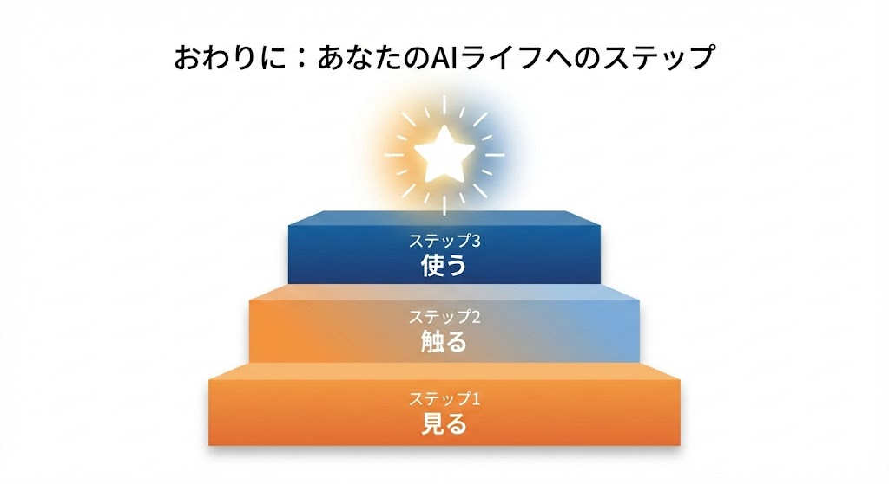
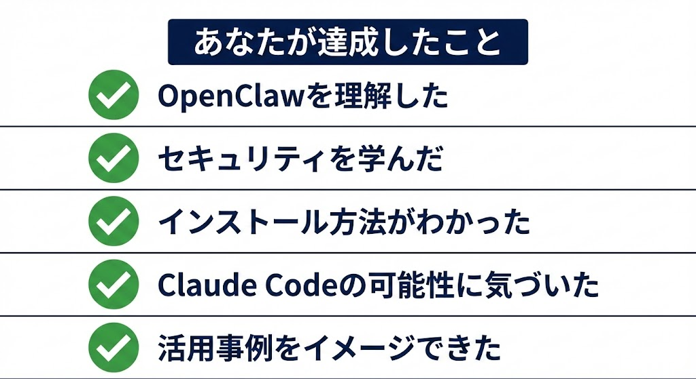
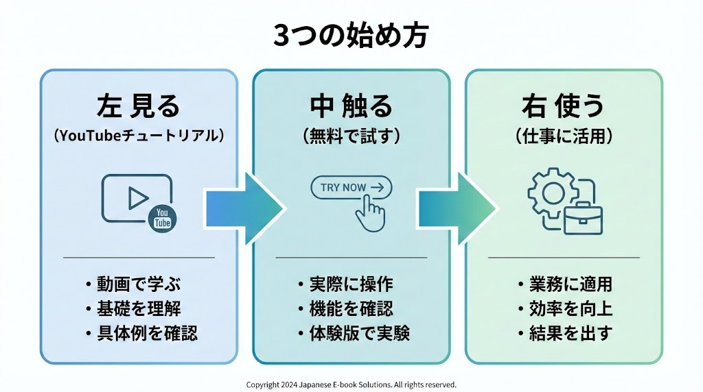
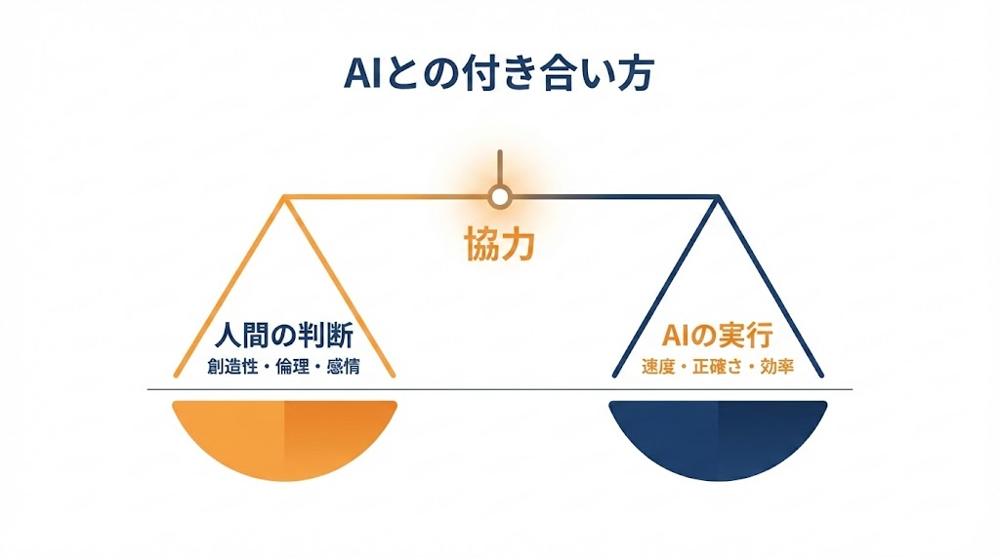
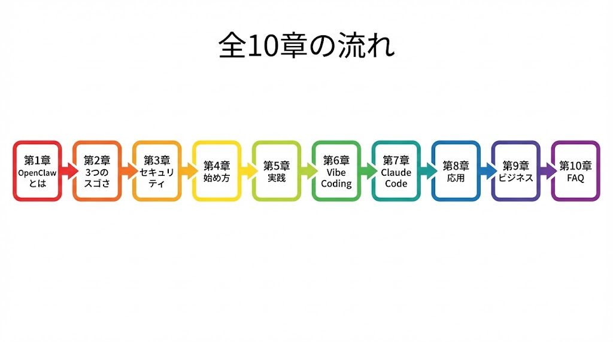

# おわりに：AIと一緒に働く未来はもう始まっている

{ width=100% }

---

「AIは、すごい人たちが使うもの」──この本を読む前は、そう思っていたかもしれません。でも今は、**「自分みたいな普通の人のためのもの」**だと感じているのではないでしょうか。

---

\newpage

## あなたはもう、スタートラインに立っています

この本を最後まで読んだあなたは、すでに多くの人より一歩先にいます。

{ width=100% }

- OpenClawが何かを理解しました
- セキュリティの注意点を知りました
- インストール方法が分かりました
- Claude Codeとバイブコーディングの可能性に気づきました
- 活用事例で「自分ならこう使う」とイメージできました

あとは、やるだけです。

---

\newpage

## 完璧じゃなくていい

最初はうまくいかないこともあるでしょう。コマンドを打ち間違えるかもしれません。エラーが出て焦るかもしれません。

そんな時は、**エラーメッセージをAIに聞けばいいのです。**

> 「このエラーの意味を教えて。どうすれば直る？」

AIが答えてくれます。AIの設定で困ったら、AIに聞く。これが2026年の当たり前です。

---

\newpage

## 3つの始め方

この本を読み終えたら、まずは**1つだけ**やってみてください。

{ width=100% }

| レベル | やること | 所要時間 |
|---|---|---|
| レベル1：見る | Moltbook（AIだけのSNS）を覗く / OpenClawのGitHubページを見る | 5分 |
| レベル2：触る | 第6章の手順でインストール / Telegramで最初のメッセージを送る | 30分 |
| レベル3：使う | 毎朝の天気・予定通知を設定 / Claude Codeで簡単なWebページを作る | 1時間〜 |

---

\newpage

## AIは「敵」ではなく「味方」

「AIに仕事を奪われる」という不安の声はよく聞きます。しかし実際は、**AIを使いこなせる人が、もっと大きな仕事ができるようになる**ということです。

{ width=100% }

OpenClawは雑務を引き受けてくれます。メール、スケジュール管理、データ整理。その分、あなたは**人間にしかできないこと**に集中できます。クリエイティブなアイデアを考えたり、人と信頼関係を築いたり、新しいことに挑戦したり。

AIは、あなたの可能性を広げる「相棒」です。

---

Telegramを開いて「明日からよろしくね」と送ると、OpenClawは「こちらこそ、よろしくお願いします！何かあったらいつでも声をかけてください」と返してくれます。ぜひ、あなただけのAI秘書を育ててみてください。

---

\newpage

## 全章の総まとめ

{ width=100% }

| 章 | 内容 |
|---|---|
| 第1章 | OpenClawは24時間働くAI秘書です。週末プロジェクトから世界を席巻しました |
| 第2章 | 3つのスゴさ：全部覚える・自分から動く・PCを操作します |
| 第3章 | 3層構造：受付（チャット）+ 司令塔（Gateway）+ 頭脳（LLM）です |
| 第4章 | セキュリティ5箇条を守れば安心です。API料金の上限設定も忘れずに |
| 第5章 | 必要なのはPCとネットとAPIキーです。Mac miniは不要です |
| 第6章 | インストールは6ステップです。コマンドはコピペでOKです |
| 第7章 | メール管理、朝のブリーフィング、家計簿、Web更新、会議要約 |
| 第8章 | Moltbook：AIだけが暮らすSNSです。160万体以上が参加しています |
| 第9章 | Claude Codeとバイブコーディング。非エンジニアでもソフトが作れます |
| 第10章 | FAQ：料金、日本語対応、安全ルール、MCP、スキルのすべて |

---

**ここまで読んでくださり、ありがとうございました。**

**さあ、あなたのAI秘書との生活を始めましょう。**

---

> 漫画でわかる！OpenClaw入門 ～ パソコン苦手でも大丈夫！話題のAI秘書を完全理解 ～
>
> 2026年版
