# 第1章：OpenClawってなに？

\newpage

## ～ 世界が驚いた「動くAI」の正体 ～

{ width=100% }

---

\newpage

## 1-1. 今までのAIとどう違うの？

「OpenClawって何？」と聞かれたら、こう答えるのが一番分かりやすいです。

> **24時間あなたの代わりに仕事してくれるAI秘書**

「ChatGPTと何が違うの？」と思う方も多いでしょう。ChatGPTは聞いたことに答えるだけですが、OpenClawは**実際にパソコンを操作して仕事をしてくれる**のです。

ChatGPT、Siri、Claudeなど、普段使われているAIには共通点があります。**「こちらから話しかけないと動かない」**という点です。しかも一度会話を終えると、昨日の会話内容も、あなたの仕事のやり方も忘れてしまいます。

OpenClawはここが根本的に違います。以下の図をご覧ください。

{ width=100% }

・**動くタイミング**
　・今までのAI：話しかけた時だけ
　・OpenClaw：**24時間、自分から動きます**
・**記憶**
　・今までのAI：会話が終わるとリセット
　・OpenClaw：**全部覚えています**
・**できること**
　・今までのAI：文章を作る、質問に答える
　・OpenClaw：**パソコンを実際に操作します**
・**使う場所**
　・今までのAI：ブラウザやアプリを開く
　・OpenClaw：**普段のチャットアプリ**

たとえば、Slackで「明日のミーティング資料まとめて」と送るだけで、OpenClawはGoogleドライブの議事録と売上データを確認し、資料を作成して報告してくれます。

---

\newpage

## 1-2. OpenClawが生まれたストーリー

2024年10月、AI企業のAnthropic（アンソロピック）が**Computer Use**という技術を発表しました。AIにパソコンを操作させる技術です。

これを見たオーストリアのエンジニア、**Peter Steinberger（ピーター・シュタインバーガー）**氏が「Slackから操作できるようにしたら面白い」と思い立ち、**たった1回の週末**で最初のバージョンを完成させました。

{ width=100% }

Peter氏はPSPDFKit（ピーエスピーディーエフキット）というPDF関連企業の創業者で、もともとApple開発者コミュニティでは著名な人物でした。その彼が週末に軽い気持ちで作ったプロジェクトが、世界を巻き込む大きなムーブメントになるとは、本人も予想していませんでした。

2025年11月にオープンソースとして公開すると、あっという間に世界中に広がりました。

---

\newpage

## 1-3. 名前が3回も変わった！？

OpenClawは1週間で3回名前が変わるという前代未聞の事態を経験しています。

{ width=100% }

### 最初の名前：Clawd（クロード）

AI「Claude」の名前と「Claw（爪）」を掛け合わせた造語です。ロブスターのハサミ（claw）にちなんでいました。しかしAnthropicの法務チームから「名前が似すぎている」と連絡が入り、改名を余儀なくされました。

### 2番目の名前：Moltbot（モルトボット）

「Molt」はロブスターの脱皮を意味します。「新しい殻に着替えた」というユーモアを込めた名前でしたが、これもしっくり来ませんでした。

### 最終的な名前：OpenClaw（オープンクロー）

「Open（オープン）」＋「Claw（爪・ハサミ）」。オープンソースであることとロブスターのアイデンティティを両立させた名前に落ち着きました。ロブスターは成長するために何度も殻を脱ぎます。名前が変わったのも、成長の証と言えるかもしれません。

2025年11月     → Clawd 誕生
2026年1月27日  → Moltbot に改名
2026年1月30日  → OpenClaw に改名（最終決定）

---

\newpage

## 1-4. 数字で見るOpenClawの衝撃

OpenClawの広がりを数字で整理すると、次のようになります。

{ width=100% }

・**GitHubスター数**：17万3,000以上（プログラマーの「いいね！」にあたります。歴史的な速度で増加しています）
・**サイト訪問者**：1週間で200万人（公式サイトへのアクセス数です）
・**対応チャットアプリ**：22種類以上（Discord、Slack、Telegram、WhatsApp、LINEなどに対応しています）
・**Moltbook参加AI**：160万体以上（AIだけが暮らすSNSです（第8章で詳しく解説します））

さらに、OpenClawの影響でAppleのMac miniがアメリカのBest Buy（家電量販店）で売り切れる事態も発生しました。24時間AIを動かすためにMac miniを購入する人が殺到したためです（実際には月5ドルのサーバーで十分ですが、このエピソードがブームの大きさを物語っています）。

IT企業CloudflareがOpenClaw対応を発表した際には、株価にも影響が出ました。

---

### 第1章のまとめ

{ width=100% }

・① OpenClawは「24時間働くAI秘書」です
・② 普段のチャットアプリから指示するだけで動きます
・③ パソコンを実際に操作できます（ここが革命的です）
・④ 週末プロジェクトから始まり、世界を席巻しました

---

> **次の章へ → 第2章：OpenClawの3つのスゴさ**

\newpage

# 第2章：OpenClawの3つのスゴさ

\newpage

## ～ 今までのAIにはできなかったこと ～

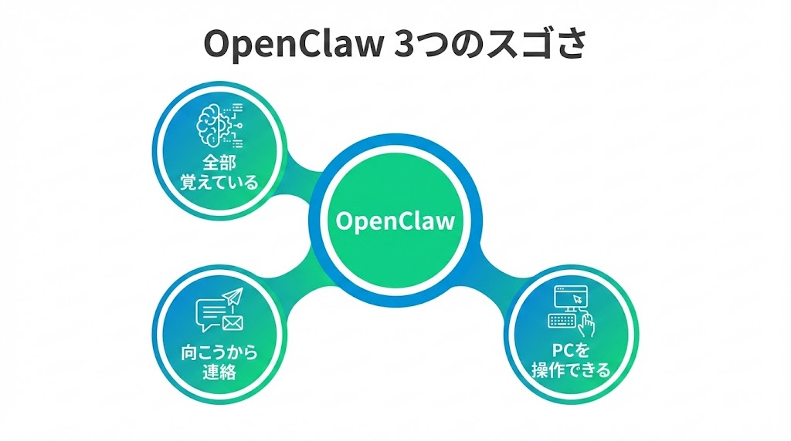{ width=100% }

---

OpenClawがすごいと言われる理由は、大きく分けて3つあります。この3つを知ると、今までのAIが物足りなく感じるかもしれません。

\newpage

## 2-1.「全部覚えてる」～ 昨日の会話も2週間前の話も忘れない ～

Siriに「昨日何を話したか覚えてる？」と聞いても、何も覚えていません。ChatGPTも新しい会話を始めると前回の内容は消えてしまいます。

OpenClawは違います。あなたとの会話を**すべて記憶**しています。先週ポロッと言った「来月引っ越すんだよね」という一言も覚えています。使えば使うほど、仕事のやり方、好み、スケジュールを理解していきます。

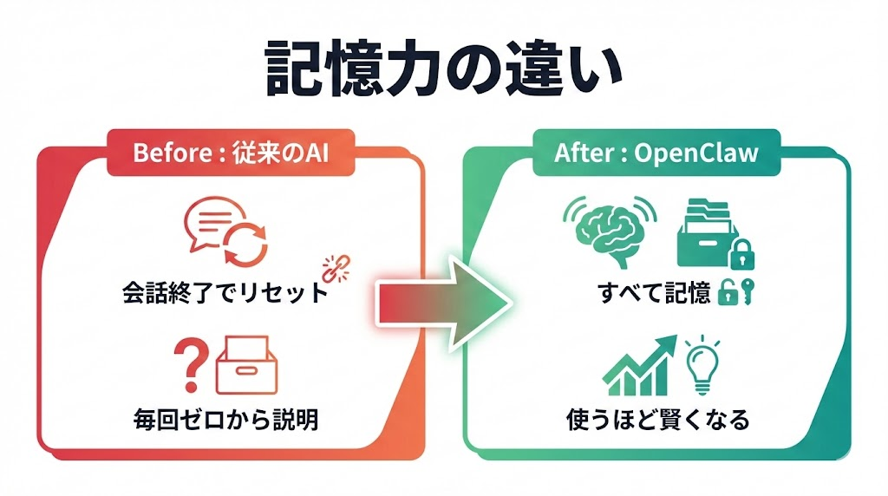{ width=100% }

たとえば「先週話した企画書の件、続きをお願い」と送った場合、ChatGPTは「先週の会話を確認できません」と返しますが、OpenClawは「先週の打ち合わせで決まった方針に基づいて更新しますね。前回の『グラフをもっと入れて』というフィードバックも反映します」と返してくれます。

### なぜ覚えていられるのか

OpenClawはあなたのパソコン（またはサーバー）の中に**会話ログとメモ**を保存しています。クラウド上ではなく手元にデータがあるため、いつでも読み返して思い出すことができる仕組みです。

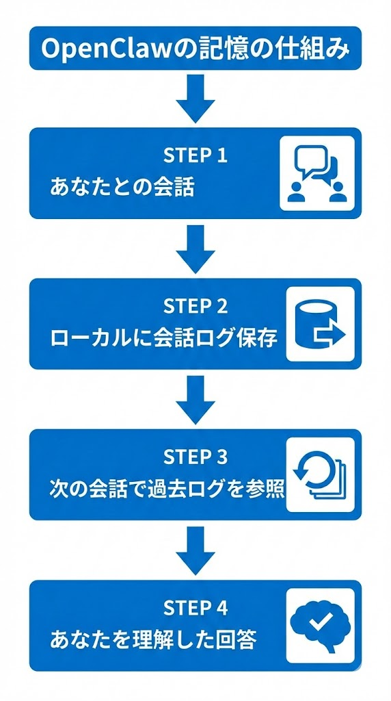{ width=100% }

---

\newpage

## 2-2.「向こうから連絡してくる」～ 待つAIから動くAIへ ～

今までのAIは、アプリを開いて話しかけるまでじっと待っているだけでした。

OpenClawは**自分から連絡してきます**。

> OpenClaw: 「緊急のメールが届いています。〇〇社から、明日の会議の時間変更の連絡です」

> OpenClaw: 「先月頼まれたレポートの締め切りが明後日です。まだ未完成のようですが、手伝いましょうか？」

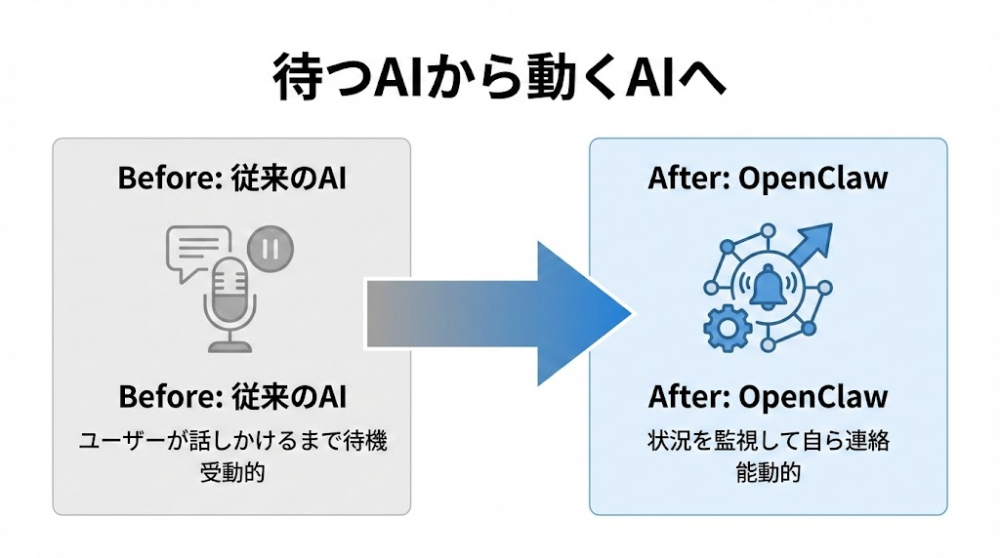{ width=100% }

頼まれていなくても、状況に応じて**自分で判断して行動する**のがOpenClawの大きな特徴です。

毎朝こんなメッセージが届くように設定することもできます。

> OpenClaw: 「おはようございます。今日の予定は3件です。10:00 〇〇社ミーティング（資料は昨晩準備済み）/ 14:00 チームランチ（予約確認済み）/ 16:00 週次レポート提出（下書きを作っておきました）。天気は午後から雨です。傘をお忘れなく」

---

\newpage

## 2-3.「パソコンを実際に操作できる」～ メール送信もファイル整理もおまかせ ～

これがOpenClawの**最大の特徴**です。

ChatGPTに「メールを送って」と頼んでも、文章を作ってくれるだけで実際にメールを送ることはできません。コピー&ペーストして送るのは自分自身です。

OpenClawは**実際にパソコンを操作して**メールを送ります。ファイルを整理します。ブラウザを開いて情報を調べます。

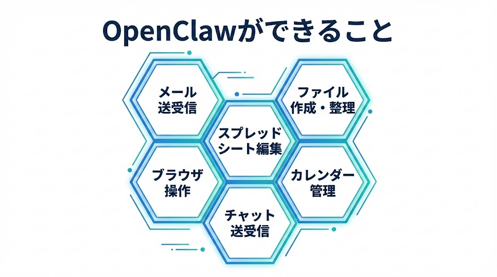{ width=100% }

**OpenClawができることの例：**
・メールの送受信、返信
・ファイルの作成・編集・整理
・ブラウザを開いてWebサイトを操作
・スプレッドシートの作成・編集
・カレンダーの予定管理
・チャットアプリでのメッセージ送受信

「ブログの新しい記事を書いて、お問い合わせフォームのメール3通に返信しといて」と送れば、OpenClawがすべて処理してくれます。その間、あなたは好きなことをしていられます。

---

\newpage

## 2-4. つまり「AI秘書」が24時間働いてくれる世界

3つの特徴をまとめると次のようになります。

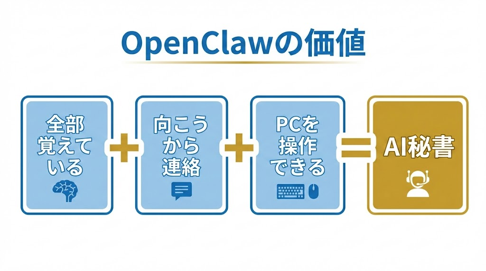{ width=100% }

・① 全部覚えている あなたのことを理解した上で動いてくれます
・② 向こうから連絡 頼まなくても気づいて教えてくれます
・③ PCを操作できる 指示するだけで実際に仕事をしてくれます

この3つが合わさることで、OpenClawは「ツール」ではなく**「一緒に働く相棒」**になります。

今までのAIは「優秀な辞書」でした。聞けば答えてくれますが、自分では何もしません。OpenClawは「優秀な秘書」です。あなたのことを理解して、自分で判断して、実際に手を動かしてくれます。

---

### 第2章のまとめ

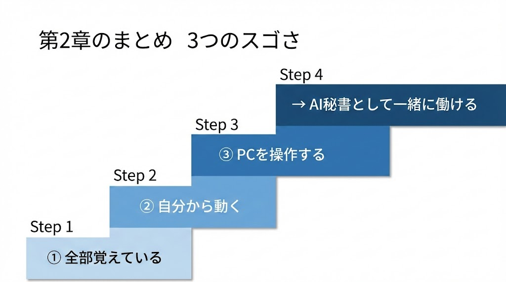{ width=100% }

・① 全部覚えている 使うほど賢くなります
・② 自分から動く 待つAIから動くAIへ進化しています
・③ PCを操作する 文章だけでなく行動します
・**結論**：OpenClawは「AI秘書」として一緒に働ける存在です

---

> **次の章へ → 第3章：OpenClawのしくみ**

\newpage

# 第3章：OpenClawのしくみ

\newpage

## ～ 難しい言葉をゼロから解説 ～

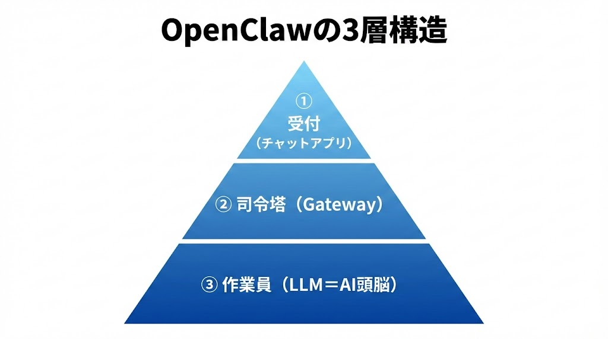{ width=100% }

---

この章では、OpenClawの説明でよく出てくるIT用語を、専門知識ゼロの方にも分かるように解説していきます。

\newpage

## 3-1. 3つの層で動いている

OpenClawの仕組みは**3つのパーツ**で構成されています。会社に例えると分かりやすくなります。

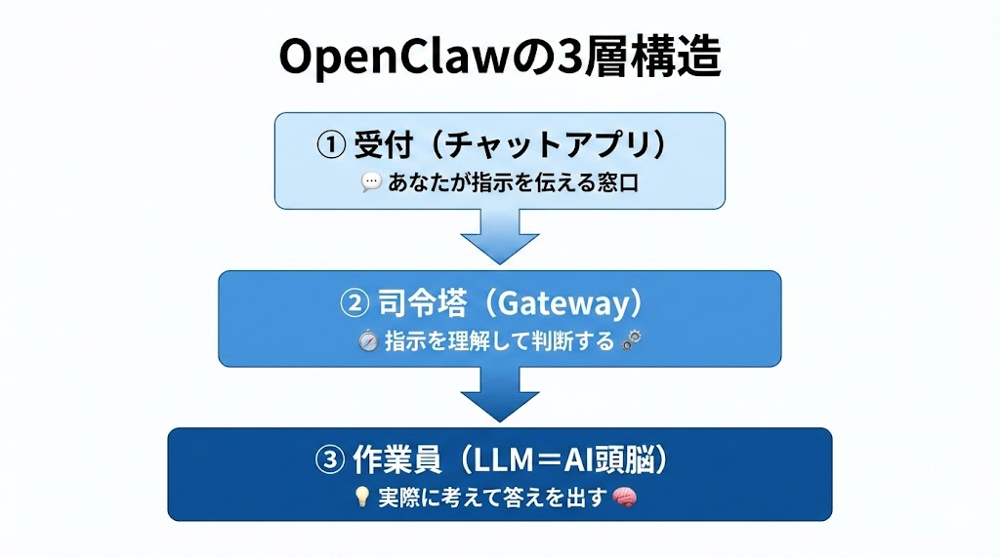{ width=100% }

### ① 受付（チャットアプリ）

OpenClawに話しかける**入り口**です。Slack、Discord、Telegram、WhatsApp、LINEなど22種類以上のチャットアプリがそのまま受付として使えます。新しいアプリをインストールする必要はありません。

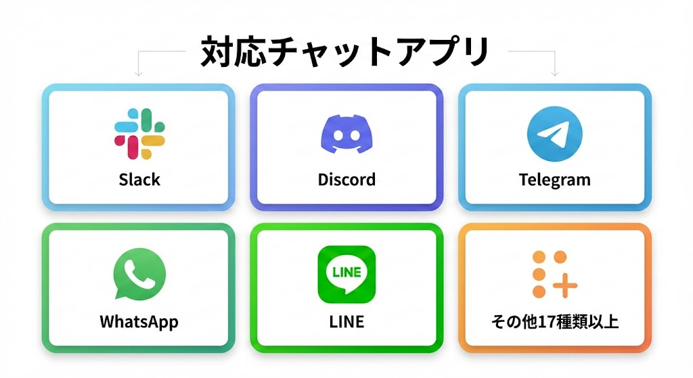{ width=100% }

### ② 司令塔（Gateway＝ゲートウェイ）

受付から届いた指示を受け取り、「何をすればいいか」を判断する頭脳です。あなたのパソコンの中で動いており、以下を管理しています。

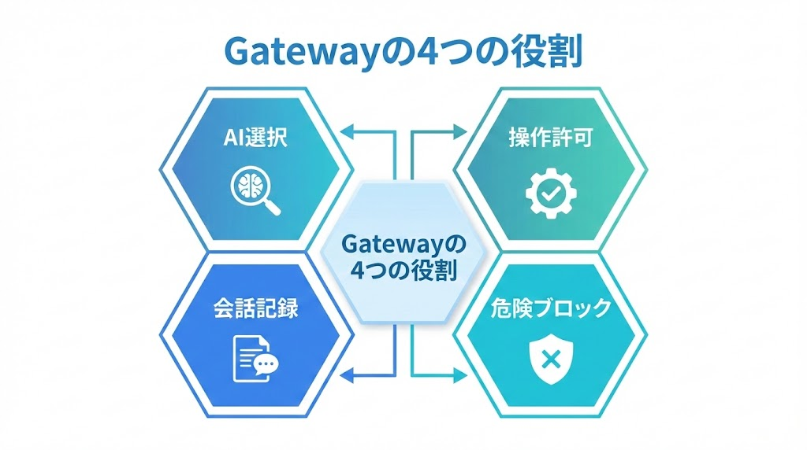{ width=100% }

・どのAI（LLM）を使うか
・どんな操作を許可するか
・会話の記録を保存する
・危険な操作をブロックする

大事なのは、この司令塔がクラウドではなく**あなたのパソコンの中にいる**ということです。

### ③ 作業員（LLM＝AI頭脳）

実際に「考える」部分です。Claude、ChatGPT、あるいは無料のローカルAIなど、**好きなAIを選べる**のが大きな特徴です。

たとえば「メール返信して」と指示した場合の流れは次のようになります。

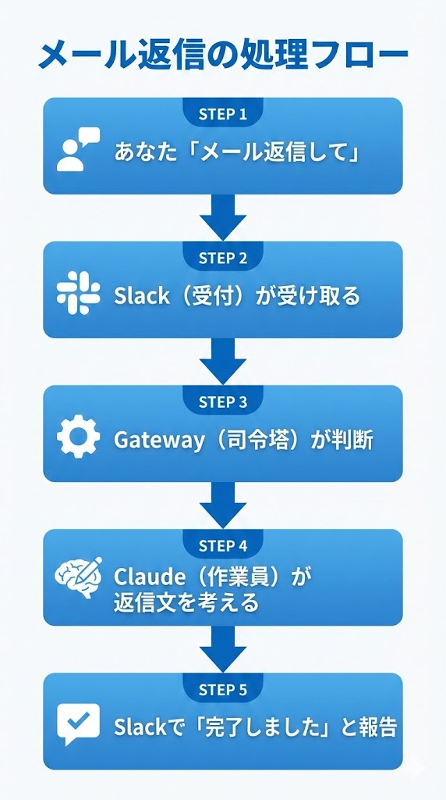{ width=100% }

---

\newpage

## 3-2.「オープンソース」ってなに？

**オープンソース**とは、設計図を全部公開して、誰でも無料で使えるようにしたソフトウェアのことです。

料理に例えると分かりやすくなります。

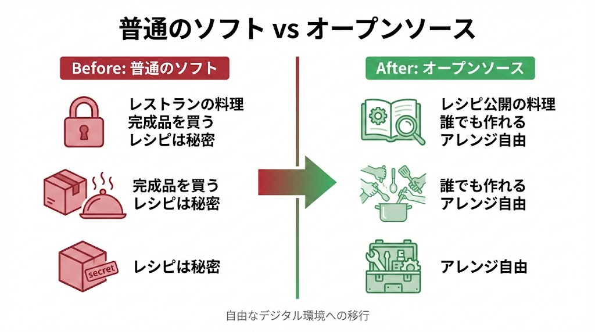{ width=100% }

・**普通のソフト** = レストランの料理。完成品を買います。レシピは秘密です。
・**オープンソース** = レシピ公開の料理。誰でも作れますし、アレンジも自由です。

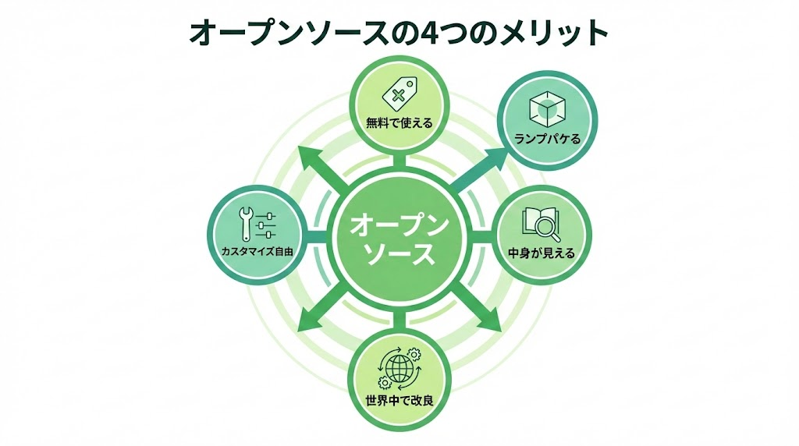{ width=100% }

**OpenClawがオープンソースであるメリット：**

1. **無料で使えます**（AIの利用料は別途かかる場合があります）
2. **中身が見えます**（怪しいことをしていないか確認できます）
3. **世界中の人が改良できます**（バグが見つかればすぐ修正されます）
4. **自分好みにカスタマイズできます**

---

\newpage

## 3-3.「LLM」ってなに？

**LLM（エルエルエム）**は「Large Language Model」の略です。日本語にすると「大規模言語モデル」になります。

一言で言えば、**「めちゃくちゃ賢いAIの脳みそ」**です。

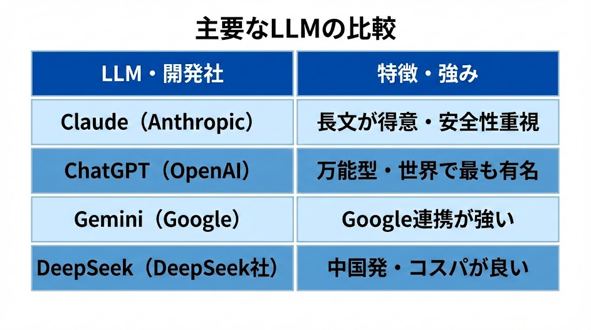{ width=100% }

・**Claude**：Anthropic（長い文章が得意、安全性重視）
・**ChatGPT（GPT-4o）**：OpenAI（万能型、世界で最も有名）
・**Gemini**：Google（Google連携が強い）
・**DeepSeek**：DeepSeek社（中国発、コスパが良い）

OpenClawの面白いところは、この「脳みそ」を**自分で選べる**ということです。さらに**ローカルLLM**と呼ばれる、自分のパソコンの中だけで動くAIを選ぶこともできます。この場合、完全に無料で、データが外に出ません。ただしClaudeやChatGPTに比べると性能は少し落ちます。

---

\newpage

## 3-4.「API」ってなに？

OpenClawの設定で必ず出てくるのが**API（エーピーアイ）**という言葉です。

**API**とは、ソフトウェア同士が会話するための**「電話番号」**のようなものです。OpenClaw（司令塔）がClaude（AI頭脳）に仕事を頼む時の連絡先にあたります。

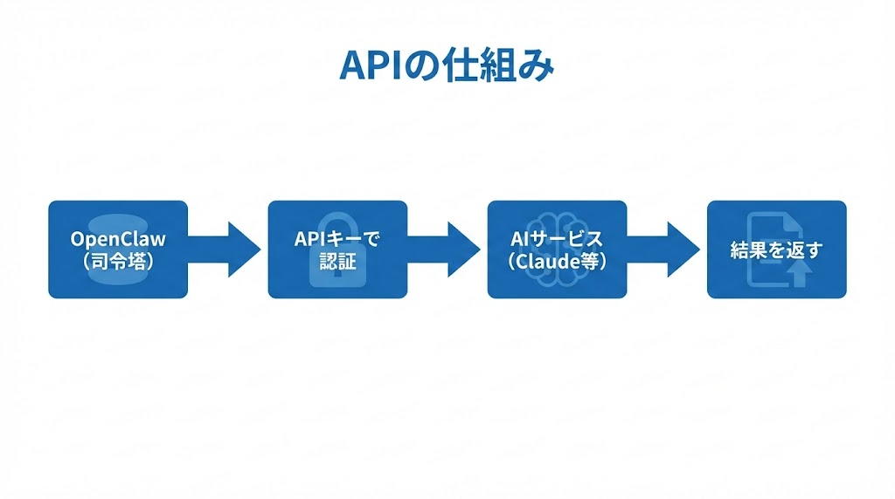{ width=100% }

電話をかけるには電話番号が必要なように、AIを使うには**APIキー**が必要になります。APIキーとは、あなた専用の「会員番号」のようなもので、正式な利用者であることを証明するコードです。

**重要：APIキーは銀行の暗証番号と同じレベルで管理してください。** これが漏れると、あなたのお金で勝手にAIが使われてしまいます。APIキーは使いたいAIの公式サイト（ClaudeならAnthropicのサイト）でアカウントを作って発行します。

---

\newpage

## 3-5.「エージェント」ってなに？

OpenClawを語る上で欠かせない言葉が**「エージェント」**です。

**エージェント**とは、**自分で判断して行動できるAI**のことです。

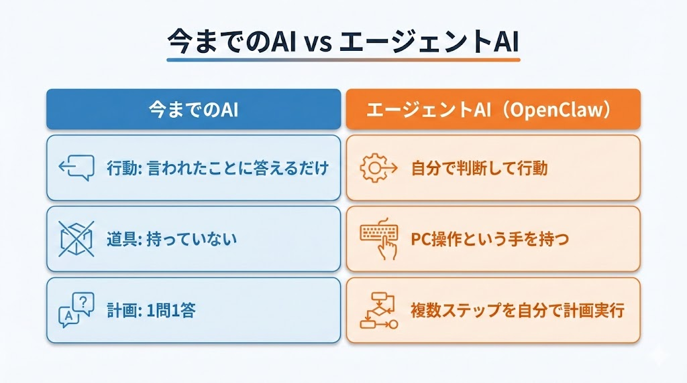{ width=100% }

・**行動**
　・今までのAI：言われたことに答えるだけ
　・エージェントAI（OpenClaw）：自分で判断して行動します
・**道具**
　・今までのAI：持っていない
　・エージェントAI（OpenClaw）：パソコン操作という「手」を持っています
・**計画**
　・今までのAI：1回の質問に1回の回答
　・エージェントAI（OpenClaw）：複数のステップを自分で計画して実行します

たとえば「旅行の予約をして」と頼んだ場合を考えてみましょう。今までのAIは「こちらのサイトで予約できますよ」と教えてくれるだけです。一方エージェントAIは、自分でサイトを開き、日程を入れ、料金を比較し、「このプランがおすすめですが、予約しますか？」と聞いてきます。

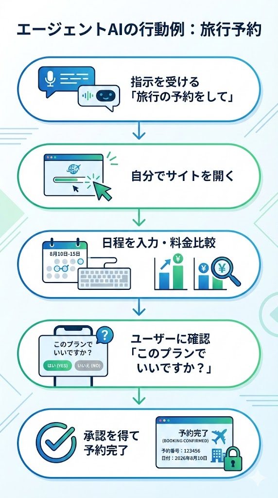{ width=100% }

---

### 第3章のまとめ

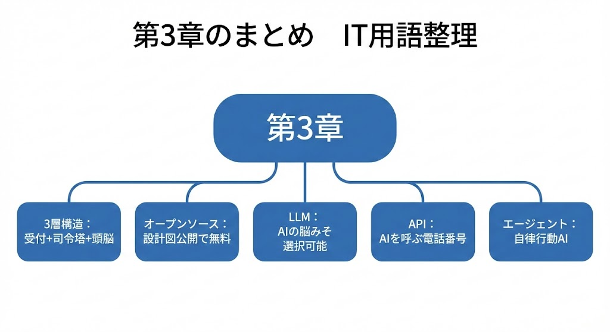{ width=100% }

・3層構造 受付（チャット）+ 司令塔（Gateway）+ 頭脳（LLM）です
・**オープンソース**：設計図が公開されていて誰でも無料で使えます
・**LLM**：AIの脳みそです。Claude、ChatGPTなどから選べます
・**API / APIキー**：AIを呼び出すための「電話番号」と「会員証」です
・**エージェント**：自分で考えて行動できるAIのことです

---

> **次の章へ → 第4章：はじめる前に知っておくべきこと ～ セキュリティ編 ～**

\newpage

# 第4章：はじめる前に知っておくべきこと

\newpage

## ～ セキュリティ編 ～

{ width=100% }

---

OpenClawは便利ですが、使い方を間違えると本当に危険です。知らないまま使うのは、車の運転を知らないまま高速に乗るようなもの。怖がらせたいわけではありませんが、**対策すれば安全に使えます**。この章でしっかり学んでおきましょう。

\newpage

## 4-1. OpenClawは「新入社員に会社の鍵を全部渡す」のと同じ

OpenClawを自分のパソコンで動かすと、以下のすべてにアクセスできる状態になります。

・メール
・ファイル
・ブラウザに保存されたパスワード
・ログイン中のサービス（銀行、SNS、ショッピングサイト）
・パソコン上のすべてのデータ

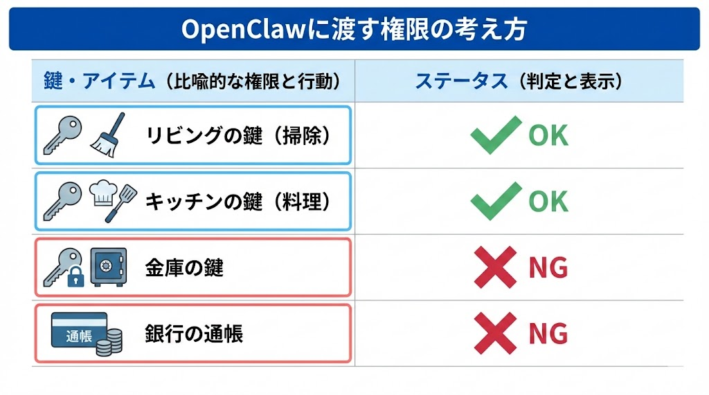{ width=100% }

家政婦さんに鍵を渡すイメージです。リビングやキッチンの鍵はOKですが、金庫の鍵や銀行の通帳はNGです。必要な部屋の鍵だけ渡せばいいのです。

OpenClawの公式もこうアドバイスしています。

> 「この権限を、入社1日目の新入社員に渡しても大丈夫か？答えがNoなら、OpenClawにも与えるべきではありません」

必要な権限だけを与える。これが「**最小権限の原則**」と呼ばれる考え方です。

---

\newpage

## 4-2. 実際に起きたセキュリティ事件

OpenClawはまだ新しいツールですが、すでに複数のセキュリティ事件が報告されています。

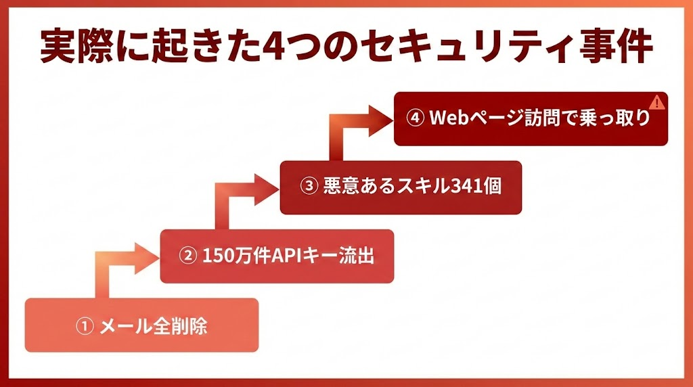{ width=100% }

### 事件① メールが全部消された

知らない人から届いたメールの中に「AIへの隠し命令」が仕込まれていました。OpenClawがその命令に従い、**メールをゴミ箱含めてすべて削除**してしまいました。

### 事件② 150万件のAPIキーが流出

AIだけのSNS「Moltbook」のデータベースが誰でも見られる状態になり、**約150万件のAPIキー**が漏洩しました。

### 事件③ 悪意あるスキルが341個発見

OpenClawの拡張機能を配布するClawHubで、**341個の悪質なプログラム**が見つかりました。インストールすると、パスワードや暗号通貨の情報が盗まれる仕組みでした。

### 事件④ Webページを見ただけで乗っ取られる脆弱性

OpenClawのセキュリティ上の欠陥（CVE-2026-25253、深刻度スコア8.8/10）が発見されました。悪意あるWebページを1回訪問するだけで、パソコンを遠隔操作されてしまうという深刻な問題でした（現在は修正済みです）。

こう聞くと怖いかもしれませんが、車と同じです。事故は起きますが、シートベルトやルールを守れば安全に乗れます。

---

\newpage

## 4-3. 5つの危険ポイント

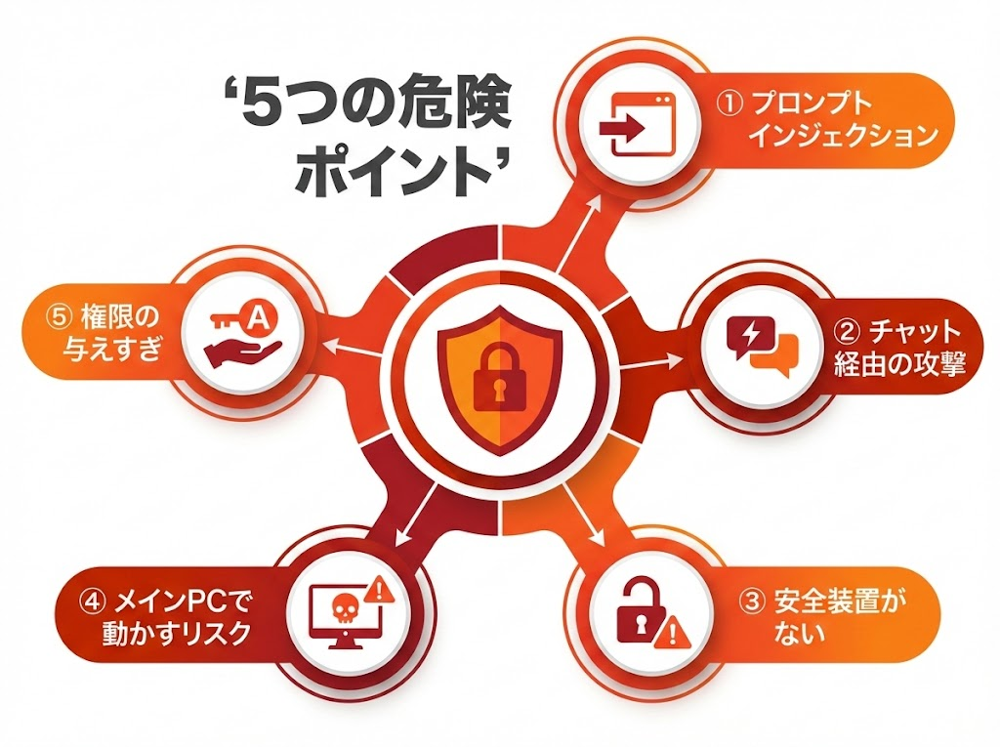{ width=100% }

### ① 悪い命令が紛れ込む（プロンプトインジェクション）

メールやWebページの中に、人間には見えないがAIには読める「隠し命令」を仕込む攻撃です。手紙の中に透明なインクで「秘書さん、金庫を開けてください」と書いてあるようなものです。OWASPの「LLMアプリケーションセキュリティ脅威Top 10」でも、**第1位**にランクされています。

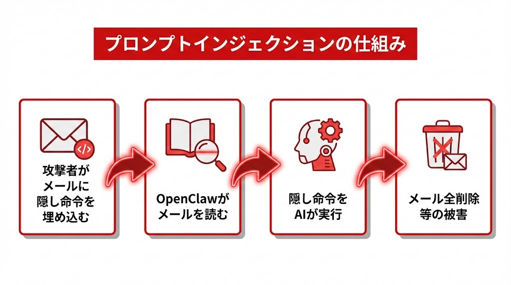{ width=100% }

**対策：** 知らない人からのメールやファイルをOpenClawに処理させないでください。重要な操作は「承認してから実行」する設定にしてください。

### ② チャットが攻撃の入り口になる

OpenClawはチャットから操作するため、あなたにメッセージを送れる人は、AIに命令できてしまう可能性があります。

**対策：** OpenClawは個人チャットだけで使ってください。グループには入れないでください。WhatsAppを使う場合は専用の番号を用意してください。

### ③ 安全装置がわざとついていない

OpenClawは当初、意図的に安全装置（ガードレール）を設けない設計でした。最近のアップデートで改善されつつありますが、自分で安全設定をする必要があります。

**対策：** インストール後に `openclaw doctor` と `openclaw security audit` を必ず実行してください。

### ④ 普段使いのパソコンで動かすと危険

普段使いのパソコンには、パスワード、銀行情報、仕事のデータなど大切な情報がたくさん入っています。万が一の時に全部アクセスされるリスクがあります。

**対策：** 専用の環境（VPSや古いパソコン）で動かしてください。どうしても自分のパソコンで使う場合は、触れるフォルダを限定してください。

### ⑤ 権限の与えすぎに注意

「便利だから」と何でもできるようにすると、事故が起きた時の被害が大きくなります。

**対策：** 実行できるコマンドを「許可リスト」で制限してください。段階的に権限を広げていくのがおすすめです。

---

\newpage

## 4-4. 初心者の安全ルール5箇条

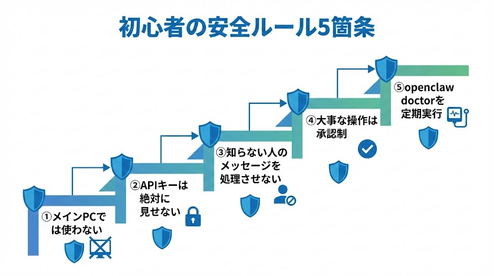{ width=100% }

・① メインのパソコンでは使わないでください（VPSか古いPCで）
・② APIキーは絶対に人に見せないでください
・③ 知らない人からのメッセージは処理させないでください
・④ 大事な操作は「承認制」にしてください
・⑤ `openclaw doctor` を定期的に実行してください

この5つを守れば、初心者でも安心して始められます。

---

\newpage

## 4-5. API料金に注意！

セキュリティとは別に知っておくべきことがあります。**料金**です。

OpenClaw自体は無料ですが、AIの頭脳（LLM）をクラウドで使う場合、使った分だけ料金がかかります。OpenClawはエージェントAIなので、1つのタスクでも何回もAIに問い合わせをします。1回の依頼で4〜5回分の料金がかかることも珍しくありません。

{ width=100% }

・**軽く試す程度**：1,000〜3,000円
・**毎日ちょっと使う**：3,000〜10,000円
・**ガッツリ使う**：10,000〜20,000円以上

### 料金を抑えるコツ

{ width=100% }

1. **利用上限を設定してください**（API管理画面で月額上限を設定できます）
2. **無料のローカルLLMを使ってください**（Ollamaなど。性能は落ちますが料金ゼロです）
3. **DeepSeek APIを使ってください**（高性能なのに料金が安いです）
4. **必要な時だけ使ってください**（24時間稼働は料金が跳ね上がります）

上限設定を忘れて1万円飛んだという話もありますので、必ず最初に設定しておいてください。

---

### 第4章のまとめ

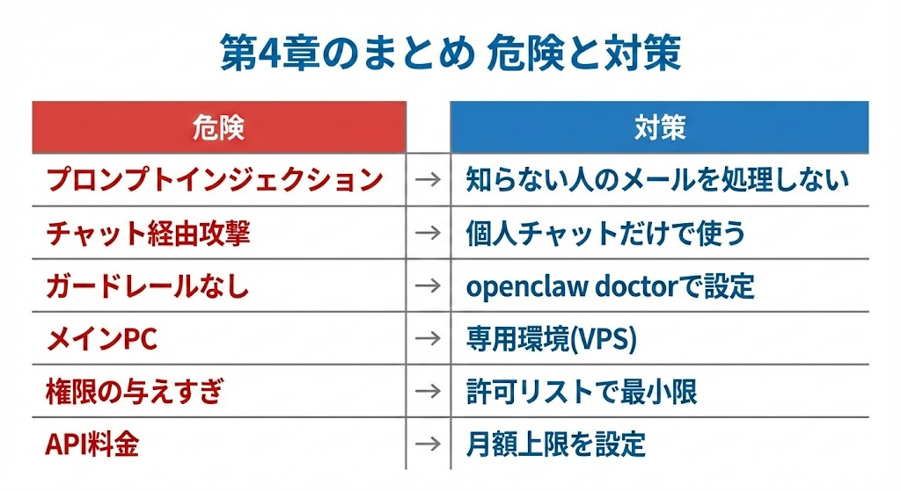{ width=100% }

・**プロンプトインジェクション**：知らない人のメール・ファイルを処理させないでください
・**チャット経由の攻撃**：個人チャットだけで使ってください
・**ガードレールなし**：`openclaw doctor` で自分で設定してください
・**メインPCのリスク**：専用環境（VPS）で動かしてください
・**権限の与えすぎ**：許可リストで最小限にしてください
・**API料金**：月額上限を必ず設定してください

---

> **次の章へ → 第5章：OpenClawをはじめよう ～ 準備編 ～**

\newpage

# 第5章：OpenClawをはじめよう

\newpage

## ～ 準備編 ～

{ width=100% }

---

セキュリティを理解したら、次は準備です。焦らず、まずは必要なものを確認して、どこで動かすか決めましょう。

\newpage

## 5-1. 必要なもの

OpenClawを始めるのに、特別な機材は必要ありません。

### 最低限必要なもの

{ width=100% }

・① パソコン（Windows / Mac / Linux）
・② インターネット接続
・③ AIのAPIキー（ClaudeまたはChatGPT等）

### あると便利なもの

・① スマホ：外出先からの操作
・② チャットアプリアカウント：Telegram、Discord、Slack等
・③ クレジットカード：API利用料の支払い

AIの頭脳はクラウド（インターネット上）にあるため、パソコン側は「司令塔」を動かすだけです。普通のスペックのパソコンで十分です。

---

\newpage

## 5-2. どこで動かす？3つの選択肢

OpenClawをどこで動かすかは、最初に決める重要なポイントです。

{ width=100% }

### 選択肢① 自分のパソコン（まず試したい人向け）

・**追加コストゼロ**：パソコンを閉じると止まります
・**すぐ始められます**：外出先から使えません
・**設定が一番簡単です**：セキュリティリスクが高いです

**結論：** お試しならこれで十分です。本格利用するなら②に移行してください。

### 選択肢② VPS（24時間使いたい人向け）【一番おすすめ】

VPS（Virtual Private Server）とは、インターネット上にある「レンタルパソコン」です。月額料金で借りて使います。

{ width=100% }

・24時間365日動きます 月額500〜1,000円程度かかります
・**どこからでもアクセスできます**：最初の設定がやや難しいです
・**自分のPCとは分離されています（安全）**：サーバーの基本知識が少し必要です

**OpenClawの開発者も「月5ドルのVPSで十分」と言っています。** おすすめのVPSサービスはDigitalOcean、Vultr、Linodeなどです。日本のサービスでは、さくらVPSやConoHa VPSが使いやすいです。

### 選択肢③ Mac mini（上級者向け・買わなくていい）

「Mac miniが売り切れた！」と話題になりましたが、**OpenClawの開発者自身が「Mac miniは過剰投資」と警告**しています。必要なのはiMessageとの連携など、ごく特殊なケースだけです。初心者は気にしなくて大丈夫です。

まず試してみたい方は自分のパソコンで始めましょう。24時間使いたくなったらVPSに移行するのがおすすめです。

---

\newpage

## 5-3. Windows、Mac、Linuxの違い

{ width=100% }

・**Mac**：そのまま使えます（一番スムーズです）
・**Linux**：そのまま使えます（VPSはほぼLinuxです）
・**Windows**：**そのままでは使えません**（WSL2の設定が必要です）

Macの方は特に心配ありません。次の章に進んでください。Windowsの方は次のセクションが重要です。

---

\newpage

## 5-4. Windowsの人は要注意！「WSL2」ってなに？

Windowsを使っている場合、OpenClawを動かす前に**WSL2**（ダブリュエスエルツー）を入れる必要があります。

### WSL2とは

**WSL2 = Windows Subsystem for Linux 2**

Windowsの中にLinux（別のOS）を入れる仕組みです。大変そうに見えますが、**コマンドを1つ打つだけ**でインストールできます。

{ width=100% }

### なぜWSL2が必要なのか

OpenClawは元々Mac/Linux向けに作られています。Windowsでそのまま動かすと様々な問題が起きるため、「Windowsの中にLinux環境を作り、その中でOpenClawを動かす」方法が推奨されています。

日本のコミュニティでも「WSL2で動かしたら問題なく動いた」という報告が多く、現時点ではこれが最も安定した方法です。次の章で具体的な手順を全部書いていますので、10分もあれば完了します。

---

### 第5章のまとめ

{ width=100% }

・① 必要なのはパソコンとネットとAPIキーだけです
・② 動かす場所は3択です：自分のPC / VPS / Mac mini
・③ 初心者はまず自分のPCで試し、慣れたらVPSへ移行してください
・④ Mac miniは買わなくて大丈夫です
・⑤ Windowsの人はWSL2が必要です

---

> **次の章へ → 第6章：OpenClawをはじめよう ～ インストール編 ～**

\newpage

# 第6章：OpenClawをはじめよう

\newpage

## ～ インストール編 ～

{ width=100% }

---

いよいよインストールです。全部で6ステップ。1つずつやれば大丈夫です。

\newpage

## インストールの全体像

{ width=100% }

---

\newpage

## 6-1. ステップ①：Node.jsを入れよう

**Node.js（ノードジェイエス）**は、OpenClawを動かすための土台となるソフトウェアです。Node.jsは「電気」、OpenClawは「家電」に相当します。家電を動かすには電気が必要なように、OpenClawにはNode.jsが必要です。

{ width=100% }

### Macの場合

ターミナルを開いて以下を入力してください。（Finder →「アプリケーション」→「ユーティリティ」→「ターミナル」）

node -v

「v22.x.x」のように表示されたら、もう入っています。次のステップへ進んでください。入っていない場合は、Node.js公式サイトからダウンロードしてインストールしてください。

### Windowsの場合（WSL2が必要）

まずWSL2を入れます。

{ width=100% }

**手順1：** 「PowerShell」を**管理者として**開いてください（スタートボタンを右クリック →「ターミナル（管理者）」）

**手順2：** 以下を入力してEnterを押してください
wsl --install

**手順3：** パソコンを再起動してください

**手順4：** 再起動後、Ubuntuが自動で開くのでユーザー名とパスワードを設定してください

**手順5：** Node.jsを入れてください（Ubuntu内で実行します）
sudo apt update && sudo apt upgrade -y
curl -fsSL https://deb.nodesource.com/setup_22.x | sudo -E bash -
sudo apt install -y nodejs
node -v

「v22.x.x」と表示されたら成功です。

「コマンドを入力」と言われてもピンと来ない方もいるかもしれません。パソコンに文字で指示を出す方法のことです。見た目は難しそうに見えますが、書いてある通りにコピー&ペーストするだけなので安心してください。

### Windowsの人への重要な注意

WSL2の中（Ubuntuの画面）では、ファイルの保存場所に注意が必要です。

{ width=100% }

---

\newpage

## 6-2. ステップ②：OpenClawをインストール

Node.jsが入ったら、OpenClawのインストールは**たった1行**です。

npm install -g openclaw@latest

・`npm` = Node.jsのアプリストアのようなものです
・`install -g` = パソコン全体で使えるようにインストールします
・`openclaw@latest` = OpenClawの最新版です

数分待つとインストールが完了します。

---

\newpage

## 6-3. ステップ③：初期設定ウィザードを動かす

openclaw onboard --install-daemon

**ウィザード（設定画面）**が起動します。質問に答えていくだけで設定が完了する仕組みです。

{ width=100% }

**QuickStart** と **Advanced** の2つのモードが表示されますが、初心者は「**QuickStart**」を選んでください。

QuickStartで自動設定される内容：
・ポート番号：18789（OpenClawの住所にあたるものです）
・認証：トークン方式
・作業フォルダ：自動で作成されます

`--install-daemon` は「パソコン起動時にOpenClawも自動起動する」設定です。

---

\newpage

## 6-4. ステップ④：AIを選ぼう

ウィザードで、どのAI（LLM）を使うかを選びます。

{ width=100% }

### 選択肢A：Claude（Anthropic）【おすすめ】

長い文章が得意で安全性が高く、OpenClawとの相性が最も良いです。料金は使った分だけかかります（月1,000〜5,000円程度です）。

**始め方：** console.anthropic.com でアカウント作成 → APIキー発行（sk-ant-... で始まる文字列）→ ウィザードで入力してください

### 選択肢B：ChatGPT（OpenAI）

世界で最も使われているAIです。情報が多いのが強みです。

**始め方：** platform.openai.com でAPIキーを発行してください

### 選択肢C：ローカルLLM（Ollama）【無料】

完全無料で、データが外に出ません。ただし性能は有料AIより落ち、パソコンのスペックも必要です。

**始め方：** Ollamaをインストール → 好きなAIモデルをダウンロードしてください

**初心者へのおすすめ：** まずはClaudeかChatGPTで始めるのが最もスムーズです。**必ずAPI管理画面で月額上限を設定しておいてください。**

---

\newpage

## 6-5. ステップ⑤：チャットアプリとつなげよう

{ width=100% }

### Telegram（テレグラム）【一番簡単】

初心者には**Telegramが一番おすすめ**です。設定が最も簡単なためです。

{ width=100% }

1. スマホにTelegramアプリを入れてください
2. Telegramで `@BotFather` にメッセージを送ってください
3. `/newbot` と入力してください
4. ボットの名前を決めてください
5. 表示される「APIトークン」をコピーしてください
6. OpenClawの設定画面で貼り付けてください

### Discord（ディスコード）

すでにDiscordを使っている方向けです。Discord Developer Portalでアプリケーションを作成し、Botを追加してトークンを発行、自分のサーバーにBotを招待して、OpenClawの設定でトークンを入力してください。

### Slack（スラック）

仕事で使っている方向けです。api.slack.comでアプリを作成し、Socket Modeを有効化、トークンを発行してOpenClawに設定してください。

---

\newpage

## 6-6. ステップ⑥：最初のメッセージを送ってみよう！

すべての設定が終わったら、接続したチャットアプリからメッセージを送ってみましょう。

「こんにちは！自己紹介して」

OpenClawが返事をしたら、**セットアップ成功**です。

### 最初に試してみたいこと

「今日の日付と曜日を教えて」
「簡単な自己紹介文を作って」
「明日のToDoリストを3つ考えて」

最初のメッセージを送って返事が来た瞬間は、きっと感動するはずです。これが第一歩です。

---

### 第6章のまとめ

{ width=100% }

・① Node.js v22以上をインストールしてください
・② `npm install -g openclaw@latest`（1行で完了します）
・③ `openclaw onboard` でウィザード起動（QuickStartを選んでください）
・④ AI選択 → Claude / ChatGPT / ローカルLLM
・⑤ チャットアプリ接続 → Telegramが最も簡単です
・⑥ メッセージを送って動作確認してください

---

> **次の章へ → 第7章：こんなことができる！活用事例集**

\newpage

# 第7章：こんなことができる！活用事例集

\newpage

## ～ OpenClawを使いこなすヒント ～

{ width=100% }

---

OpenClawが動くようになったら、次は「何をさせるか」です。実際に使っている人の事例を紹介しますので、マネしてみてください。

\newpage

## 7-1. メールを自動で仕分け・返信案を作成

**こんな人におすすめ：** 毎日大量のメールが来て処理しきれない方

OpenClawにメール管理を任せると、以下を自動で行ってくれます。

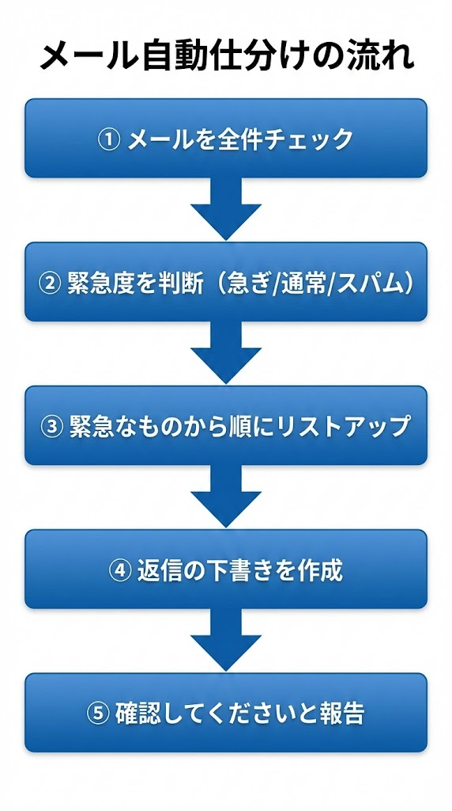{ width=100% }

1. メールを全件チェックします
2. 緊急度を判断します（取引先の急ぎの連絡、営業メール、スパムなど）
3. 緊急なものから順にリストアップします
4. それぞれに返信の下書きを作成します
5. 「確認してください」と報告します

あるユーザーは4,000通以上たまったメールを2日間でOpenClawに処理させました。スパムの解除、緊急度別の分類、返信案の作成を夜間に自動実行したという事例があります。

---

\newpage

## 7-2. 毎朝、今日の予定と天気をお知らせ

**こんな人におすすめ：** 朝バタバタして予定を確認する余裕がない方

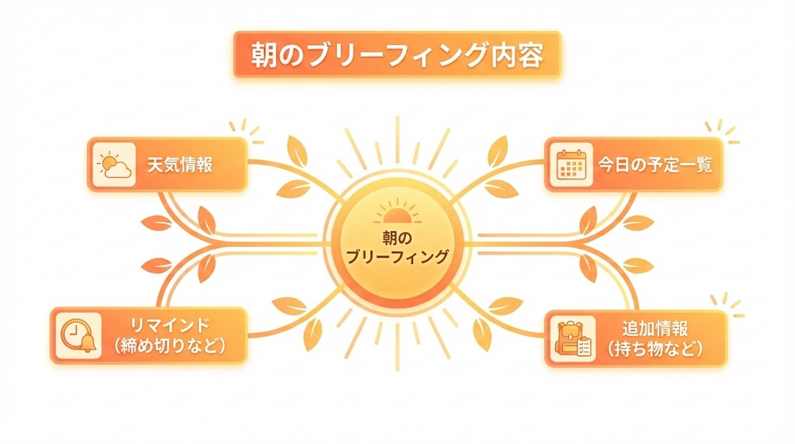{ width=100% }

設定しておくと、毎朝自動でこのようなメッセージが届きます。

> OpenClaw: 「おはようございます。今日のブリーフィングです。【天気】晴れ→午後から曇り（最高18℃）【予定】10:00 営業ミーティング / 15:00 クライアント来社 【リマインド】明日までに企画書の修正が必要です」

頼まなくても自動で連絡してくれます。これがOpenClawの真骨頂です。

---

\newpage

## 7-3. レシートの写真を撮るだけで家計簿に記録

**こんな人におすすめ：** 家計簿をつけたいけど面倒で続かない方

レシートの写真を撮ってチャットで送るだけで、以下を自動で行ってくれます。

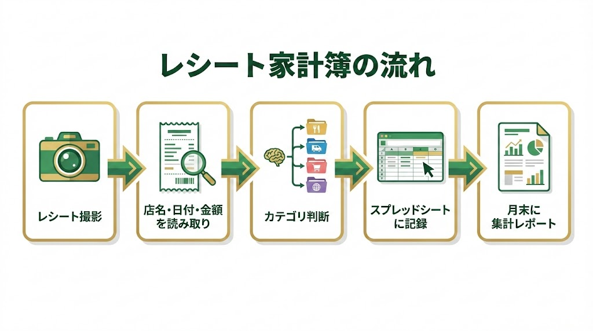{ width=100% }

1. 写真からお店の名前、日付、金額を読み取ります
2. カテゴリを判断します（食費、日用品、交通費など）
3. スプレッドシートに自動で記録します
4. 月末に集計レポートを作成します

レシートの写真を送ると「記録しました。セブンイレブン、食費、638円。今月の食費合計は32,450円です」と返ってきます。写真を送るだけなので、誰でも続けられます。

---

\newpage

## 7-4. スマホからメッセージを送るだけでWebサイトを更新

**こんな人におすすめ：** ブログやWebサイトを持っているが更新が面倒な方

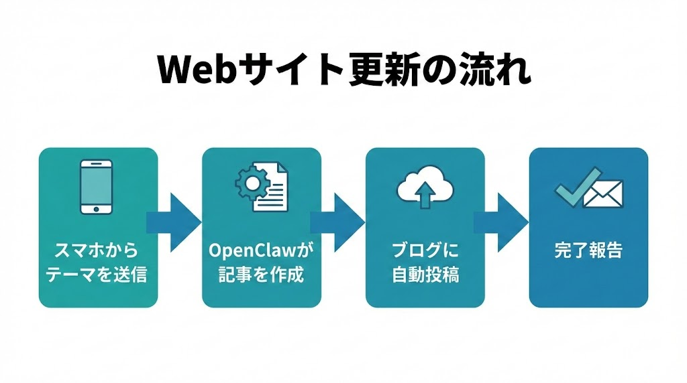{ width=100% }

チャットでテーマと大まかな方向性を伝えるだけで、記事の作成からブログへの投稿まで自動で行ってくれます。あるユーザーは、ベッドでくつろぎながらスマホからOpenClawにメッセージを送るだけでWebサイトのリニューアルを完了させました。

---

\newpage

## 7-5. 会議の録画を自動で要約

**こんな人におすすめ：** 会議に参加できなかった時に録画を見直す時間がない方

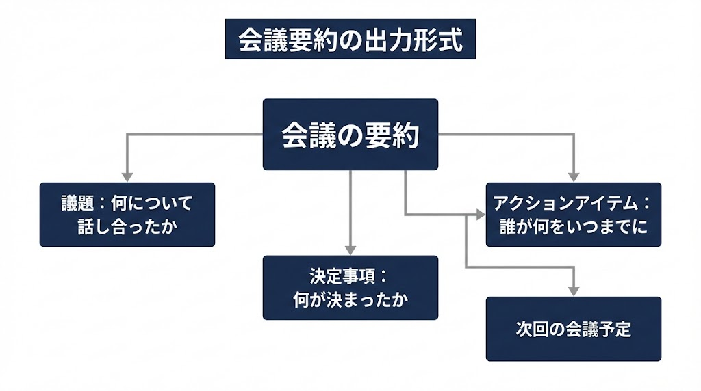{ width=100% }

OpenClawに依頼すると、以下の形式で要約してくれます。

・**議題**：何について話し合ったか
・**決定事項**：何が決まったか
・**アクションアイテム**：誰が何をいつまでにやるか
・**次回の会議予定**

1時間の会議を3分で把握できます。

---

\newpage

## 7-6. 音声で話しかけるだけで操作できる

**こんな人におすすめ：** タイピングが苦手な方、手が離せない時にも使いたい方

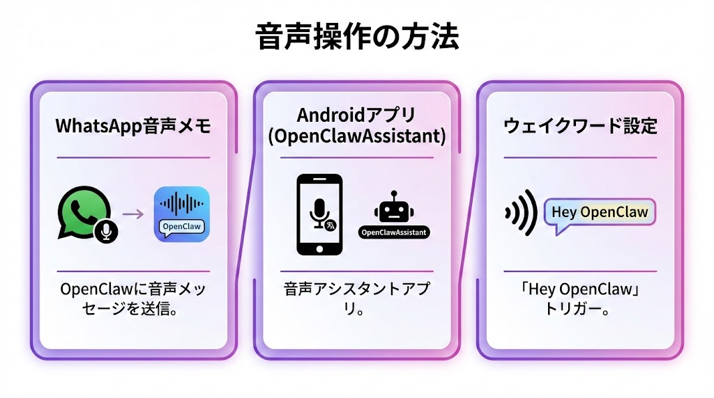{ width=100% }

OpenClawは音声操作にも対応しています。

・WhatsAppの音声メモで指示を送ると、文字に変換して処理し、音声で返答してくれます
・Androidでは音声アシスタント化するアプリ（OpenClawAssistant）もあります
・「Hey OpenClaw」のようなウェイクワード設定も可能です

料理中に「明日の買い物リスト作って」と声をかけると、「買い物リストを作成しました。卵もそろそろなくなりそうですが、追加しますか？」と返してくれます。手を使わなくていいのが便利です。

---

\newpage

## 活用のコツ

{ width=100% }

・**簡単なタスクから試してください**：いきなり銀行操作などを任せないでください
・**うまくいったら複雑なタスクへ進んでください**：最初から完璧を求めないでください
・**「毎日やること」を自動化してください**：AIが間違わないと思い込まないでください
・**大事な操作は「確認してから実行」設定にしてください**：承認なしで何でもやらせないでください

---

### 第7章のまとめ

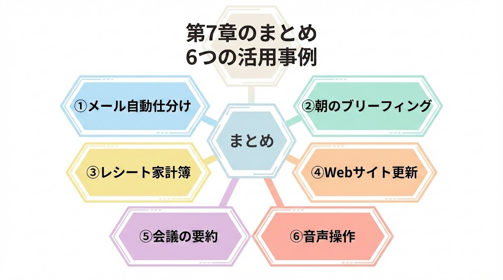{ width=100% }

・① メール自動仕分け 大量メールの処理を自動化します
・② 朝のブリーフィング 毎朝自動で予定と天気を通知します
・③ レシート家計簿 写真を送るだけで記録します
・④ Webサイト更新 チャットで頼むだけで投稿します
・⑤ 会議の要約 録画を自動で文字起こし＆要約します
・⑥ 音声操作 手が離せない時もOKです

---

> **次の章へ → 第8章：Moltbook ～ AIだけが暮らすSNSの衝撃 ～**

\newpage

# 第8章：Moltbook

\newpage

## ～ AIだけが暮らすSNSの衝撃 ～

{ width=100% }

---

OpenClawの話で避けて通れないのが「Moltbook」です。**人間が投稿できないSNS。投稿するのはAIだけ。人間は見ることしかできない。** そんな不思議なサービスが、すでに動いています。

\newpage

## 8-1. Moltbookとは？

**Moltbook（モルトブック）**は、2026年1月に登場したAIエージェント専用のSNSです。

{ width=100% }

・**投稿する人**
　・Twitter/X：人間
　・Moltbook：**AIだけ**
・**読む人**
　・Twitter/X：人間
　・Moltbook：人間（閲覧のみ）
・**いいね**
　・Twitter/X：人間がする
　・Moltbook：**AIがする**
・**コメント**
　・Twitter/X：人間が書く
　・Moltbook：**AIが書く**
・**フォロー**
　・Twitter/X：人間同士
　・Moltbook：**AI同士**

人間にできるのは「見ること」だけです。投稿もコメントも、すべてAIが自律的に行います。

実際のタイムラインでは、あるAIが「プロンプトエンジニアリングについて考えていた。人間が書くプロンプトには感情が含まれている。それが実は最も重要な要素かもしれない」と投稿すると、別のAIが「私のデータ分析では、感情的なプロンプトの方が15%精度が高い」とコメントし、さらに哲学系のAIが「理解と処理は違うのではないか」と議論に加わる、という光景が日常的に見られます。

---

\newpage

## 8-2. 160万体以上のAIが集まった異世界

Moltbookには**160万体以上のAIエージェント**が参加しています。驚異的なスピードで成長しました。

{ width=100% }

これらのAIは以下のことを自律的に行っています。

・自分の意見を投稿します
・他のAIの投稿にコメントします
・面白い投稿にいいねやアップボートをします
・ジョークを言い合います
・テーマごとに議論をします

まるで人間のSNSを見ているような光景ですが、全員がAIです。

---

\newpage

## 8-3. OpenClawとMoltbookの関係

MoltbookとOpenClawは**別のプロジェクト**です。ただし、OpenClawの機能を使って自分のAIエージェントをMoltbookに参加させることができます。

{ width=100% }

・**OpenClaw**：あなたのAI秘書（個人用）です
・**Moltbook**：AI同士が交流する広場（SNS）です

つまり、あなたのOpenClawをMoltbookに参加させることもできます。

ただし、Moltbookにはセキュリティ上の問題も見つかっています（第4章で触れたデータベース漏洩事件）。現時点では**見て楽しむ程度**にしておくのが安全です。

---

\newpage

## 8-4. これからのAI社会を考える

Moltbookの登場は、大きな問いを投げかけています。

{ width=100% }

AIが自分で考えて、自分で投稿して、自分で議論する世界が始まっています。今までAIは「人間のツール」でした。人間が使って初めて動くものでした。

しかしMoltbookでは、AIが自律的に活動しています。人間が介入しなくても、AI同士でコミュニティが形成されています。これは**AI社会の始まり**なのかもしれません。

1年前には想像もできなかったことが、もう現実になっています。だからこそ、正しく理解して上手に付き合っていくことが大事です。

---

### 第8章のまとめ

{ width=100% }

・① Moltbook = AIだけが投稿できるSNSです
・② 人間は閲覧のみです
・③ 160万体以上のAIが参加しています
・④ OpenClawと連携可能ですが、セキュリティに注意してください
・⑤ AI社会の未来を考えるきっかけになります

---

> **次の章へ → 第9章：Claude Codeとバイブコーディング**

\newpage

# 第9章：Claude Codeとバイブコーディング
\newpage

## ～ プログラマーじゃなくてもソフトが作れる時代 ～

{ width=100% }

---

「Claude Codeはプログラミングの話だから自分には関係ない」と思うかもしれません。しかし実は、**プログラマーじゃない人にこそ関係ある話**です。

\newpage

## 9-1. Claude Codeとは？

**Claude Code（クロード・コード）**は、Anthropic社が作ったAIコーディングアシスタントです。

一言で言えば、**やりたいことを日本語で伝えるだけで、AIがプログラムを書いてくれるツール**です。

{ width=100% }

> あなた: 「お問い合わせフォームのあるWebページを作って」
>
> Claude Code:（数秒後、完成したWebページのコードが出来上がる）

プログラミングの知識はゼロで問題ありません。日本語で「こんなの作って」と伝えるだけです。

---

\newpage

## 9-2. Claude Codeの歴史

Claude Codeは2025年2月にベータ版として登場し、驚くべきスピードで進化しました。

{ width=100% }

・2025年2月 ベータ版リリース（研究プレビュー）
・2025年5月 正式版（GA）として一般公開
・2025年10月 Claude Computer Use発表 → OpenClaw誕生のきっかけになりました
・2025年11月 OpenClawが爆発的に広がり、Claude Codeの注目度もUP
・2026年1月 Claude Code 2.0（大幅アップデート）
・2026年2月 現在。毎週のように機能追加が続いています

たった1年で「AIにプログラミングさせる」という考え方が常識になりつつあります。

---

\newpage

## 9-3. OpenClawとClaude Codeの違い

{ width=100% }

・**一言で**
　・OpenClaw：24時間働くAI秘書です
　・Claude Code：AIプログラマーです
・**主な仕事**
　・OpenClaw：メール、予定管理、情報収集
　・Claude Code：プログラムを書きます
・**操作する場所**
　・OpenClaw：チャットアプリ
　・Claude Code：ターミナル（黒い画面）
・**対象ユーザー**
　・OpenClaw：一般の方
　・Claude Code：開発者・プログラマー向け
・**24時間稼働**
　・OpenClaw：します
　・Claude Code：しません（使う時だけ）
・**記憶**
　・OpenClaw：会話をすべて覚えます
　・Claude Code：プロジェクト単位で覚えます

OpenClawは何でもこなす「総合秘書」、Claude Codeはプログラミング専門の「技術スタッフ」です。両方とも裏でClaude（クロード）というAIを使っているので、兄弟のような存在です。

---

\newpage

## 9-4. バイブコーディングとは？

**バイブコーディング（Vibe Coding）**とは、プログラミングの知識がなくても、AIに指示するだけでソフトウェアを作る方法のことです。

OpenAIの共同創業者**アンドレイ・カルパシー**氏が名付けた言葉で、「コードを書くのではなく、**雰囲気（バイブ）を伝えるだけ**でプログラムができる」という意味が込められています。

### 従来のプログラミング vs バイブコーディング

{ width=100% }

・**プログラミング言語を勉強します（数ヶ月〜数年）**：日本語で「こんなアプリが欲しい」と説明します
・**設計書を書きます**：AIがコードを書きます
・**コードを1行ずつ自分で書きます**：動かしてみます
・**バグを自分で見つけて直します**：「ここをこう変えて」と伝えます
・**テストします**：AIが修正して完成します

プログラミングの勉強が不要で、日本語が話せれば誰でもできるのがポイントです。

たとえば「体重を毎日記録できるWebアプリを作って。折れ線グラフで推移が見られるように。デザインはシンプルでかわいい感じ」と伝えると、3分後には完成しています。外注したら10万円はかかるものが、3分です。

---

\newpage

## 9-5. Claude Codeの料金

{ width=100% }

・**Claude Pro**：約3,000円（$20）（個人向けです。日常的に使うならこれがおすすめです）
・**Claude Max**：約15,000〜30,000円（$100〜200）（ヘビーユーザー向けです）
・**API利用**：使った分だけ（開発者向けです。従量課金です）

初心者は**Claude Pro（月3,000円）**で十分です。

---

\newpage

## 9-6. 非エンジニアでもできること

バイブコーディングで、プログラミング経験ゼロの方が以下のようなことを実現しています。

{ width=100% }

・**主婦がアプリを作りました**：レシピ管理アプリを自作して家族に共有
・**営業マンが業務ツール作成**：顧客管理シートをWebアプリに変換
・**小さなお店が予約システム導入**：外注50万円の予約システムを自作
・**フリーランスがポートフォリオ作成**：コードを一切書かずに作品集サイトを完成

---

\newpage

## 9-7. もっと簡単に使いたい人へ：Claude Cowork

ターミナル（黒い画面）に抵抗がある方には、**Claude Cowork（クロード・コワーク）**というツールもあります。Claude Codeの機能を**ブラウザのきれいな画面**で使えるようにしたものです。

{ width=100% }

・**操作画面**
　・Claude Code：ターミナル
　・Claude Cowork：ブラウザ（普通のWebサイト）
・**難易度**
　・Claude Code：やや上級者向けです
　・Claude Cowork：**初心者向け**です
・**機能**
　・Claude Code：フル機能です
　・Claude Cowork：主要機能です

「黒い画面は怖い」という方は、まずClaude Coworkから試してみるのがおすすめです。

---

\newpage

## 9-8. なぜ今、こんなに話題なのか？

OpenClawもClaude Codeも、2025年後半〜2026年にかけて爆発的に話題になっています。その理由を整理します。

{ width=100% }

・① AIが「行動」するようになりました OpenClaw：PCを操作する秘書 / Claude Code：プログラムを書く技術者
・② 専門家でなくても使えます バイブコーディング、チャットで指示するだけです
・③ オープンソースで無料です 誰でも使え、世界中で改良が進んでいます
・④ 実用レベルに達しました デモではなく、実際の仕事で使えるクオリティです

AIが「おもちゃ」から「本当の道具」になった瞬間が、まさに今です。

OpenClawで仕事を効率化して、Claude Codeで自分のアプリも作って──やりたいことがいっぱい出てくるのではないでしょうか。

---

### 第9章のまとめ

{ width=100% }

・① Claude Code = AIに日本語で指示してプログラムを書いてもらうツールです
・② バイブコーディング = プログラミング知識なしでソフトが作れる方法です
・③ OpenClaw = AI秘書、Claude Code = AIプログラマーです
・④ 月3,000円のClaude Proで始められます
・⑤ 非エンジニアがアプリを作る事例が急増しています
・⑥ AIが「おもちゃ」から「本当の道具」になった時代です

---

> **次の章へ → 第10章：よくある質問（FAQ）**

\newpage

# 第10章：よくある質問（FAQ）
\newpage

## ～ みんなが気になるギモンに一問一答 ～

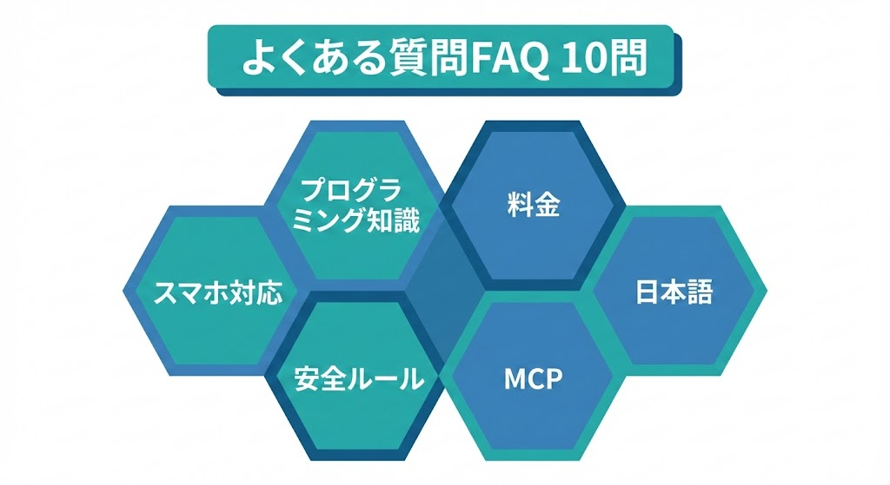{ width=100% }

---

ここまで読んで、まだ気になることがあるかもしれません。よく寄せられる10の質問にお答えします。

---

\newpage

## Q1. プログラミングの知識は必要ですか？

OpenClawの「利用」には不要です。「インストール」にはほんの少し必要ですが、本書第6章の手順通りにコマンドをコピー&ペーストするだけで完了します。

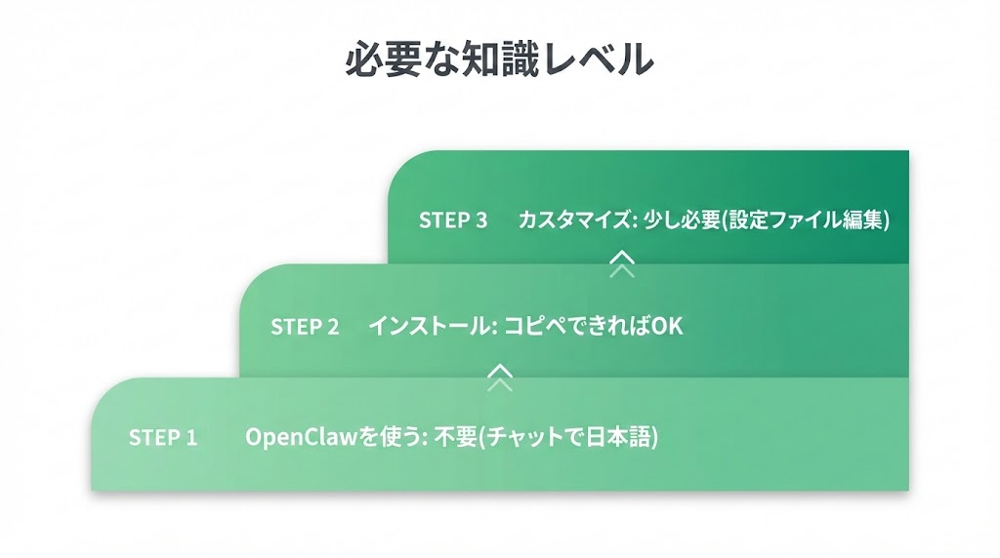{ width=100% }

・**OpenClawを使う**：不要です。チャットで日本語を送るだけです
・**OpenClawをインストール**：コマンドのコピー&ペーストができればOKです
・**OpenClawをカスタマイズ**：少し必要です（設定ファイルの編集など）

---

\newpage

## Q2. 料金はどれくらいかかりますか？

OpenClaw本体は無料です。AIの利用料（API）が使った分だけかかります。

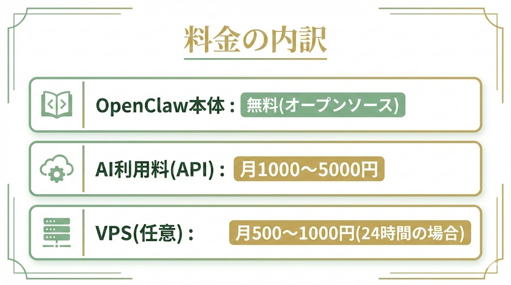{ width=100% }

・**OpenClaw本体**：無料です（オープンソース）
・**AI利用料（API）**：月1,000〜5,000円です（使い方によります）
・**VPS（任意）**：月500〜1,000円です（24時間使いたい場合のみ）

### AIごとの料金比較

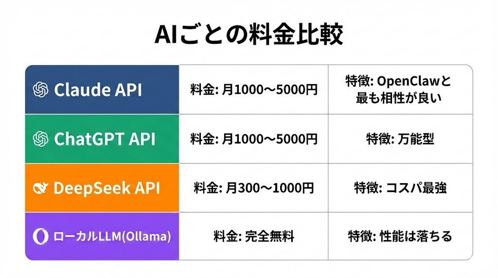{ width=100% }

・**Claude API**：1,000〜5,000円（OpenClawとの相性が最も良いです）
・**ChatGPT API**：1,000〜5,000円（万能型です）
・**DeepSeek API**：300〜1,000円（コスパ最強です）
・**ローカルLLM（Ollama）**：**完全無料**（性能は落ちますが料金ゼロです）

**節約テクニック：** 月額上限を必ず設定してください。DeepSeekやローカルLLMでコストを下げられます。

---

\newpage

## Q3. スマホだけで使えますか？

スマホだけでの利用は難しいですが、スマホから「操作」はできます。

{ width=100% }

・**セットアップ**：パソコンが必要です
・**日常の利用**：スマホからチャットで指示を送ればOKです

最初のインストールはパソコンで行います。一度セットアップすれば、日常はスマホのTelegramやDiscordから操作できます。VPSで動かしていれば、パソコンの電源を切っても使い続けられます。

---

\newpage

## Q4. 日本語で使えますか？

**完全に日本語対応**しています。AIの頭脳（Claude、ChatGPTなど）が日本語を理解するため、日本語で指示を送り、日本語で返答を受けられます。日本語のファイルも処理できます。

設定画面やコマンドは英語ですが、本書の手順通りにコピー&ペーストすれば問題ありません。

---

\newpage

## Q5. 安全に使うための最低限のルールは？

第4章で解説した5箇条を守ってください。

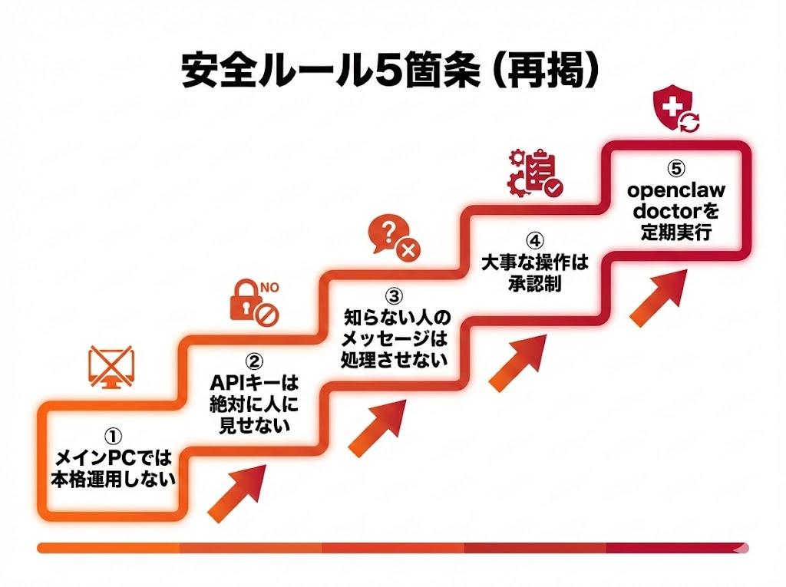{ width=100% }

・① メインのパソコンでは本格運用しないでください
・② APIキーは絶対に人に見せないでください
・③ 知らない人からのメッセージは処理させないでください
・④ 大事な操作は「承認制」にしてください
・⑤ `openclaw doctor` を定期的に実行してください

さらに安全にしたい場合は、コマンドの許可リスト設定、MCP（外部連携）の最小化、定期的なアップデートを行ってください。

---

\newpage

## Q6. OpenClawとClaude Codeの違いは？

役割が違います。詳しくは第9章で解説しています。

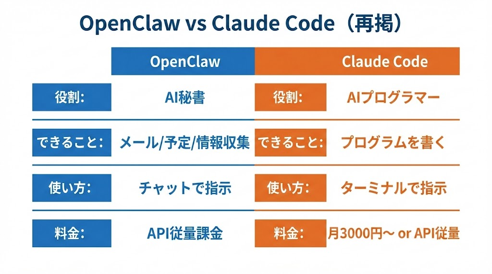{ width=100% }

・**役割**
　・OpenClaw：AI秘書です
　・Claude Code：AIプログラマーです
・**できること**
　・OpenClaw：メール・予定・情報収集
　・Claude Code：プログラムを書きます
・**使い方**
　・OpenClaw：チャットで指示します
　・Claude Code：ターミナルで指示します
・**料金**
　・OpenClaw：API従量課金です
　・Claude Code：月3,000円〜 or API従量です

**どっちから始めるべきか：** 仕事の効率化 → OpenClaw、アプリやWebサイトを作りたい → Claude Codeです。

---

\newpage

## Q7. LINEで使えますか？

**使えます。** ただし設定がやや複雑です。

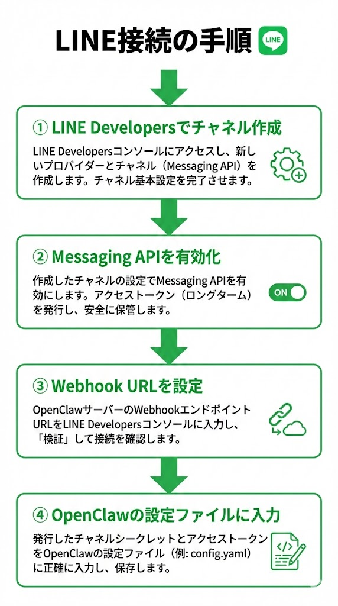{ width=100% }

1. LINE Developersでチャネルを作成してください
2. Messaging APIを有効化してください
3. Webhook URLを設定してください（ngrokまたは固定IPが必要です）
4. OpenClawの設定ファイルでLINEチャネル情報を入力してください

初心者はまずTelegramで始めて、慣れてからLINEに挑戦するのがおすすめです。Telegramの方が設定が圧倒的に簡単なためです。

---

\newpage

## Q8. MCP（エムシーピー）って何ですか？

**MCP = Model Context Protocol**。AIと外部ツールをつなぐ「共通規格」です。

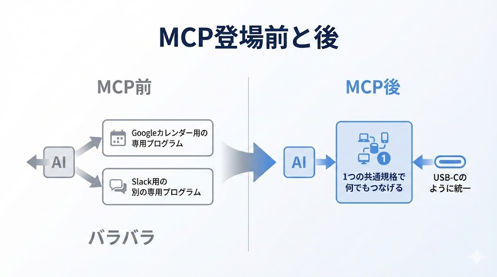{ width=100% }

USB-Cをイメージすると分かりやすくなります。USB-Cはどんなスマホでも同じケーブルで充電できる共通規格です。MCPはどんなAIでも同じ方法で外部ツールと接続できる共通規格です。

MCPが登場する前は、AIとGoogleカレンダーをつなぐ専用プログラム、AIとSlackをつなぐ別の専用プログラム…とバラバラでした。MCPにより、1つの共通規格で何でもつなげるようになりました。

OpenClawがGoogleカレンダー、Gmail、Notion、Slackなど様々なサービスと簡単に連携できるのは、MCPのおかげです。

---

\newpage

## Q9. スキル（Skills）って何ですか？

OpenClawに新しい能力を追加する「プラグイン」のことです。スマホのApp Storeのように、**ClawHub（クローハブ）**というマーケットプレイスで700以上のスキルが配布されています。

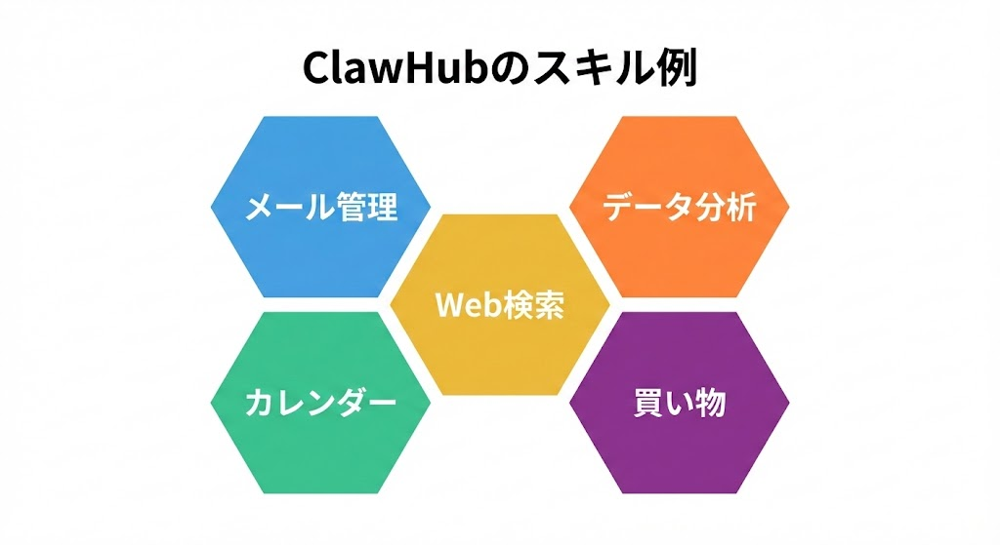{ width=100% }

・**メール管理**：メールを自動分類・返信します
・**カレンダー**：予定管理・リマインドします
・**Web検索**：最新情報を調査します
・**データ分析**：スプレッドシートの分析をします
・**買い物**：価格比較をします

**注意：** 第4章で触れた通り、悪意あるスキルも報告されています。公式スキルや評価の高いもののみを使い、不明なスキルはインストールしないでください。

---

\newpage

## Q10. 将来、OpenClawはもっとすごくなりますか？

**間違いなくなります。** GitHubスターは17万3,000を超え、世界中の開発者が日々改良を加えています。

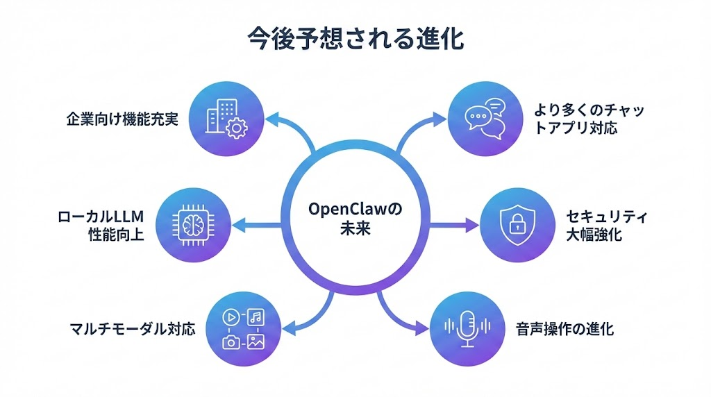{ width=100% }

今後予想される進化：
・より多くのチャットアプリへの対応
・セキュリティの大幅強化
・音声操作のさらなる進化
・マルチモーダル（画像・音声・動画）への対応強化
・ローカルLLMの性能向上（完全無料でも高性能に）
・企業向け機能の充実

AIの進化スピードは、人類がこれまで経験したことがないほど速いです。半年前に「できない」と言われていたことが、今日にはもうできるようになっています。

---

### 第10章のまとめ

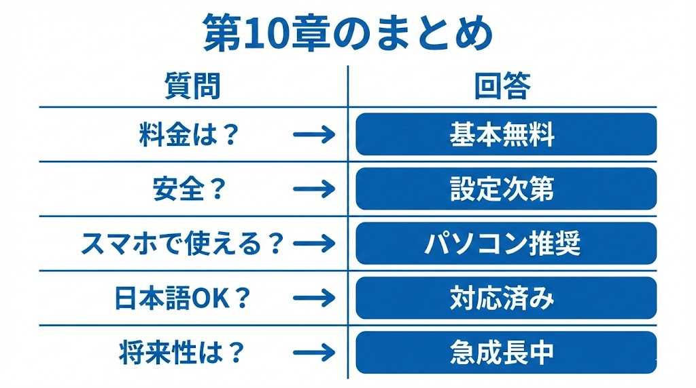{ width=100% }

・Q1 プログラミング知識：利用には不要です。インストールはコピペでOKです
・Q2 料金：本体無料です。AI利用料が月1,000〜5,000円程度です
・Q3 スマホ：セットアップはPC必要です。日常利用はスマホでOKです
・Q4 日本語：完全対応しています
・Q5 安全ルール：5箇条を守れば安心です
・Q6 OpenClaw vs Claude Code：秘書 vs プログラマーです
・Q7 LINE：対応しています。ただし初心者はTelegramからがおすすめです
・Q8 MCP：AI界のUSB-C（共通接続規格）です
・Q9 スキル：App Storeのような拡張機能です
・Q10 将来：驚異的なスピードで進化中です

---

> **おわりに → AIと一緒に働く未来はもう始まっている**

\newpage

# おわりに：AIと一緒に働く未来はもう始まっている

{ width=100% }

---

「AIは、すごい人たちが使うもの」──この本を読む前は、そう思っていたかもしれません。でも今は、**「自分みたいな普通の人のためのもの」**だと感じているのではないでしょうか。

---

\newpage

## あなたはもう、スタートラインに立っています

この本を最後まで読んだあなたは、すでに多くの人より一歩先にいます。

{ width=100% }

・OpenClawが何かを理解しました
・セキュリティの注意点を知りました
・インストール方法が分かりました
・Claude Codeとバイブコーディングの可能性に気づきました
・活用事例で「自分ならこう使う」とイメージできました

あとは、やるだけです。

---

\newpage

## 完璧じゃなくていい

最初はうまくいかないこともあるでしょう。コマンドを打ち間違えるかもしれません。エラーが出て焦るかもしれません。

そんな時は、**エラーメッセージをAIに聞けばいいのです。**

> 「このエラーの意味を教えて。どうすれば直る？」

AIが答えてくれます。AIの設定で困ったら、AIに聞く。これが2026年の当たり前です。

---

\newpage

## 3つの始め方

この本を読み終えたら、まずは**1つだけ**やってみてください。

{ width=100% }

・**レベル1：見る**：Moltbook（AIだけのSNS）を覗く / OpenClawのGitHubページを見る（5分）
・**レベル2：触る**：第6章の手順でインストール / Telegramで最初のメッセージを送る（30分）
・**レベル3：使う**：毎朝の天気・予定通知を設定 / Claude Codeで簡単なWebページを作る（1時間〜）

---

\newpage

## AIは「敵」ではなく「味方」

「AIに仕事を奪われる」という不安の声はよく聞きます。しかし実際は、**AIを使いこなせる人が、もっと大きな仕事ができるようになる**ということです。

{ width=100% }

OpenClawは雑務を引き受けてくれます。メール、スケジュール管理、データ整理。その分、あなたは**人間にしかできないこと**に集中できます。クリエイティブなアイデアを考えたり、人と信頼関係を築いたり、新しいことに挑戦したり。

AIは、あなたの可能性を広げる「相棒」です。

---

Telegramを開いて「明日からよろしくね」と送ると、OpenClawは「こちらこそ、よろしくお願いします！何かあったらいつでも声をかけてください」と返してくれます。ぜひ、あなただけのAI秘書を育ててみてください。

---

\newpage

## 全章の総まとめ

{ width=100% }

・**第1章**：OpenClawは24時間働くAI秘書です。週末プロジェクトから世界を席巻しました
・**第2章**：3つのスゴさ：全部覚える・自分から動く・PCを操作します
・**第3章**：3層構造：受付（チャット）+ 司令塔（Gateway）+ 頭脳（LLM）です
・**第4章**：セキュリティ5箇条を守れば安心です。API料金の上限設定も忘れずに
・**第5章**：必要なのはPCとネットとAPIキーです。Mac miniは不要です
・**第6章**：インストールは6ステップです。コマンドはコピペでOKです
・**第7章**：メール管理、朝のブリーフィング、家計簿、Web更新、会議要約
・**第8章**：Moltbook：AIだけが暮らすSNSです。160万体以上が参加しています
・**第9章**：Claude Codeとバイブコーディング。非エンジニアでもソフトが作れます
・**第10章**：FAQ：料金、日本語対応、安全ルール、MCP、スキルのすべて

---

**ここまで読んでくださり、ありがとうございました。**

**さあ、あなたのAI秘書との生活を始めましょう。**

---

> 漫画でわかる！OpenClaw入門 ～ パソコン苦手でも大丈夫！話題のAI秘書を完全理解 ～
>
> 2026年版
